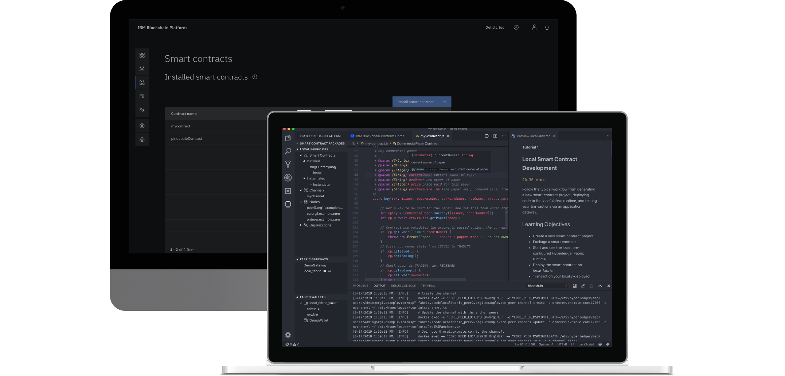

# IBM Blockchain Platform Extension for VS Code

[](https://marketplace.visualstudio.com/items?itemName=IBMBlockchain.ibm-blockchain-platform) [](https://marketplace.visualstudio.com/items?itemName=IBMBlockchain.ibm-blockchain-platform)

The IBM Blockchain Platform extension helps developers to create, test and debug smart contracts, connect to Hyperledger Fabric environments, and build applications that transact on your blockchain network.

For a step-by-step guide on getting started with the extension's features, access our Beginner Tutorial via our integrated Home page. Alternatively, explore, clone and open the Hyperledger Fabric samples, all without leaving VS Code. For more comprehensive documentation, [follow this link](https://cloud.ibm.com/docs/services/blockchain/howto?topic=blockchain-develop-vscode)



## Want to learn more about the IBM Blockchain Platform?

Join us for the IBM Blockchain Platform User Series where product and technical experts share their expertise and educate on a specific feature, function or capability of the IBM Blockchain Platform. Get the answers to your questions and engage live with the experts, while ensuring you're leveraging all that the IBM Blockchain Platform has to offer.

**[Click here to find out more information about the IBM Blockchain Platform User Series webcast!](http://ibm.biz/blockchainuserseries)**

**[Click here to schedule a free 1:1 consultation with an IBM Blockchain Platform expert!](https://www.ibm.com/blockchain/platform?schedulerform)**


## Installation

Please visit the [Visual Studio Code Marketplace](https://marketplace.visualstudio.com/items?itemName=IBMBlockchain.ibm-blockchain-platform) for installation and more details.

## Requirements

The first time you install this extension, it will check your system for the prequisites, and guide you to install any that you are missing. 

Windows 10, Linux, or Mac OS are currently the supported operating systems.
Each of these operating systems have their own additional requirements. 

For the full list of requirements that the extension will check for, please refer to the ['Dependency Installation'](#dependency-installation) section at the end of the README.


## Smart Contract Development Lifecycle
_Please note that all commands contributed by this extension are accessible via the VS Code Command Palette. The commands outlined below are available from burger menus located on the panel headers, or by right-clicking tree items, in the extension's side bar view._

The expected smart contract development lifecycle follows several broad points, all possible entirely within VS Code using this extension:
1. Creating and packaging a smart contract
2. Connecting to an instance of Hyperledger Fabric
3. Running and debugging a smart contract
4. Submitting transactions and generating functional-level smart contract tests

### Create and Develop a Fabric smart contract project
A smart contract project is a directory containing all the relevant contract and metadata files that define a smart contract. Use the `Create New Project` command to create a basic smart contract, available in JavaScript, TypeScript, Go or Java.

### Package Open Project
To package a project you have open in your workspace, run the `Package Open Project` command. Packages are listed in the `Smart Contracts` panel. The `Blockchain` output channel lists what files have been packaged during this action. Alternatively run the `Import a Package` command to import a pre-existing .cds package to be used within VS Code.

If you wish to control which files in the project are packaged, you can create a `.fabricignore` file in the top level directory of your smart contract project. The file and pattern format for a `.fabricignore` file is the same as a [`.gitignore`](https://git-scm.com/docs/gitignore) file, for example:

```
/.classpath
/.git/
/.gradle/
/.project
/.settings/
/bin/
/build/
```

### Connecting to an instance of Hyperledger Fabric

The extension is compatible with connecting to and interacting with any Fabric 1.4.x network.

#### 1 Org Local Fabric
The extension contains a pre-configured local instance of Hyperledger Fabric named `1 Org Local Fabric`, which the extension will automatically pull and use the correct Docker images for. It is a pre-configured network with one organization, one peer and one channel. It can be enabled and operated under the `Fabric Environments` panel. The first time it is started, Fabric 1.4.6 images will be installed and an admin identity created in the `1 Org Local Fabric - Org1 Wallet` wallet.

For `1 Org Local Fabric` management tasks such as restart and teardown, right click on `1 Org Local Fabric` in the `Fabric Environments` panel.

The `1 Org Local Fabric` currently uses Fabric 1.4.6 images.

#### Connecting to another instance of Hyperledger Fabric
The extension allow you to connect to any Hyperledger Fabric instance and perform some operational tasks. The tasks available are: install, instantiate and registering and enrolling identities.

To connect to a Hyperledger Fabric instance on the `Fabric Environments` panel click the `+` button. This will ask you for JSON node files that describe how to connect to a Hyperledger Fabric Node i.e. peer, orderer, or certificate authority.

If you are connecting to an instance of IBM Blockchain Platform console on IBM Cloud, you can add an environment by connecting directly to the console. You will be able to login to IBM Cloud using username and password, API key or single sign-on, as well as create a new account if you don't already have one. Once the environment is created, if you prefer to work whilst logged out and do not want to be prompted to login on connect, you can disable 'Poll For Config Updates When Connected To IBM Blockchain Platform On IBM Cloud Environments' in the user settings.

If connecting to an IBM Blockchain Platform console software version, you can also add an environment by connecting directly to the console. When prompted for authentication credentials you can either provide User ID and password, or API key and API secret.

For other instances of Hyperledger Fabric you can create the JSON node files yourself.

##### JSON Node Files
All node files must contain a `name`, `type`, and `api_url` property. There are three types: `fabric-peer`, `fabric-ca` and `fabric-orderer`. `Peer` and `Orderer` nodes must also contain an `msp_id` property. While `Certificate Authority` nodes must contain a `ca_name` property. If you have `TLS` enabled then then the `pem` property must also be set.

There are also some additional optional properties. `peer` and `orderer` nodes can set the property `ssl_target_name_override`, this will override the hostname used to verify the servers TLS certificate. A `certificate authority` node can contain the properties `enroll_id` and `enroll_secret`, these properties are used for identity to connect to the certificate authority. If you have a `multi-node ordering service` then on each `orderer` node the `cluster_name` property can be set. If this property is set then the `orderer` nodes in the same cluster will be grouped together.
A JSON node file can contain more than one node definition using array syntax

Here are some examples of node files:

These some basic examples showing the required properties

```
{
    "name": "ca.org1.example.com",
    "api_url": "http://localhost:17054",
    "type": "fabric-ca",
    "ca_name": "ca.org1.example.com"
}
```

```
{
    "name": "peer0.org1.example.com",
    "api_url": "grpc://localhost:17051",
    "type": "fabric-peer",
    "msp_id": "Org1MSP"
}
```

```
{
    "name": "orderer.example.com",
    "api_url": "grpc://localhost:17050",
    "type": "fabric-orderer",
    "msp_id": "OrdererMSP"
}
```

Here is how to have multiple nodes in one JSON file

```
[
    {
        "name": "peer0.org1.example.com",
        "api_url": "grpc://localhost:17051",
        "type": "fabric-peer",
        "msp_id": "Org1MSP"
    },
    {
        "name": "orderer.example.com",
        "api_url": "grpc://localhost:17050",
        "type": "fabric-orderer",
        "msp_id": "OrdererMSP"
    }
]

```

Here is a certificate authority with `enroll_id` and `enroll_secret` set

```
{
   "name": "ca.org1.example.com",
   "api_url": "http://localhost:17054",
   "type": "fabric-ca",
   "ca_name": "ca.org1.example.com",
   "enroll_id": "admin",
   "enroll_secret": "adminpw"
}
```

Here is an example of a multi-node ordering service

```
[
    {
         "name": "orderer.example.com",
         "api_url": "grpc://localhost:17050",
         "type": "fabric-orderer",
         "msp_id": "OrdererMSP",
         "cluster_name": "myCluster"
     },
     {
          "name": "orderer1.example.com",
          "api_url": "grpc://localhost:17051",
          "type": "fabric-orderer",
          "msp_id": "OrdererMSP",
          "cluster_name": "myCluster"
     }
]
```

Here is an example of a peer with `TLS` enabled, please note the `pem` property value has been shortened. The `pem` property is the root `TLS` certificate of the peer's MSP. The property should be base64 encoded from a pem file. 

```
{
    "name": "peer0.org1.example.com",
    "api_url": "grpcs://localhost:17051",
    "type": "fabric-peer",
    "msp_id": "Org1MSP",
    "pem": "LS0tLS1CRUdJTiBDRVJUSUZJQ0FURS0tLS0tCk1JSUNJVENDQWNpZ0F3"
 }
```

If you already have a wallet in the extension with the identity you want to use for a node, you can set the `wallet` and `identity` properties. Setting both the properties would skip the setup step for that node. For example if you had the wallet `myWallet` with identity `myIdentity` you could do the following:
```
{
    "name": "peer0.org1.example.com",
    "api_url": "grpc://localhost:17051",
    "type": "fabric-peer",
    "msp_id": "Org1MSP",
    "wallet": "myWallet",
    "identity": "myIdentity"
}
```


##### Associating identities with nodes
After creating an environment, the next step before connecting is to associate an identity with each node. To do this, click the name of the environment you have just created in the Fabric Environments panel. To complete setup, click on each node from the list to associate an identity with them. The identity must be an admin identity for the node. To change the identity associated with a node when connected the environment, right-click on the node and select Replace identity associated with a node.

##### Importing more nodes
You can import more nodes to an existing environment by connecting to the environment, expand `nodes` and then click on `+ Import nodes`. 

### Install and Instantiate smart contract packages
Deploying a smart contract package is a two step process: install the package on a peer and instantiate it on a channel. Run the `Install Smart Contract` command, followed by the `Instantiate Smart Contract` command to deploy your smart contract package on the `1 Org Local Fabric` runtime. The deployed smart contracts are listed in the `Fabric Environments` panel.

### Debugging a smart contract
Debugging your smart contract allows you to run through the smart contract transactions with breakpoints and output, to ensure your transaction works as intended. ***Note: This is only currently available for the local Fabrics such as the `1 Org Local Fabric` or any other created from a template. Remote debug is not currently available***

To debug Go smart contracts, please install the [Go extension](https://github.com/microsoft/vscode-go/releases).

To debug Java smart contracts, please install the [Language Support for Java extension](https://marketplace.visualstudio.com/items?itemName=redhat.java) and the [Debugger for Java extension](https://marketplace.visualstudio.com/items?itemName=vscjava.vscode-java-debug)

To debug Node (JavaScript or TypeScript) chaincode written using the low-level programming model, you must add the `program` attribute to your launch configuration in launch.json. It should contain the path to the file calling `Shim.start`. For example:
```
{
    "type": "fabric:node",
    "request": "launch",
    "name": "Debug Smart Contract",
    "program": "${workspaceFolder}/dist/start.js"
}

```
where `start.js` contains the line `Shim.start(new Chaincode());`.

To debug your smart contract follow these steps:

1. Ensure you are connected to the `1 Org Local Fabric` runtime.
2. Open your smart contract project in your workspace.
3. Open the debug view in Visual Studio Code using the left-hand navigation bar.
4. Select the `Debug Smart Contract` configuration by using the dropdown in the upper-left and click the **play** button on the debug toolbar. The extension will automatically instantiate or upgrade the smart contract as appropriate. If you want to test out a function that is called on instantiate or upgrade add the following to the launch configuration, where `name` is the name of the smart contract and `version` is different to the previous version used. Alternatively if you are using JavaScript or TypeScript then you can update the `version` in the package.json file.

```
    "env": {
        "CORE_CHAINCODE_ID_NAME": <name>:<version>
    }
```

5. Add breakpoints to the smart contract by clicking on the relevant line numbers in your smart contract files.
6. To submit or evaluate a transaction, click the blockchain icon on the debug toolbar. Alternatively, in the `Fabric Gateways` panel, you can right click on transactions to submit or evaluate them. Execution will be paused on any breakpoints you've defined.

#### Making changes to your contract while debugging
To make iterative changes to your smart contract while debugging, after making your changes click the **restart** button. You can also stop the debugging session, make further changes and start debugging again, without needing to upgrade your smart contract.

### Add a gateway to establishing a client connection to your own Hyperledger Fabric instance
To connect to our own Hyperledger Fabric instance, it must be running [Hyperledger Fabric v1.4.1](https://hyperledger-fabric.readthedocs.io/en/release-1.4/install.html) or later.

Add your gateway by providing a name and connection profile via the `Add Gateway` command; it will be listed in the `Fabric Gateways` panel. Add a file system wallet to connect to your gateway with via the `Add Wallet` command.

You can also create a gateway from a fabric environment. When you run the `Add Gateway` command there will be an option to create a gateway from a fabric environment, select this then choose the environment you want to create the gateway from.

### Connect to a gateway and discover its resources
Connect by clicking on a gateway in the `Fabric Gateways` panel, and expand the navigation tree to explore its resources. Instantiated Smart Contracts are listed under the channel and from here you can generate functional-level test files on single or multiple smart contracts. Submit or evaluate individual transactions listed under the instantiated smart contracts, with the result displayed in the `Blockchain` output channel.

#### Java functional tests

To test Java smart contracts, please install the [Java Test Runner extension](https://marketplace.visualstudio.com/items?itemName=vscjava.vscode-java-test).

When creating Java functional tests new dependencies must be added to the build file.

If you select 'Yes' when prompted with `The last step might overwrite build.gradle/pom.xml. Do you wish to continue?`, these modifications will be done automatically. You can alternatively choose to skip this step and manually add the code listed below.

##### Gradle Project - modify build.gradle:

Add the following dependencies:
```
testImplementation 'org.hyperledger.fabric:fabric-gateway-java:1.4.2'
testImplementation 'org.assertj:assertj-core:3.14.0'
testImplementation 'com.fasterxml.jackson.dataformat:jackson-dataformat-yaml:2.10.0'
testImplementation 'com.fasterxml.jackson.core:jackson-databind:2.10.0'
```

##### Maven Project - modify pom.xml:

Add the following dependencies:
```
<dependency>
    <groupId>org.hyperledger.fabric</groupId>
    <artifactId>fabric-gateway-java</artifactId>
    <version>1.4.2</version>
</dependency>
<dependency>
    <groupId>org.assertj</groupId>
    <artifactId>assertj-core</artifactId>
    <version>3.14.0</version>
</dependency>
<dependency>
    <groupId>com.fasterxml.jackson.dataformat</groupId>
    <artifactId>jackson-dataformat-yaml</artifactId>
    <version>2.10.0</version>
</dependency> 
<dependency>
    <groupId>com.fasterxml.jackson.core</groupId>
    <artifactId>jackson-databind</artifactId>
    <version>2.10.0</version>
</dependency>
```

All functional tests will be created in `<yourProject>/src/test/java/org/example`.

#### Persisting generated tests after upgrading from v1.0.18 or earlier
Any functional tests generated using version 1.0.18 of the extension or earlier will break after upgrading to a newer version. In v1.0.19 changes were made to the structure of environments stored on the file system, so some of the paths used by the older functional tests will no longer be correct.

Should you wish to persist your previously generated tests:
- Export both the wallet and the connection profile of the Hyperledger Fabric network your smart contract is instantiated on
- Update `ts-smart-contract-util.ts` to use the filepaths of what you just exported

Note that these paths broke because they are hardcoded to use our internal directories, so that the generated tests will work out of the box. It is not recommended to keep those paths, as they will break in the event of changes such as this one.


### Wallet Management
The extension creates a `1 Org Local Fabric - Org1 Wallet` file system wallet when the `1 Org Local Fabric` runtime instance is started and is automatically associated with the `1 Org Local Fabric - Org1` gateway. When `1 Org Local Fabric` is started, an admin identity is added to the `1 Org Local Fabric - Org1 Wallet` and cannot be deleted unless the `1 Org Local Fabric` runtime is torn down.

The `Add Identity to Wallet` command will ask for a name, MSPID and a method to add an identity. These methods include providing a certificate and private key, a JSON identity file, or a gateway, enrollment id and secret.

For wallets associated with other remote Fabric gateways, the `Add Wallet`, `Export Wallet` and `Remove Wallet` commands are available in the `Fabric Wallets` panel for wallet management.

### Creating an identity with attributes
Identities can be registered and enrolled with attributes from the `1 Org Local Fabric` certificate authority.

The `Create Identity (register and enroll)` command will ask for an identity name and whether the identity should have any attributes added.
Selecting `Yes` will ask for the identity's attributes that should be provided in the following format:

```
[{"name": "attr1", "value": "attr1value", "ecert": true}, {"name": "attr2", "value": "attr2value", "ecert": true}]
```

The key `ecert` must be set to true in order for a smart contract to be able to read the value of the attribute using ['getAttributeValue'](https://fabric-shim.github.io/release-1.4/fabric-shim.ClientIdentity.html#getAttributeValue).

Hovering over an identity in the `Fabric Wallets` panel will show any attributes associated with the identity.

### Changing transaction timeout values

In the extension, the default timeout value for transactions is 120 seconds.
However, when debugging a transaction it might be necessary to change the time taken before a transaction fails.

The following settings can be changed in the user settings to increase or decrease the time taken for a transaction to timeout:
- `ibm-blockchain-platform.fabric.client.timeout` - timeout value used for communication to the peers and orderers (changes `request-timeout`)
- `ibm-blockchain-platform.fabric.chaincode.timeout` - timeout value for chaincode that's been started by the 1 Org Local Fabric (changes `CORE_CHAINCODE_EXECUTETIMEOUT`)

***Note: If the value of `ibm-blockchain-platform.fabric.client.timeout` is changed, you must disconnect from a connected gateway before the new value takes affect***

***Note: If the value of `ibm-blockchain-platform.fabric.chaincode.timeout` is changed, you must restart the 1 Org Local Fabric before the new value takes affect***

### 1 Org Local Fabric Runtime ports

As of `v1.0.21` the `ibm-blockchain-platform.fabric.runtime` user setting has changed format from:

```
"ibm-blockchain-platform.fabric.runtime": {
    "ports": {
        "startPort": 17050,
        "endPort": 17069
    }
}
```

to

```
"ibm-blockchain-platform.fabric.runtime": {
    "1 Org Local Fabric": {
        "ports": {
            "startPort": 17050,
            "endPort": 17069
        }
    }
}
```

The `startPort` and `endPort` are used when attempting to start the 1 Org Local Fabric, to determine which ports to try and run the Docker containers on.

If you decide to change these ports, you will need to run the `Teardown Fabric Runtime` command before starting it again. This is required in order to regenerate the files containing the new port range.

## Using transaction data files to submit a transaction
Instead of manually typing in your arguments when you want to submit or evaluate a transaction, you can instead associate a directory of transaction data with your smart contract, and use the data files in that directory to submit your transaction instead. These associations are stored on the gateway that you are connected to when you associate - if you connect to a different gateway that has the same smart contract installed and instantiated, you will have to associate your transaction data directory again.

To associate a directory of transaction data with your smart contract, run the `Associate Directory for Transaction Data` command, and choose the directory that you want to associate. When you submit or evaluate a transaction when you have associated a transaction data directory, you will be able to submit any transaction data in that directory instead of inputting the informattion manually.

Transaction data files are in JSON format, but must end with the file extension `.txdata`. Each file contains an array of objects that are parsed by the extension and used to submit transactions. Below is an example of what your transaction data file might look like:

    [
        {
            "transactionName": "myTransaction",
            "transactionLabel": "This is my transaction",
            "arguments": [
                "001",
                "myValue"
            ],
            "transientData": {
                "key": "value"
            }
        }
    ]

Note that the `transactionName` is the name of the transaction as defined in your smart contract, whereas `transactionLabel` is a custom label that is used to differentiate between transaction data objects.


## Useful Commands
The IBM Blockchain Platform extension provides an explorer and commands accessible from the Command Palette, for developing smart contracts quickly:
<!---Table of commands with columns: 'command' and 'description'
--->

| Command | Description |
| --- | --- |
| Add Environment | Add a Hyperledger Fabric instance environment |
| Add Gateway | Add a Hyperledger Fabric instance gateway |
| Add Identity To Wallet | Add an identity into a wallet to be used when connecting to a Hyperledger Fabric gateway |
| Add Wallet | Add a wallet containing identities to be used when connecting to a gateway |
| Associate A Wallet | Associate a wallet with a gateway to be used when connecting |
| Associate Directory for Transaction Data | Associate a directory of transasction data with a smart contract
| Associate Identity with a Node | Associate an identity with a node to enable the extension to connect to that node |
| Connect Via Gateway | Connect to a Hyperledger Fabric instance using a gateway |
| Create New Project | Create a new smart contract project |
| Create Identity (register and enroll) | Create, register and enroll a new identity from the local Fabric runtime certificate authority |
| Delete Environment | Delete a Hyperledger Fabric instance environment |
| Delete Identity | Delete an identity from a wallet |
| Delete Gateway | Delete a Hyperledger Fabric instance gateway |
| Delete Package | Delete a smart contract package |
| Dissociate A Wallet | Remove the association between a wallet and a gateway |
| Dissociate Directory for Transaction Data | Remove the association between a directory of transaction data and a smart contract |
| Disconnect From Environment | Disconnect from the environment you're currently connected to |
| Disconnect From Gateway | Disconnect from the blockchain gateway you're currently connected to |
| Evaluate Transaction | Evaluate a smart contract transaction |
| Export Connection Profile | Export connection profile for a blockchain gateway |
| Export Package | Export a smart contract package to use outside VS Code |
| Export Wallet | Export a wallet to use outside VS Code |
| Generate Tests for All Smart Contracts| Create functional level test files for all contracts |
| Generate Tests for Smart Contract(s) | Create functional level test files for single or multiple contracts |
| Import a Package | Import a smart contract package |
| Import nodes into environment | Import more nodes into an environment |
| Install Smart Contract | Install a smart contract package onto a local Fabric runtime peer |
| Instantiate Smart Contract | Instantiate an installed smart contract package onto a channel |
| Open Release Notes | Open the release notes page |
| Package Open Project | Create a new smart contract package from a project in the Explorer |
| Remove Wallet | Remove a wallet from the Fabric Wallets view |
| Replace Identity Associated with a Node | Replace which identity is associated with a node |
| Restart Fabric Runtime | Restart the local Fabric instance |
| Start Fabric Runtime | Start the local Fabric instance |
| Stop Fabric Runtime | Stop the local Fabric instance |
| Submit Transaction | Submit a transaction to a smart contract |
| Subscribe to Event | Subscribe to an event emitted from a smart contract |
| Teardown Fabric Environment | Teardown the local Fabric runtime (hard reset) |
| Upgrade Smart Contract | Upgrade an instantiated smart contract |
| View Homepage | View the extensions homepage |
| View Prerequisites | View the required and optional dependencies on the prerequisites page |

### Dependency Installation
<details>
<summary>Click to view installation instructions</summary>

The following dependencies are required on all operating systems: 
- [VS Code version 1.38.0 or greater](https://code.visualstudio.com)
> VS Code version can be found by running: `code --version`

- [Node v10 (v10.15.3 or greater) or v12 (v12.15.0 or greater) and npm v6.x or greater](https://nodejs.org/en/download/)
> Node version can be found by running: `node --version`
>
> npm version can be found by running: `npm --version`

**If installing Node and npm using a manager such as 'nvm' or 'nodenv', you will need to set the default/global version and restart VS Code for the version to be detected by the Prerequisites page.**

The following dependencies are optional:
- [Go version v1.12 or greater for developing Go contracts](https://golang.org/dl/)
> Go version can be found by running: `go version`

- [Java v8 for developing Java contracts](https://adoptopenjdk.net/?variant=openjdk8)
> Java version can be found by running: `java -version`


### Additional requirements for Mac & Linux

- Xcode Command Line Tools
> Can be installed by running: `xcode-select --install`
>
> Can find version by running: `xcode-select --version`

### Additional requirements for Windows

- You are using Windows 10 Pro or Enterprise and have the Anniversary Update 1607

### 1 Org Local Fabric functionality

This extension can use Docker and Docker Compose to run a simple pre-configured local Hyperledger Fabric network on your machine. By default this feature is enabled as we highly recommend using it, however you may disable this feature if required.

You will need the following:

- [Docker version v17.06.2-ce or greater](https://www.docker.com/get-docker)
> Docker version can be found by running: `docker --version`

- [Docker Compose v1.14.0 or greater](https://docs.docker.com/compose/install/) 
> Docker Compose version can be found by running: `docker-compose --version`

#### Additional requirements for Windows

- Docker for Windows is configured to use Linux containers (this is the default)
- You will need to install the C++ Build Tools for Windows from [windows-build-tools](https://github.com/felixrieseberg/windows-build-tools#windows-build-tools)
- You will need to install OpenSSL v1.0.2 [OpenSSL binaries](https://www.openssl.org/community/binaries.html)
  - Install the normal version, not the version marked as "light"
  - Install the Win64 version into `C:\OpenSSL-Win64` on 64-bit systems

For more information see the [1 Org Local Fabric](#1-org-local-fabric) section.

### Additional information
To open the Prerequisites page manually, run the `View Prerequisites` command inside VS Code from the Command Palette.

Please note: the extension doesn't currently work with the VSCode Remote Development feature, we plan to make this work in the future, follow progress [here](https://github.com/IBM-Blockchain/blockchain-vscode-extension/issues/1357). 

</details>

## Contact Us
If you have find any problems or want to make suggestions for future features please create [issues and suggestions on Github](https://github.com/IBM-Blockchain/blockchain-vscode-extension/issues). For any questions please [create a question on Stack Overflow](https://stackoverflow.com/questions/tagged/ibp-vscode-extension).

## Just so you know

The extension uses telemetry reporting to track usage data and help improve future extension versions. Disabling VS Code telemetry reporting also disables the extension's telemetry reporting.
For instructions on how to disable telemetry reporting, please visit the [Visual Studio Code FAQ](https://code.visualstudio.com/docs/supporting/FAQ#_how-to-disable-telemetry-reporting)

## License <a name="license"></a>
The source code files are made available under the Apache License, Version 2.0 (Apache-2.0), located in the [LICENSE](LICENSE.txt) file.

This software uses the IBM Plex Sans font licensed under the SIL Open Font License, Version 1.1.
Copyright © 2017 IBM Corp. with Reserved Font Name "Plex"

This Font Software is licensed under the SIL Open Font License, Version 1.1.
This license is copied below, and is also available with a FAQ at:
http://scripts.sil.org/OFL
