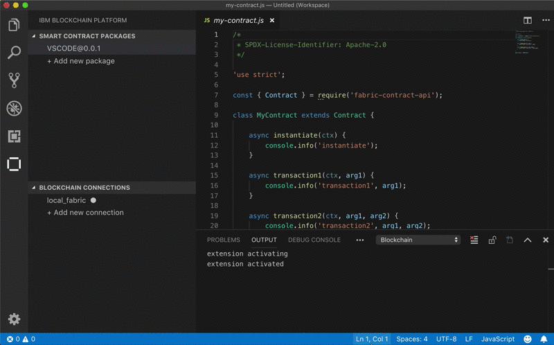

# IBM Blockchain Platform Extension for VSCode

[](https://marketplace.visualstudio.com/items?itemName=IBMBlockchain.ibm-blockchain-platform) [](https://marketplace.visualstudio.com/items?itemName=IBMBlockchain.ibm-blockchain-platform) [](https://travis-ci.org/IBM-Blockchain/blockchain-vscode-extension)

The IBM Blockchain Platform extension has been created to assist users in developing, testing, and deploying smart contracts; including connecting to Hyperledger Fabric environments.

> ⚠ Please note: this extension is available for early experimentation.  There are many features and improvements to come before the v1.0 release.  Please bear this in mind, and if you find something you'd like to see added, let the team know by raising a GitHub issue or suggestion (see "Contact Us" below).

## Contact Us
If you have find any problems or want to make suggestions for future features please create [issues and suggestions on Github](https://github.com/IBM-Blockchain/blockchain-vscode-extension/issues). For any questions please [create a question on Stack Overflow](https://stackoverflow.com/questions/tagged/ibp-vscode-extension).

## Tutorial
Follow our [Tutorial](https://developer.ibm.com/tutorials/ibm-blockchain-platform-vscode-smart-contract) and learn how to develop, test and deploy smart contracts using VSCode.

## Installation

**[Install the IBM Blockchain Platform extension here](vscode:extension/IBMBlockchain.ibm-blockchain-platform)**


Or visit the [Visual Studio Code Marketplace](https://marketplace.visualstudio.com/items?itemName=IBMBlockchain.ibm-blockchain-platform) for more details

## Requirements

You will need the following installed in order to use the extension:
- [VSCode version 1.32 or greater](https://code.visualstudio.com)
- [Node v8.x or greater and npm v5.x or greater](https://nodejs.org/en/download/)
- [Docker version v17.06.2-ce or greater](https://www.docker.com/get-docker)
- [Docker Compose v1.14.0 or greater](https://docs.docker.com/compose/install/)
- [Go version v1.12 or greater for developing Go contracts](https://golang.org/dl/)

> ⚠ Please note: From version 0.1.0+, your smart contract package.json should depend on at least fabric-contract@1.4.0-beta2. This is only required for smart contracts not created using version 0.1.0+ of this extension.

If you are using Windows, you must also ensure the following:
- Your version of Windows supports Hyper-V and Docker:
  - Windows 10 Enterprise, Pro, or Education with 1607 Anniversary Update or later
- Docker for Windows is configured to use Linux containers (this is the default)
- You have installed the C++ Build Tools for Windows from [windows-build-tools](https://github.com/felixrieseberg/windows-build-tools#windows-build-tools)
- You have installed OpenSSL v1.0.2 from [Win32 OpenSSL](http://slproweb.com/products/Win32OpenSSL.html)
  - Install the normal version, not the version marked as "light"
  - Install the Win32 version into `C:\OpenSSL-Win32` on 32-bit systems
  - Install the Win64 version into `C:\OpenSSL-Win64` on 64-bit systems

You can check your installed versions by running the following commands from a terminal:
- `node --version`
- `npm --version`
- `docker --version`
- `docker-compose --version`


## Features
The IBM Blockchain Platform extension provides an explorer and commands accessible from the Command Palette, for developing smart contracts quickly:
<!---Table of commands with columns: 'command' and 'description'
--->

| Command | Description |
| --- | --- |
| Add Gateway | Add a Hyperledger Fabric instance gateway |
| Add Identity To Wallet | Add an identity into a wallet to be used when connecting to a Hyperledger Fabric gateway |
| Add Wallet | Add a wallet containing identities to be used when connecting to a gateway |
| Associate A Wallet | Associate a wallet with a gateway to be used when connecting |
| Connect Via Gateway | Connect to a Hyperledger Fabric blockchain using a gateway |
| Create Smart Contract Project | Create a new smart contract project |
| Create Identity (register and enroll) | Create, register and enroll a new identity from the local_fabric runtime certificate authority |
| Debug | Debug a Smart Contract |
| Delete Identity | Delete an identity from a wallet |
| Delete Gateway | Delete a Hyperledger Fabric instance gateway |
| Delete Package | Delete a smart contract package |
| Disassociate A Wallet | Remove the association between a wallet and a gateway |
| Disconnect From Gateway | Disconnect from the blockchain gateway you're currently connected to |
| Edit Gateway | Edit connection profile for connecting to a blockchain gateway |
| Edit Wallet | Edit wallet containing identities used for connecting to a blockchain gateway |
| Evaluate Transaction | Evaluate a smart contract transaction |
| Export Connection Profile | Export connection profile for the local_fabric gateway |
| Export Package | Export a smart contract package to use outside VSCode |
| Generate Smart Contract Tests | Create functional level test files for single or multiple contracts |
| Import Package | Import a smart contract package |
| Install Smart Contract | Install a smart contract package onto a local_fabric runtime peer |
| Instantiate Smart Contract | Instantiate an installed smart contract package onto a channel |
| Open Fabric Runtime Terminal | Open a terminal with access to the Fabric runtime (peer CLI) |
| Package a Smart Contract Project | Create a new smart contract package from a project in the Explorer |
| Refresh Fabric Gateways | Refresh the Fabric Gateways view |
| Refresh Smart Contract Packages | Refresh the Smart Contract Packages view |
| Refresh Fabric Wallets | Refresh the Fabric Wallets view |
| Refresh Local Fabric Ops | Refresh the Local Fabric Ops view |
| Remove Wallet | Remove a wallet from the Fabric Wallets view |
| Restart Fabric Runtime | Restart the local_fabric instance |
| Start Fabric Runtime | Start the local_fabric instance |
| Stop Fabric Runtime | Stop the local_fabric instance |
| Submit Transaction | Submit a transaction to a smart contract |
| Teardown Fabric Runtime | Teardown the local_fabric runtime (hard reset) |
| Toggle Development Mode | Toggle the local_fabric instance development mode |
| Upgrade Smart Contract | Upgrade an instantiated smart contract |
| View Homepage | View the extensions homepage |

## Smart Contract Development Lifecycle
_Please note that all operations shown are also possible using the commands in the table above, issued at the VSCode command-prompt._

### Create a Fabric smart contract project
Use the `Create Smart Contract Project` command to start a new project. Select from the available smart contract programming languages. Choose a directory to store the project (or create a new one). A skeleton project will be generated with a very basic smart contract, unit tests, a `package.json` and other useful files.


### Edit / write smart contract files
You'll find the smart contract file in the `lib` directory of a newly generated project if you use JavaScript and in the `src` directory if you use TypeScript.


### Package a smart contract project
To package a project you have open in your workspace, run the `Package a Smart Contract Package` command. Packages will be added to the `Smart Contract Packages` panel in the explorer view.

Alternatively, navigate to the explorer view (click the IBM Blockchain Platform icon in the left-navigation) then click the `add` icon on the Smart Contract Packages view (this will package up the project you have open in your workspace). The Blockchain output channel lists what files have been packaged during this action.

When you package a smart contract project, all of the smart contract code is added into a new Fabric smart contract package file (using the standard Fabric chaincode deployment specification format). You can deploy this package using this extension. Alternatively, you can deploy the package using other tools, such as the Fabric CLI (`peer chaincode install` command).


### Export a smart contract package
Right-click a package and select the `Export Package` option.  You can select where the package is exported to. Use this to take the packages you have made and deploy them somewhere else, using other tools, such as the Fabric CLI (`peer chaincode install` command).


### Connect to the local_fabric runtime

**When using the pre-configured local instance of Hyperledger Fabric named `local_fabric`, the extension will automatically pull and use the correct Docker images.**

The `local_fabric` runtime can be enabled in `Local Fabric Ops` panel. The first time you enable it, Fabric images will be installed and an admin identity created in the `local_fabric_wallet` visible in the `Fabric Wallets` panel. 
Click the menu on the `Local Fabric Ops` header-bar for management options (including start/stop and teardown).
Left-click the `local_fabric` gateway to connect to it within the `Fabric Gateways` view, using the `admin` identity.

> ⚠ Please note: v0.4.0 will teardown the `local_fabric` runtime instance when it installs, removing any existing configuration created with older versions of the extension.


### Connect to your own Hyperledger Fabric instance and discover the existing resources
Using this extension, you can connect to a pre-configured local instance of Hyperledger Fabric named `local_fabric`, or you can connect to your own Hyperledger Fabric instance. If you choose to connect to your own Hyperledger Fabric instance, it must be running Hyperledger Fabric v1.4.1 or later. Further documentation here: 

https://hyperledger-fabric.readthedocs.io/en/release-1.4/install.html

1. Add your gateway by providing a name and connection profile via the `Add Gateway` command. It will be listed in the `Fabric Gateways` panel.
2. Add a file system wallet to connect to your gateway with, by providing either an existing wallet or creating one and adding an identity. This action is available via the `Add Wallet` command, and wallets are visible in the `Fabric Wallets` panel.
3. (Optional) Use the `Associate A Wallet` command to associate a gateway and a wallet.
4. Left-click a gateway in the `Fabric Gateways` panel to connect to the blockchain runtime it represents. Select the wallet and identity to connect with. If the gateway has an associated wallet, select an identity contained in the associated wallet to connect with. 
5. Expand the sections in the `Fabric Gateways` navigation tree to explore its resources. When you're done, use the "back" icon in the section's header-bar to disconnect.

> ⚠ Please note: v0.4.0 has restructured Fabric gateways and wallets, so you will need to add any gateways and wallets created with previous releases again in order to use them. 

### Install smart contract package
Smart contract packages are installed on Fabric peers.  Start `local_fabric`, find a peer under `Nodes` in the `Local Fabric Ops` panel and right-click to select `Install Smart Contract`. Alternatively click on `+ Install` or right-click `Installed` under `Smart Contracts` in the `Local Fabric Ops` panel


### Instantiate smart contract package
Start `local_fabric`, find a channel under `Channels` in the `Local Fabric Ops` panel and right-click to select `Instantiate Smart Contract`. Alternatively click on `+ Instantiate` or right-click `Instantiated` under `Smart Contracts` in the `Local Fabric Ops` panel. You will be asked to select from a list of open projects, smart contract packages or smart contracts installed on peers in the channel.

It is useful to think of installing on peers as the first step and instantiating on a channel as the second step of deploying a smart contract package.


### Submit transaction
Once connected to a Fabric gateway in the `Fabric Gateways` panel, right-click a transaction under an instantiated smart contract and click `Submit transaction`. This will submit a transaction to a smart contract.



### Debugging a smart contract
Debugging your smart contract allows you to run through the smart contract transactions with breakpoints and output, to ensure your transaction works as intended. To debug your smart contract follow these steps:

1. Ensure you are connected to the `local_fabric` runtime and that the `local_fabric` peer is in development mode. Development mode is indicated by an infinity symbol on a peer, under `Nodes` in the `Local Fabric Ops` panel. To toggle development mode, right-click the peer and select `Toggle Development Mode`. 
2. Open your smart contract project in your workspace.
3. Open the debug view in Visual Studio Code using the left-hand navigation bar.
4. Select the `Debug Smart Contract` configuration by using the dropdown in the upper-left.
5. Package and install the smart contract by clicking the **play** button.
6. Select whether to `Create a new debug package and install` or `Resume from a previous debug session`.
7. Add breakpoints to the smart contract by clicking on the relevant line numbers in your smart contract files.
8. If `Create a new debug package and install` was selected, click **Instantiate** in the `Local Fabric Ops` panel.
9. To submit or evaluate a transaction, click the blockchain icon on the debug toolbar. Alternatively, in the `Fabric Gateways` panel, you can right click on transactions to submit or evaluate them. Execution will be paused on any breakpoints you've defined.

To make iterative changes to your smart contract while debugging, after making your changes click the **restart** button. You do not need to instantiate the contract again upon restarting the debug session. Please note, as this stores the smart contract in local memory, for many changes to large smart contracts, you may need to reinstantiate the smart contract. If you restart the local_fabric runtime after debugging, you must choose the "new debugging session" option after starting a new debugging session. You must then upgrade the smart contract to the new `vscode-debug-XXXXXXX` version before submitting and debugging transactions.

> ⚠ Please note after installing 0.3.3, you may no longer be able to debug existing smart contract projects that are written in TypeScript. You must add the following two settings to your launch configuration in launch.json:
``` "preLaunchTask": "tsc: build - tsconfig.json",
"outFiles": [
    "${workspaceFolder}/dist/**/*.js"
] 
```
> A valid launch configuration is as follows:
``` {
    "type": "fabric:node",
    "request": "launch",
    "name": "Debug Smart Contract",
    "preLaunchTask": "tsc: build - tsconfig.json",
    "outFiles": [
        "${workspaceFolder}/dist/**/*.js"
    ]
} 
```
> Note that the values of the `preLaunchTask` and `outFiles` settings are specific to your project configuration, and the values above are only guaranteed to work with a TypeScript smart contract project generated by this extension.

### Edit an existing blockchain gateway
Gateways can be edited by right-clicking and selecting `Edit Gateway` in the `Fabric Gateways` panel.  This will open User Settings, with the gateway available for editing. This is not available for the `local_fabric` runtime. Wallets can be edited in the same way via the `Edit Wallet` command.


### Teardown the local_fabric runtime
When you start/stop the local_fabric, all data will be maintained. Choose `Teardown Fabric Runtime` from the `Local Fabric Ops` header-bar to completely teardown the runtime and start over (you must then confirm this action). This action will also delete all identities in the `local_fabric_wallet`.


### Wallet Management
The extension creates a `local_fabric_wallet` file system wallet when it is installed, which is used to connect to the `local_fabric` runtime instance and is automatically associated with that gateway. When `local_fabric` is started, an admin identity is added to the the `local_fabric_wallet` and cannot be deleted unless the `local_fabric` runtime is torn down.

To add an identity into any wallet, right-click on the wallet in the `Fabric Wallets` panel and run the `Add Identity to Wallet` command. This will ask for a name, MSPID and a method to add an identity. These methods include providing a certificate and private key, or a gateway, enrollment id and secret.

For wallets associated with other remote Fabric gateways, the `Add Wallet`, `Edit Wallet` and `Remove Wallet` commands are available in the `Fabric Wallets` panel for wallet management.

## Supported Operating Systems

Linux, Mac OS, and Windows are currently the only supported operating systems for use with the extension.

## Telemetry Reporting

The extension uses telemetry reporting to track usage data and help improve future extension versions.

For instructions on how to disable telemetry reporting, please visit the visit the [Visual Studio Code FAQ](https://code.visualstudio.com/docs/supporting/FAQ#_how-to-disable-telemetry-reporting).

## Future Additions
To track the projects future features, visit [GitHub Issues](https://github.com/IBM-Blockchain/blockchain-vscode-extension/issues?q=is%3Aopen+is%3Aissue+label%3AEpic).

## License <a name="license"></a>
The source code files are made available under the Apache License, Version 2.0 (Apache-2.0), located in the [LICENSE](LICENSE) file.

This software uses the IBM Plex Sans font licensed under the SIL Open Font License, Version 1.1.
Copyright © 2017 IBM Corp. with Reserved Font Name "Plex"

This Font Software is licensed under the SIL Open Font License, Version 1.1.
This license is copied below, and is also available with a FAQ at:
http://scripts.sil.org/OFL
