---

# Related publishing issue: https://github.ibm.com/IBMCode/Code-Tutorials/issues/338

abstract: "Use the IBM Blockchain Platform's VSCode extension to streamline the process of developing, testing, and deploying a smart contract."

authors:
  - name: "Horea Porutiu"
    email: "Horea.Porutiu@ibm.com"

completed_date:	"2018-11-20"

components:
  - "hyperledger-fabric"

draft: false

excerpt: "Use the IBM Blockchain Platform's VSCode extension to streamline the process of developing, testing, and deploying a smart contract."

last_updated: "2019-02-25"

meta_description: "Use the IBM Blockchain Platform's VSCode extension to streamline the process of developing, testing, and deploying a smart contract."

meta_keywords: "IBM Blockchain platform, extension, VSCode, Smart Contract"

primary_tag: "blockchain"

pta:
 - "emerging technology and industry"

pwg:
  - "blockchain"

related_content:
  - type: announcements
    slug: "ibm-blockchain-platform-vscode-smart-contract"
  - type: tutorials
    slug: "cl-ibm-blockchain-101-quick-start-guide-for-developers-bluemix-trs"
  - type: patterns
    slug: "create-and-execute-blockchain-smart-contracts"

related_links:
  - title: "Video: Start developing with the IBM Blockchain Platform VSCode Extension"
    url: "https://youtu.be/0NkGGIUPhqk"
  - title: "IBM Blockchain Platform"
    url: "https://www.ibm.com/blockchain/platform"
  - title: "IBM Blockchain - Marbles demo"
    url: "https://github.com/IBM-Blockchain/marbles"
  - title: "Hyperledger Fabric docs"
    url: "https://hyperledger-fabric.readthedocs.io/en/release-1.2/"

# runtimes:

services:
  - "blockchain"

subtitle: "Streamline the process of developing, testing, and deploying a smart contract"

tags:
  - "blockchain"

title: "Develop a smart contract with the IBM Blockchain Platform VSCode extension"

type: tutorial

---

Learn the process of using IBM Blockchain Platform's VSCode extension to streamline the process of developing, testing, and deploying a smart contract. Once you finish this tutorial, you will understand how to quickly develop, demo, and deploy your blockchain application on a local Hyperledger Fabric network using VSCode. This tutorial assumes some basic understanding of Hyperledger Fabric.

## Watch the videos

  [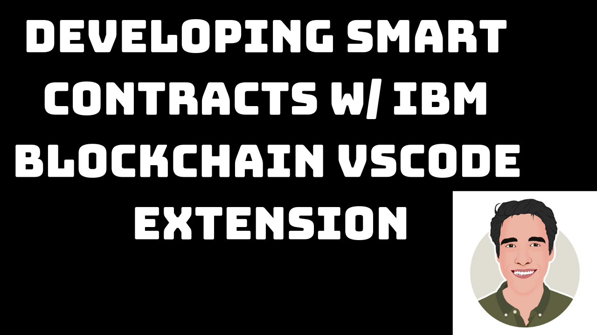](https://www.youtube.com/watch?v=r77p-8k4Mpk)

[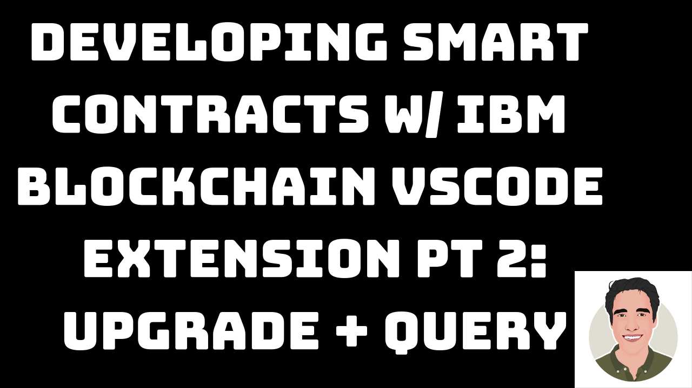](https://www.youtube.com/watch?v=ixu8tyXsCwY&t=1s)

## Learning objectives

* Install the IBM Blockchain Platform VSCode extension
* Create a new JavaScript smart contract
* Package a smart contract
* Create, explore, and understand a Hyperledger Fabric network
* Deploy the smart contract on a local Hyperledger Fabric instance
* Use a Node.js SDK to interact with the deployed smart contract package

## Prerequisites

You will need the following installed in order to use the extension:

* [Node v8.x or greater and npm v5.x or greater](https://nodejs.org/en/download/)
* [Yeoman (yo) v2.x](http://yeoman.io/)
* [Docker version v17.06.2-ce or greater](https://www.docker.com/get-started)
* [Docker Compose v1.14.0 or greater](https://docs.docker.com/compose/install/)
* [VSCode 1.28.2 or higher](https://code.visualstudio.com/download)

If you are using Windows, you must also ensure the following:

* Your version of Windows supports Hyper-V and Docker:
  * Windows 10 Enterprise, Pro, or Education with 1607 Anniversary Update or later
* Docker for Windows is configured to use Linux containers (this is the default)
* You have installed the C++ Build Tools for Windows from [windows-build-tools](https://github.com/felixrieseberg/windows-build-tools#windows-build-tools)
* You have installed OpenSSL v1.0.2 from [Win32 OpenSSL](http://slproweb.com/products/Win32OpenSSL.html)
  * Install the normal version, not the version marked as "light"
  * Install the Win32 version into `C:\OpenSSL-Win32` on 32-bit systems
  * Install the Win64 version into `C:\OpenSSL-Win64` on 64-bit systems

You can check your installed versions by running the following commands from a terminal:

* `node --version`
* `npm --version`
* `yo --version`
* `docker --version`
* `docker-compose --version`

## Estimated time

After the prerequisites are installed, this should take approximately 30-45 minutes to complete.

## Steps

1. [Get started](#step-1-get-started)
2. [Create a new smart contract project](#step-2-create-a-new-smart-contract-project)
3. [Modify the smart contract](#step-3-modify-the-smart-contract)
4. [Package the smart contract](#step-4-package-the-smart-contract)
5. [Install the smart contract](#step-5-install-the-smart-contract)
6. [Instantiate the smart contract](#step-6-instantiate-the-smart-contract)
7. [Export connection details](#step-7-export-connection-details)
8. [Submit transactions](#step-8-submit-transactions)
9. [Update the smart contract](#step-9-update-the-smart-contract)
10. [Submit more transactions](#step-10-submit-more-transactions)
11. [Query the ledger](#step-11-query-the-ledger)
12. [Test the contract](#step-12-test-the-contract)

### Step 1. Get started

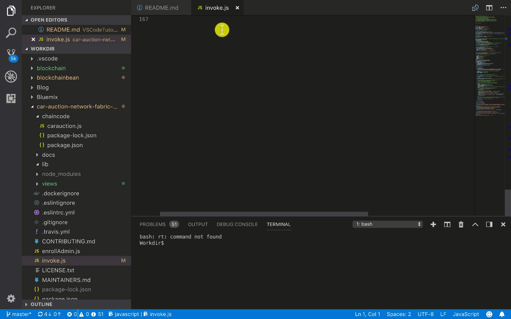

The first thing you need to do is to install the IBM Blockchain Platform VSCode extension. To do this, you 
need to install the latest version of VSCode; to see if you have the latest 
VSCode extension, go to
`Code` > `Check for Updates`. If VSCode crashes at this point (which it did for me), it likely
means you don't have the latest version. If your VSCode crashes, check the troubleshooting section below. Otherwise, update your VSCode, and once you're done, click on `extensions` in the 
sidebar on the left side of your screen. At the top, search the extension marketplace for 
`IBM Blockchain Platform`. Click `Install` and then click `reload`. Now you should be all set to use the extension!

### Step 2. Create a new smart contract project

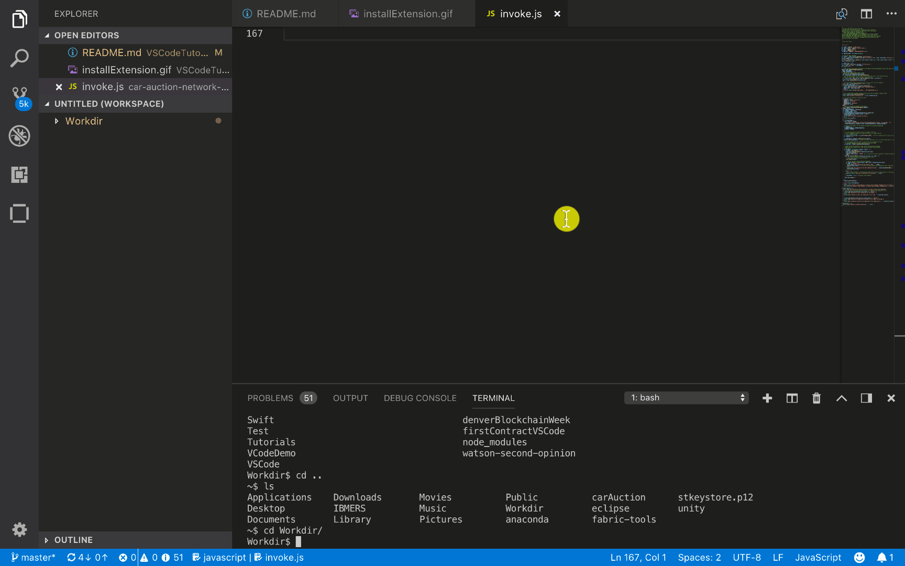

To create a smart contract project: 

1. Click on your newly downloaded IBM Blockchain Platform extension. It should be the extension
all the way at the bottom of the left sidebar.
2. Next, use the keyboard shortcut `Shift` + `CMD` + `P` to 
bring up the command pallete. Choose **IBM Blockchain Platform: Create Smart Contract Project** from the dropdown.
3. Click **JavaScript** from the dropdown. 
4. Click **New Folder**, and name the project what you want. I named mine `demoContract`.
5. Click **Create** and then **Open** your new folder which you just created. Next, from the dropdown, click **Add to Workspace**.
6. Once the extension is done packaging your contract, you can open the `lib/my-contract.js` file to see your smart 
contract code scaffold. Nice job!

### Step 3. Modify the smart contract 


Inside your `lib/my-contract.js` file, go ahead and copy 
and paste this code: 

```javascript
'use strict';

const { Contract } = require('fabric-contract-api');

class MyContract extends Contract {

  //update ledger with a greeting to show that the function was called
  async instantiate(ctx) {
    let greeting = { text: 'Instantiate was called!' };
    await ctx.stub.putState('GREETING', Buffer.from(JSON.stringify(greeting)));
  }

  //take argument and create a greeting object to be updated to the ledger
  async transaction1(ctx, arg1) {
    console.info('transaction1', arg1);
    let greeting = { text: arg1 };
    await ctx.stub.putState('GREETING', Buffer.from(JSON.stringify(greeting)));
    return JSON.stringify(greeting);
  }

}

module.exports = MyContract;
```

**Note:** The .gifs may not *exactly* match the above smart contract, but this is the one 
you should have in your `lib/my-contract.js` file now!

Let's examine the functions you just defined. The `instantiate` function creates a greeting 
object and then stores that on the ledger with the key `GREETING`. 
The `transaction1` function takes the Hyperledger
Fabric context and one argument, `arg1`, which is used to store a greeting as defined by the user.
The `ctx.stub.putState` method is used to record the `greeting` on the ledger and then you 
return that object back. Save the file and proceed!

### Step 4. Package the smart contract

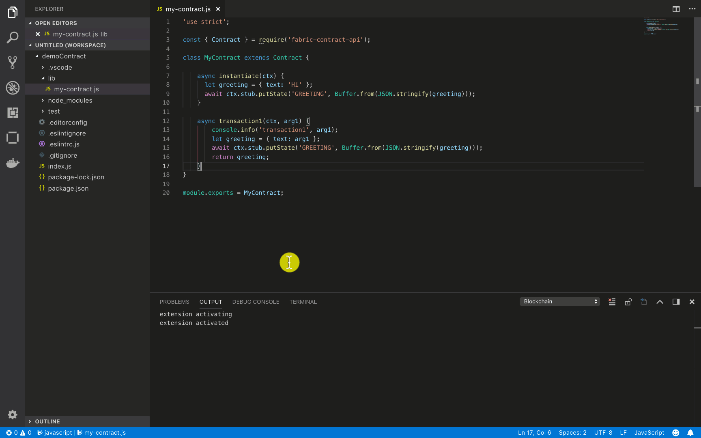

Now that you have created your smart contract and understand which functions you've defined,
it's time to package it so you can install it on a peer.

1. Open the command pallete with `Shift` + `CMD` + `P` and select **package smart contract**.
2. In the left sidebar, click on the IBM Blockchain Platform icon (it looks like a square). 
In the top-left corner, you will see all of your smart contract packages. You should 
see `demoContract@0.0.1` if everything went well. 

### Step 5. Install the smart contract

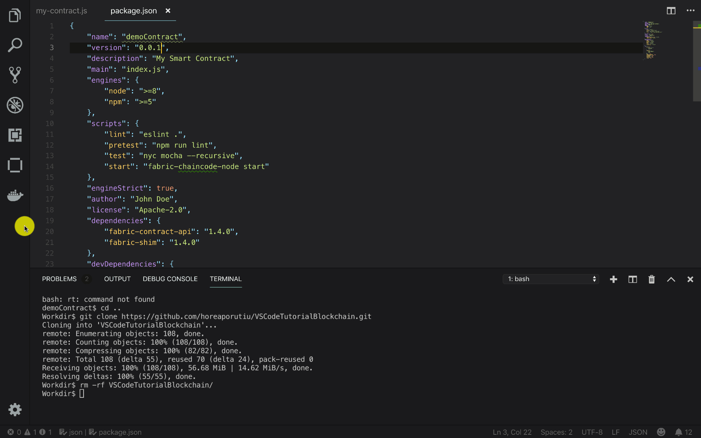

Ok, you're more than halfway there. Now for the fun part! Let's install this contract on the peer!
To do this, you must first connect to a Hyperledger Fabric network. The network that comes with
the VSCode extension is perfect for development -- it offers the minimal resources to develop and 
test your contract.

The following Docker containers are started on your local machine, each with a different role in
the network: Orderer, Certificate Authority, CouchDB, and Peer. 

To start your network, click on your IBM Blockchain Platform extension, to the left side of your editor. It's
the icon that looks like a square.

1. Once you click on the extension, you should see **LOCAL FABRIC OPS** on the left side of the editor. To the 
right of **LOCAL FABRIC OPS** you should see a three-dot symbol. Click that, and then click on **Start Fabric Runtime**.
   
   Your extension will now provision Docker containers that will act as nodes in your network. Once the 
provisioning is finished, you should see a **Smart Contracts** section under **LOCAL FABRIC OPS**.
   
2. Under **Smart Contracts** click on **+ Install**.

3. Next, the extension will ask you which peer to install the smart contract on. Choose **peer0.org1.examplee.com** 

4. The extension will ask you which package to install: Choose `demoContract@0.0.1`. If all goes well, you 
should see a notification in the bottom right corner - **Successfully installed on peer peer0.org1.example.com**
That's it! Nice job!

### Step 6. Instantiate the smart contract

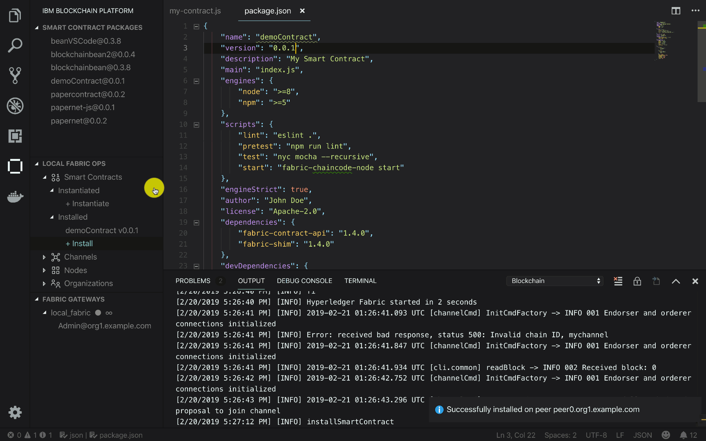

This is the real test -- will your smart contract instantiate properly? Let's find out...

1. Under **Smart Contracts** you will see a section that says **Instantiated**. Click on 
**+ Instantiate**.
2. The extension will then ask you which channel to instantiate the smart contract on - choose **mychannel**.
2. The extension will then ask you which contract and version to instantiate -- choose `demoContract@0.0.1`.
3. The extension will then ask you which function to call -- type in **instantiate**
4. Next, it will ask you for the arguments. There are none, so just hit enter.

The extension will do some work, and then in the bottom-right corner you should see that the contract
was successfully instantiated. Hooray!!

### Step 7. Export connection details
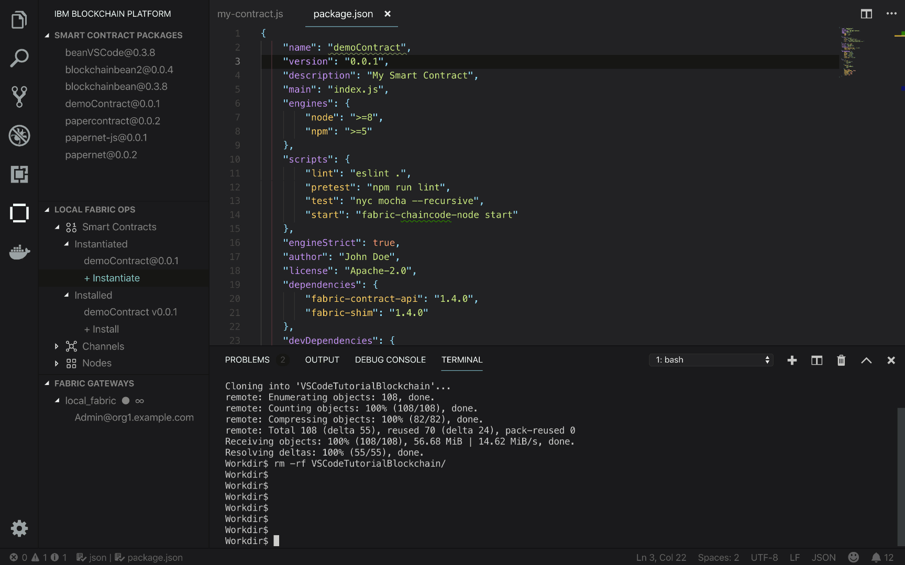

At this point, you need to start interacting a bit more closely with your
Fabric instance. You'll need to prove to the certificate authority that you are allowed
to create a digital identity on the network. This is done by showing the certificate
authority your certificate and private key.

1. Later in the tutorial, we will query the network. To do this we will need some scripts. Clone this
Github Repo outside of your smart contract directory to get the necessary scripts required to query the network. 
  
  ```
  $ git clone https://github.com/horeaporutiu/VSCodeTutorialBlockchain.git
  ```

2. Import this folder into your VSCode workspace by right-clicking an empty space
under your smart contract directory in VSCode and selecting **Add folder to workspace**. 
Find the recently cloned folder `VSCodeTutorialBlockchain` and double-click it.

3. In VSCode, click on the **IBM Blockchain Platform** extension in the left sidebar.

4. Under **LOCAL FABRIC OPS** click on  **Nodes**. Right-click on the **peer0.org1.example.com** node.
Select **Export Connection Details**.

5. The extension will ask which folder to save the connection profile to. Choose the 
**VSCodeTutorialBlockchain directory**. 

6. If all goes well, you should see something like: 
  
  ```
  Successfully exported connection details to 
  /Users/Horea.Porutiu@ibm.com/Workdir/VSCodeTutorialBlockchain/local_fabric
  ```

### Step 8. Submit transactions 
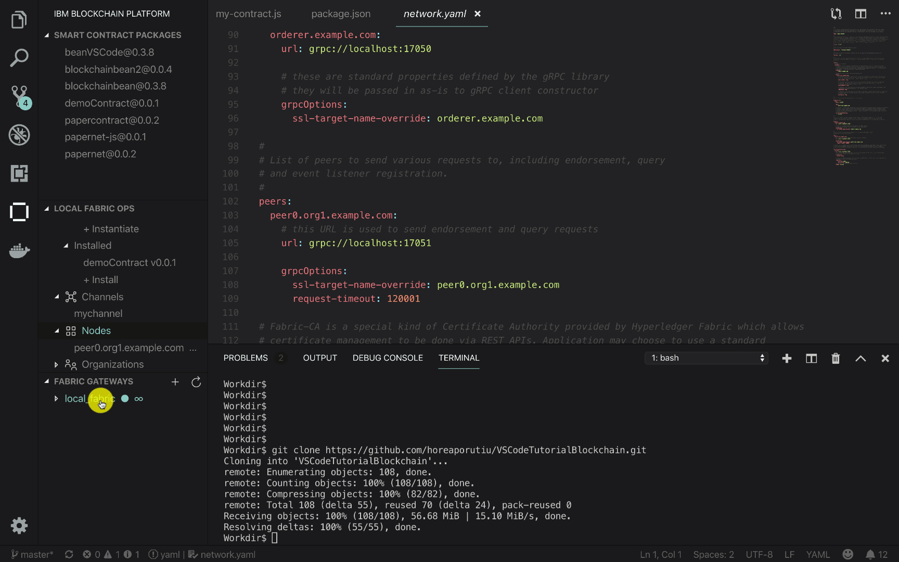

Ok, so you've instantiated your contract, exported our keys to our wallet -- so now what?
Well, now it's time to actually invoke the functions in your smart contract! To do this, 
you can use the VSCode extension. 

1. Under **LOCAL FABRIC OPS** you should see **FABRIC GATEWAYS**. 

2. Click on **local_fabric** and then on **Admin@org1.example.com**

3. If all goes well, you should see a notification that says **Connecting to local_fabric**.

4. Next, under **FABRIC GATEWAYS** and **Channels** you should see my **mychannel**. Click to expand it. Then expand 
**demoContract@0.0.1**. You should see two functions, **instantiate** and **transaction1**.

4. Right click on **transaction1** and then select `submit transaction`. For the arguments,
enter in 'hello'. 

Nice job! You've just successfully submitted a transaction to your Fabric network, and have updated the ledger!

### Step 9. Update the smart contract
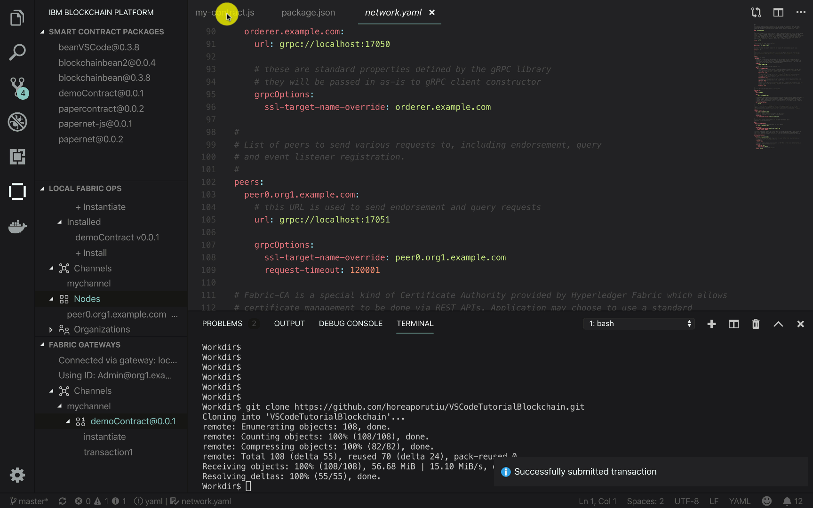
In the previous step, you updated the ledger by using the `putState` API, passing in a key and a value.
The key happened to be "GREETING" and the value happened to be the object.

```
{
  text: 'hello'
}
```

The last thing you should learn is how to query -- how to retrieve data from the ledger. You will do this
by using the `getState` API, which takes in a key and returns the value associated with that key, if it finds it.

Let's add a query function to our `demoContract`.

1. Copy and paste the following code into your `lib/my-contract.js` file:
  
  ```javascript
  'use strict';
  
  const { Contract } = require('fabric-contract-api');
  
  class MyContract extends Contract {
  
    //update ledger with a greeting 
    async instantiate(ctx) {
      let greeting = { text: 'Instantiate was called!' };
      await ctx.stub.putState('GREETING', Buffer.from(JSON.stringify(greeting)));
    }
  
    //add a member along with their email, name, address, and number
    async addMember(ctx, email, name, address, phoneNumber) {
      let member = {
        name: name,
        address: address,
        number: phoneNumber,
        email: email
      };
      await ctx.stub.putState(email, Buffer.from(JSON.stringify(member)));
      return JSON.stringify(member);
    }
  
    // look up data by key
    async query(ctx, key) {
      console.info('querying for key: ' + key  );
      let returnAsBytes = await ctx.stub.getState(key);
      let result = JSON.parse(returnAsBytes);
      return JSON.stringify(result);
    }
  
  }
  
  module.exports = MyContract;
  ```
  
  The code adds an `addMember` function which takes in arguments from the user such as email, name, address, and phone number, and saves that data on the ledger as a key-value pair. 
  
  This code also adds a `query` function; this function takes in one argument, which is the key to look up. The function returns the value associated with a given key, if there is any.
  
2. Update the `package.json` file such that line 3, which contains the version number, now reads:
  
  ```
    "version": "0.0.2",
  ```
   
   Save the file.
   
3. To upgrade your existing smart contract to the new version, under **LOCAL FABRIC OPS**  
expand **Instantiated** until you see **demoContract@0.0.1**. Next,
right-click on `demoContract` and choose **Upgrade Smart Contract**.

4. the extension will ask which version to perform an upgrade with. Choose **demoContract**.

5. The extension will ask which peer to install the smart contract on, choose **peer0.org1.example.com**

6. The extension will ask which function to call. Type in **instantiate**.

7. The extension will ask which arguments to pass. Leave this blank, and hit **enter**.
After some heavy computation (and a little bit of time), if all goes
well, you should get a notification in the bottom-right corner saying **Successfully upgraded smart contract**.

### Step 10. Submit more transactions 
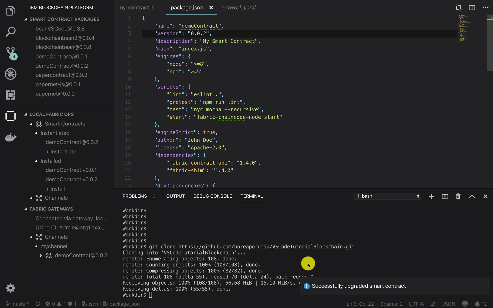

Now that you've updated your smart contract, look under **FABRIC GATEWAYS** and expand **Channels**. 
Next, expand **mychannel** and you should see **demoContract@0.0.2**

1. Next, expand **demoContract@0.0.2** to view the functions you have updated the smart contract **my-contract.js** with, namely `instantiate`, `addMember`, and `query`.

2. Right-click on **addMember** and click **Submit Transaction**. For the arguments, copy and paste the following:
  
  ```
  ginny@ibm.com, Ginny Rometty, Wall Street NY, 1234567890
  ```
  
  In the output, you should see the following:
  
  ```
  Submitting transaction addMember with args Ginny Rometty, Wall Street NY, 1234567890, ginny@ibm.com
  ```
  
  Let's add one more member, so repeat this step, but for the arguments copy and paste the following: 
  
  ```
  arvind@ibm.com, Arvind Krishna, Broadway Street NY, 1231231111
  ```
  
  Nice job. We're almost done now!


### Step 11. Query the ledger

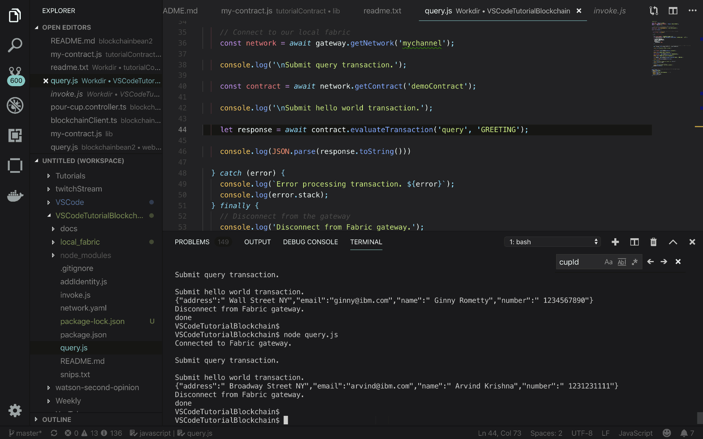
  
And now for the moment you've all been waiting for...let's actually see what is written to the ledger! To do this,
we will use the **query.js** file from our **VSCodeTutorialBlockchain** folder. 

1. Take a look at the `query.js` file from the `VSCodeTutorialBlockchain` directory. It's very similar to the `invoke.js` file, except it one major difference:
  
  ```javascript
  let response = await contract.evaluateTransaction('query', 'GREETING');
  ```
  
  The main difference is that in this file, you will use the **evaluateTransaction** API, which **does not send the 
transactions to  the ordering service** -- hence, it will not update the ledger. This is very important. In the **invoke.js** file, you submit transactions to the ordering service, which will all get **written to the ledger**, but here in the **query.js** file, you will not update the ledger.
  
2. Use your terminal in VSCode to naviagate to the **VSCodeTutorialBlockchain** folder. From there, install the 
required dependencies by using the following command:
  
  ```
  VSCodeTutorialBlockchain$ npm install
  ```
  
3. Next, run **query.js** with the following command:
  
  ```javascript
  VSCodeTutorialBlockchain$ node query.js
  ```
  
  You should get the following output: 
  
  ```javascript
  Connected to Fabric gateway.
  { text: 'Instantiate was called!' }
  Disconnect from Fabric gateway.
  done
  ```
  
4. Next, query for Ginny Rometty. Change the following line:
  
  ```javascript
  let response = await contract.evaluateTransaction('query', 'GREETING');
  ```
  
  to this:
  
  ```javascript
  let response = await contract.evaluateTransaction('query', 'ginny@ibm.com');
  ```
  
  Your output should be as follows: 
  
  ```javascript
  VSCodeTutorialBlockchain$ node query.js
  Connected to Fabric gateway.
  {"address":" Wall Street NY","email":"ginny@ibm.com","name":" Ginny Rometty","number":" 1234567890"}
  Disconnect from Fabric gateway.
  done
  ```

5. Lastly, query for Arvind. Modify the request to be as follows:
  
  ```javascript
  let response = await contract.evaluateTransaction('query', 'arvind@ibm.com');
  ```
  
  The output should be similar to the one above, except with Arvind's data.

### Step 12. Test the contract


Testing functionality is a feature of the IBM Blockchain extension, and can be done 
through the UI. Click on the IBM Blockchain Platform extension icon, on the left-hand side.

1. Under **FABRIC GATEWAYS** and under **Channels** expand **mychannel**, and 
right-click on your latest smart contract `demoContract@0.0.2` and then select
**Generate Smart Contract Tests**.

2. The extension will ask you which language to generate the test files in. Choose **JavaScript**.

3. Once the extension is done generating the tests, you can run npm test from the **demoContract** 
directory, or you can click on the **run test** button from the VSCode UI from the 
**MyContract-demoContract@0.0.2.test.js** file, as shown in the gif.

## Summary

Nice work! You learned how to create, package, install, instantiate, 
and invoke a smart contract using Hyperledger's newest APIs. At this point, 
you can focus on developing your smart contract and updating your `my-contract.js`
file knowing that you have taken care of the networking aspects of blockchain.
You can also successfully invoke and update your ledger using just VSCode,
Node.js, and Docker. Please, please, please reach out to me if there are bugs --
comment on this post and I will fix them. Thanks so much for 
reading this tutorial. I hope you enjoyed it! Horea Blockchain out!