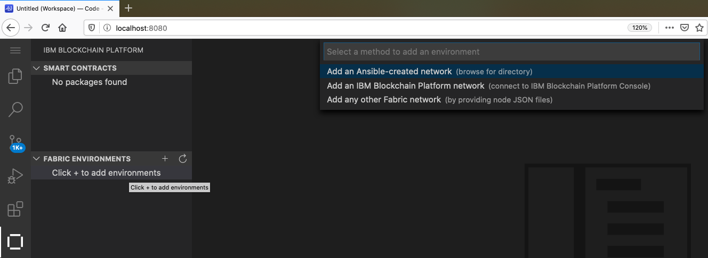
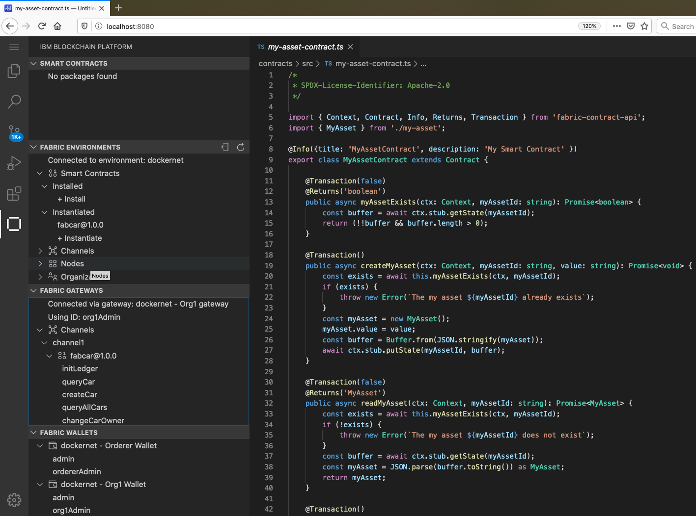

# IBM Blockchain Platform development environment for Docker

:warning: :warning: :warning:

**This directory contains sample code that is not a part of the IBM Blockchain Platform offering from IBM. This sample code may be updated or removed at any time. No official support for this sample code is provided by IBM, and any IBM support tickets regarding this sample code will be closed.**

**If you do find an issue with this sample code, please raise it as an issue against this GitHub repository. We would also welcome any feedback that you may have on this sample code.**

:warning: :warning: :warning:

The IBM Blockchain Platform extension for Visual Studio Code helps developers to create, test and debug smart contracts, connect to Hyperledger Fabric environments, and build applications that transact on your blockchain network.

This directory contains a sample Dockerfile and build scripts that can be used to build a Docker image containing Visual Studio Code and the IBM Blockchain Platform extension, along with all of the required software for developing smart contracts in Go, Java, JavaScript, and TypeScript.

When using this Docker image, Visual Studio Code and the IBM Blockchain Platform extension can be accessed from any web browser.

This Docker image makes use of the [code-server](https://github.com/cdr/code-server) project developed by [Coder](https://coder.com/).

## Building the Docker image

### Requirements

In order to build this Docker image, you must have the following software installed:

- Node.js 10.16+
  - https://nodejs.org/en/download/
- Docker 19.03+
- `jq`
  - https://stedolan.github.io/jq/download/

### Steps

First, clone this repository from GitHub:

    git clone https://github.com/IBM-Blockchain/blockchain-vscode-extension.git

Then, change into the cloned repository:

    cd blockchain-vscode-extension

Then, run the build script for this Docker image:

    bash docker/build.sh

Then, tag the Docker image appropriately for your username or organization, for example:

    docker tag ibmblockchain/vscode:latest fredbloggs/ibmblockchain-vscode:latest

Finally, if you wish to run this Docker image elsewhere, for example in Kubernetes, or on the cloud, push the Docker image to your Docker container registry (for example, Docker Hub):

    docker push fredbloggs/ibmblockchain-vscode:latest

## Running the Docker image

First, ensure that you have built the Docker image following the above steps. No publicly available Docker image is available from any Docker container registries.

Next, run the Docker image by using the following command:

    docker run -d --name vscode -p 8080:8080 -v /path/to/storage:/home/vscode fredbloggs/ibmblockchain-vscode:latest

Note: you will need to update this command for your local machine to reflect port availability and storage locations.

Finally, you can access Visual Studio Code from a web browser using the following URL: http://localhost:8080

## Using with Ansible networks

The `vscode` container will work with Hyperledger Fabric networks built using
the `ibm-blockchain-platform-manager` [Ansible
role](https://github.com/IBM-Blockchain/ansible-role-blockchain-platform-manager).
This includes both local Fabric Docker networks and remote Fabric networks.

### Using with local Fabric Docker networks

A playbook using the `ibm-blockchain-platform-manager` role can be configured to
generate a local Fabric network comprising:

 - A set of Fabric components hosted in local Docker containers
 - A set of node, gateway and wallet information to enable connectivity to these
   containers

The `vscode` container can interact with this Fabric network using Docker
networking.

To generate node and gateway information compatible with docker networking, a
playbook can be configured with the variable
`infrastructure.docker.use_internal_hostname`. This information can then be
imported into the `vscode` container to allow it to interact with the generated
local Fabric network.

### A local Fabric Docker network example

Let's build a sample Ansible
[network](https://github.com/IBM-Blockchain/ansible-examples/tree/master/one-org-network)
and connect it to the `vscode` container. You will find it easier to perform
Ansible-related commands in a separate window.

In the `one-org-network`
[playbook](https://github.com/IBM-Blockchain/ansible-examples/blob/master/one-org-network/playbook.yml), set the variable as follows:

    # one-org-network playbook
    ...
    infrastructure:
      type: docker
      docker:
        network: ibp_network
        use_internal_hostname: true
    ...

Note how the `docker.network` variable identifies the `ibp_network` Docker
network that will be generated.

Then run the playbook as usual:

    ansible-playbook playbook.yml

The Ansible output is generated in the `gateways`, `nodes` and `wallets`
directories. Copy these directories to the `vscode` container storage location:

    cp -R ../one-org-network/ /path/to/storage

Now connect the `vscode` container to the generated Docker network:

    docker network connect ibp_network vscode

Return to the blockchain sidebar in VS Code and add a new `FABRIC ENVIRONMENT`:

Select `Add an Ansible-create network` from the available options. Subsequently,
select the copied `one-org-network` directory containing the `gateways`, `nodes`
and `wallet` sub folders. Click on `OK` to select a name for the Fabric
environment, for example `dockernet`.

The information in these folders populates the `FABRIC ENVIRONMENTS`, `FABRIC
GATEWAYS` and `FABRIC WALLETS` views:

You can now interact as usual with this network.