In the last tutorial we packaged and deployed our smart contract on a local Hyperledger Fabric network. In this tutorial we will:

* Learn about identities, wallets and gateways
* Exercise a smart contract directly from VS Code
* Understand the difference between evaluating and submitting transactions

In order to successfully complete this tutorial, you must have first completed tutorial <a href='./a3.md'>A3: Deploying a smart contract</a> in the active VS Code workspace.

</img> &nbsp;&nbsp;&nbsp;&nbsp; `A4.1`: &nbsp;&nbsp;&nbsp;&nbsp;
Expand the first section below to get started.


---
<details>
<summary><b>Connect to the Hyperledger Fabric gateway</b></summary>


In order to submit transactions in Hyperledger Fabric you will need an identity, a wallet and a gateway.

<br><h3 align='left'>Identities, wallets and gateways</h3>

The resources that you can access in a Hyperledger Fabric network are determined according to your identity; that's why its called a permissioned blockchain. Your identity is typically represented by an X.509 certificate issued by your organization, and stored in your wallet. Once you have an identity and a wallet, you can create a gateway that allows you to submit transactions to a network.

A gateway represents a connection to a set of Hyperledger Fabric networks. If you want to submit a transaction, whether using VS Code or your own application, a gateway makes it easy to interact with a network: you configure a gateway, connect to it with an identity from your wallet, choose a particular network, and start submitting transactions using a smart contract that has been deployed in that network.

A gateway is configured using a connection profile, which identifies a single peer in the network as an initial connection point. We're going to use a pre-configured gateway that was created when we started the one organization network.

> <br>
   > <b>Want to know more about gateways?</b> <a href="https://hyperledger-fabric.readthedocs.io/en/latest/developapps/gateway.html">Read about them in the Hyperledger Fabric documentation.</a>
   > <br>&nbsp;

Take care to understand the difference between **Fabric Environments** and **Fabric Gateways**: an *environment* gives an overview of all the resources available to you in a Hyperledger Fabric network; a *gateway* provides an access point to those resources.

<br><h3 align='left'>Gateways and Wallets in VS Code</h3>

When the one organization network was created in the previous tutorial, a gateway was created for you at the same time; this is now shown in the Fabric Gateways view. This view allows you to add new gateways to submit transactions to both local and remote Hyperledger Fabric networks. 

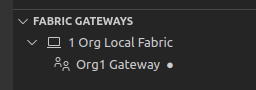</img>

Furthermore, an *Org1* wallet with an identity *Org1 Admin* has been created in the Fabric Wallets view.

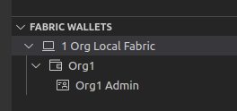</img>

The Org1 Admin identity will be used in this tutorial to submit and evaluate transactions through the smart contract.  In production and in more complex testing scenarios other non-admin identities would be used for the transactions.

<br><h3 align='left'>Connecting to the Fabric Gateway in VS Code</h3>

We will now connect to a gateway using the *Org1 Admin* identity.

</img> &nbsp;&nbsp;&nbsp;&nbsp; `A4.2`: &nbsp;&nbsp;&nbsp;&nbsp;
In the Fabric Gateways view, click "Org1 Gateway".

If you can't see this view, remember to first click the IBM Blockchain Platform icon in the activity bar.

</img>

There is only 1 identity in the Org1 wallet, so the IBM Blockchain Platform VS Code extension will use that identity automatically and connect to the local Hyperledger Fabric gateway; this will only take a few seconds to complete.

Once connected, notice that the view changes to reflect the channels available to the connected gateway. 

</img> &nbsp;&nbsp;&nbsp;&nbsp; `A4.3`: &nbsp;&nbsp;&nbsp;&nbsp;
Review the channels.

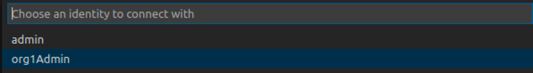</img>

The connected gateway shows the list of channels on the network, in this case just the single *mychannel*.

</img> &nbsp;&nbsp;&nbsp;&nbsp; `A4.4`: &nbsp;&nbsp;&nbsp;&nbsp;
Fully expand the Channels tree in the Fabric Gateways view to show the available transactions.

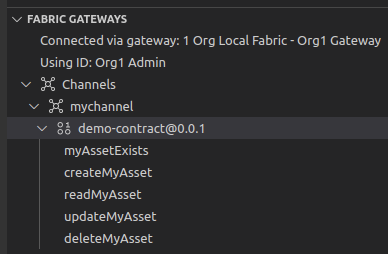</img>

The expanded tree shows the *demo-contract* smart contract that was deployed (including its version), and the five transaction methods that are available to applications.

</img> &nbsp;&nbsp;&nbsp;&nbsp; `A4.5`: &nbsp;&nbsp;&nbsp;&nbsp;
Expand the next section of the tutorial to continue.

</details>

---
<details>
<summary><b>Invoke transactions using the gateway</b></summary>

We will now exercise your smart contract. Hyperledger Fabric can generate two different kinds of transactions:

* *Submitted* transactions are recorded on the blockchain ledger.  These are used when you want to update the current value of the ledger. Submitted transactions go through the full consensus process before they are recorded on the ledger. It is possible to submit read-only ledger transactions, but it's less common.

* *Evaluated* transactions are not recorded on the blockchain ledger. These transactions are typically used when you want to simply query the current value of the ledger. Evaluated transactions do not go through the consensus process; they are run on a single peer, and the result is returned to the caller. It is possible to evaluate read-write transactions, but it's less common. 


The VS Code extension allows you to both submit and evaluate transactions. 

We will start by evaluating the transaction 'myAssetExists'.

</img> &nbsp;&nbsp;&nbsp;&nbsp; `A4.6`: &nbsp;&nbsp;&nbsp;&nbsp;
Click 'myAssetExists' which will open the Transaction View.

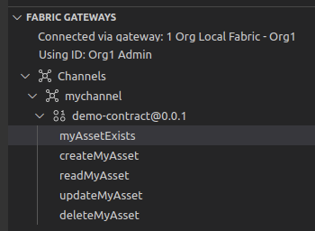</img>


</img> &nbsp;&nbsp;&nbsp;&nbsp; `A4.7`: &nbsp;&nbsp;&nbsp;&nbsp;
The Transaction View allows the transaction to be prepared before being submitted or evaluated.

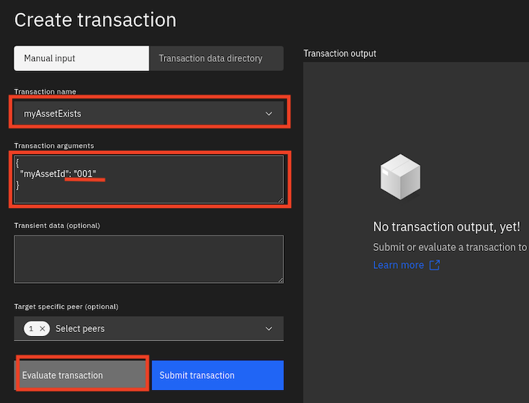</img>

On the Transaction View, the *Transaction name* can be selected from the dropdown list and the *Transaction arguments* supplied. Transient data is an advanced feature that we will cover in a later tutorial and can be ignored. We have only 1 peer in the local fabric so target specific peer can be ignored too. 

Ensure that *myAssetExists* is selected as the Transaction name, specify `"001"` for myAssetId in the JSON object pair.

Now click *Evaluate transaction*

The demo-contract smart contract will now run on the peer to generate a myAssetExists transaction response using the transaction input "001". As you will recall from the smart contract code, the contract will return true if the business object with key "001" exists in the state database, or false otherwise.

The Transaction view will be used several times in this tutorial and if it is closed or hidden at any point, just click any of the transactions in the Fabric Gateways view to bring it back.

</img> &nbsp;&nbsp;&nbsp;&nbsp; `A4.8`: &nbsp;&nbsp;&nbsp;&nbsp;Review the output

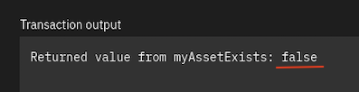</img>

When the method completes, the Transaction output field will show the results of the evaluation, and as expected the result is false.

The result of the transaction will also be shown in the output view at the bottom of the screen.

</img> &nbsp;&nbsp;&nbsp;&nbsp; `A4.9`: &nbsp;&nbsp;&nbsp;&nbsp;
Move the mouse over the "Successfully evaluated transaction" notification to reveal the close icon, and click it to close it.

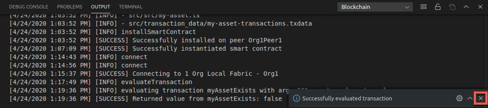</img>

We will now create the business object with key "001". This time, we will add a new transaction to the ledger, so we need to submit a transaction rather than evaluate one.

</img> &nbsp;&nbsp;&nbsp;&nbsp; `A4.10`: &nbsp;&nbsp;&nbsp;&nbsp;
On the Transaction view click on the dropdown for Transaction Name and select createMyAsset.

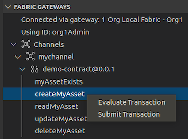</img>

As you may recall, the createMyAsset transaction takes two arguments: a key and its associated value.

</img> &nbsp;&nbsp;&nbsp;&nbsp; `A4.11`: &nbsp;&nbsp;&nbsp;&nbsp;
Replace the Transaction arguments with 
```
{
  "myAssetId": "001",
  "value": "Mona Lisa"
}
```
Take care with the syntax of the JSON argument pairs.

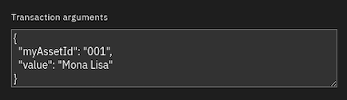</img>

</img> &nbsp;&nbsp;&nbsp;&nbsp; `A4.12`: &nbsp;&nbsp;&nbsp;&nbsp;
Check the Transaction name and the Transaction arguments, then click Submit transaction.

The Transaction output on the Transaction View will show that no value was returned, and the output log at the bottom of the screen shows that the transaction was successful.

</img>

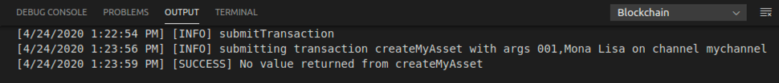</img>

</img> &nbsp;&nbsp;&nbsp;&nbsp; `A4.13`: &nbsp;&nbsp;&nbsp;&nbsp;
Still on the Transaction view, select "myAssetExists" as the Transaction name, specify `"001"` for myAssetId in the JSON arguments and click Evaluate transaction.

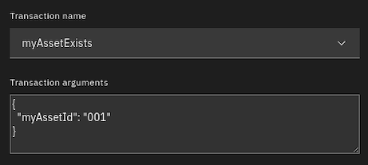</img>

The returned value seen in the Transaction output is now 'true'.

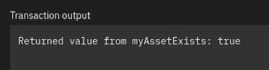</img>

</img> &nbsp;&nbsp;&nbsp;&nbsp; `A4.14`: &nbsp;&nbsp;&nbsp;&nbsp;
Submit the "updateMyAsset" transaction to change the value of the "001" key to "The Hay Wain". The JSON Transaction arguments will be:
```
{
  "myAssetId": "001",
  "value": "The Hay Wain"
}
```

No value will be returned from the transaction.
 
</img> &nbsp;&nbsp;&nbsp;&nbsp; `A4.15`: &nbsp;&nbsp;&nbsp;&nbsp;
Evaluate the "readMyAsset" transaction to return the updated asset. Specify `"001"` for myAssetId.

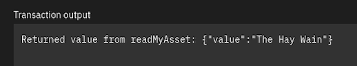</img>

</img> &nbsp;&nbsp;&nbsp;&nbsp; `A4.16`: &nbsp;&nbsp;&nbsp;&nbsp;
Finally, submit the "deleteMyAsset" transaction to delete the "001" asset from the world state.

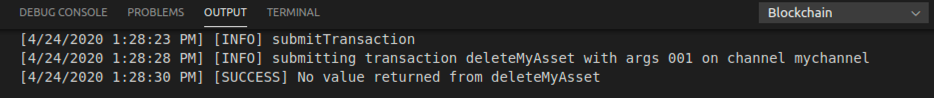</img>

Note carefully this last transaction! We have added a delete transaction to the blockchain, which has resulted in an empty state database for key "001".  It is perfectly possible to delete assets from the world state, but submitted transactions are always added to the ledger. The blockchain records the changes that have happened to the world state database, which can include deleting records as well as adding and modifying them.

<br><h3 align='left'>Summary</h3>

In this tutorial we have used identities, wallets and gateways to submit and evaluate smart contract transactions using the local default Hyperledger Fabric network provided with VS Code. 

In the next tutorial we will build and use a standalone application to transact with the blockchain.


</details>
