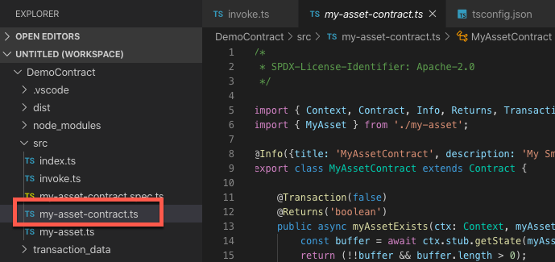
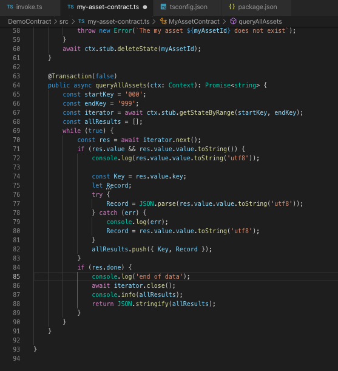
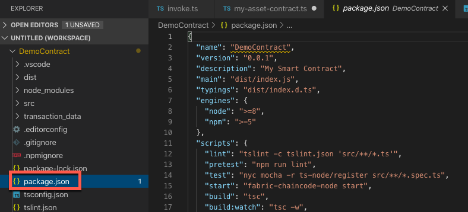
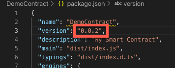
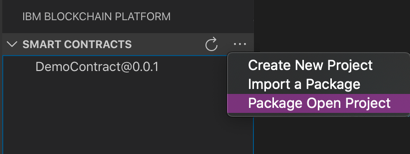
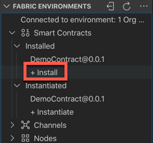
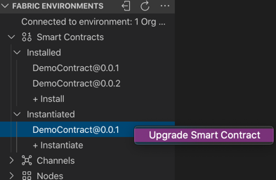

**IBM Blockchain Platform**

<h3 align='left'>← <a href='./a5.md'><b>A5: Invoking a smart contract from an external application</b></a>


## **Tutorial A6: Upgrading a smart contract**

---

Estimated time: `20 minutes`

 > <br>
   > <b>Note:</b> This tutorial in based on Hyperledger Fabric v1.x. There is a new chaincode lifecycle feature in v2 that improves the upgrade process. Check out the <a href="https://hyperledger-fabric.readthedocs.io/en/release-2.0/chaincode.html">Hyperledger Fabric v2.0 chaincode documentation</a> for details.
   > <br>&nbsp;

In the last tutorial we built and tested a Typescript application that interacted with our Hyperledger Fabric network. In this tutorial we will:

* Make a change to our smart contract
* Package, install and instantiate the new smart contract
* Try out the new smart contract

In order to successfully complete this tutorial, you must have first completed tutorial <a href='./a5.md'>A5: Invoking a smart contract from an external application</a> in the active workspace.

 &nbsp;&nbsp;&nbsp;&nbsp; `A6.1`: &nbsp;&nbsp;&nbsp;&nbsp;
Expand the first section below to get started.


---
<details>
<summary><b>Modify the smart contract</b></summary>

 &nbsp;&nbsp;&nbsp;&nbsp; `A6.2`: &nbsp;&nbsp;&nbsp;&nbsp;
Focus the VS Code editor on the *my-asset-contract.ts* file.

You should be able to switch directly to this tab as it should still be loaded from earlier tutorials. If it is not, use the Explorer sidebar to navigate to my-asset-contract.ts in the src folder of the DemoContract project.



We're going to add a new transaction to our smart contract which will return all of the available assets between '000' and '999'.

 &nbsp;&nbsp;&nbsp;&nbsp; `A6.3`: &nbsp;&nbsp;&nbsp;&nbsp;
Using copy and paste, insert the following method after the closing brace of the updateMyAsset method, but before the final closing brace of the whole file:

```typescript
    @Transaction(false)
    public async queryAllAssets(ctx: Context): Promise<string> {
        const startKey = '000';
        const endKey = '999';
        const iterator = await ctx.stub.getStateByRange(startKey, endKey);
        const allResults = [];
        while (true) {
            const res = await iterator.next();
            if (res.value && res.value.value.toString()) {
                console.log(res.value.value.toString('utf8'));

                const Key = res.value.key;
                let Record;
                try {
                    Record = JSON.parse(res.value.value.toString('utf8'));
                } catch (err) {
                    console.log(err);
                    Record = res.value.value.toString('utf8');
                }
                allResults.push({ Key, Record });
            }
            if (res.done) {
                console.log('end of data');
                await iterator.close();
                console.info(allResults);
                return JSON.stringify(allResults);
            }
        }
    }
```

You can also get the source for this method from <a href='./resources/queryAllAssets.txt'>here</a>.

Your source file should now look similar to this:



 &nbsp;&nbsp;&nbsp;&nbsp; `A6.4`: &nbsp;&nbsp;&nbsp;&nbsp;
Save the updated file ('File' -> 'Save').

There should be no compilation errors.

Before we can package our new smart contract we need to update its version number. In a development environment for production systems an automated process would typically do this for us, but here we will update the necessary file manually.

 &nbsp;&nbsp;&nbsp;&nbsp; `A6.4`: &nbsp;&nbsp;&nbsp;&nbsp;
Switch to the editor for the DemoContract *package.json* file.

Again, this should be already loaded from earlier tutorials. If not, use the Explorer sidebar to navigate to package.json in the root of the DemoContract project.

Take care to load the *DemoContract* copy of the file; you will recall that we created another package.json for DemoApplication.



 &nbsp;&nbsp;&nbsp;&nbsp; `A6.5`: &nbsp;&nbsp;&nbsp;&nbsp;
Edit the value of the version tag to `"0.0.2"`.



 &nbsp;&nbsp;&nbsp;&nbsp; `A6.6`: &nbsp;&nbsp;&nbsp;&nbsp;
Save the changes ('File' -> 'Save').

In the next section we will deploy the new smart contract to our peer.

 &nbsp;&nbsp;&nbsp;&nbsp; `A6.7`: &nbsp;&nbsp;&nbsp;&nbsp;
Expand the next section of the tutorial to continue.

</details>

---

<details>
<summary><b>Deploy the upgraded smart contract</b></summary>

In this section we will *package* the smart contract as a deployable container, *install* the package on the peer then  *instantiate* it (or rather, because the earlier version already exists, *upgrade* it).

You will recall from tutorial <a href="./a3.md">A3: Deploying a smart contract</a> that you can do these three actions in a single 'instantiate' action when using the IBM Blockchain Platform VS Code extension. This time however we will do the steps individually, which gives us greater flexibility over the process.

<br><h3 align='left'>Package the smart contract</h3>

 &nbsp;&nbsp;&nbsp;&nbsp; `A6.8`: &nbsp;&nbsp;&nbsp;&nbsp;
Click the IBM Blockchain Platform sidebar icon to show the IBM Blockchain Platform sidebar.

 &nbsp;&nbsp;&nbsp;&nbsp; `A6.9`: &nbsp;&nbsp;&nbsp;&nbsp;
Hover the mouse over the Smart Contracts view, click '...' and select 'Package Open Project'.



 &nbsp;&nbsp;&nbsp;&nbsp; `A6.10`: &nbsp;&nbsp;&nbsp;&nbsp;
Select 'DemoContract'.


After a brief pause while the packaging completes, the newer version of DemoContract will be shown in the Smart Contracts view underneath the older one:


<br><h3 align='left'>Install the smart contract</h3>

Installation of the smart contract needs to take place on every peer that will use it to endorse transactions. Endorsement is the process of signing an assertion to the rest of the network of the output of the transaction: what was read and written in the world state, for example.

In our network, there is only one peer and so this is largely immaterial; that peer needs to have an installed copy of the smart contract.

 &nbsp;&nbsp;&nbsp;&nbsp; `A6.11`: &nbsp;&nbsp;&nbsp;&nbsp;
In the Fabric Environments view, click *'+ Install'* in the 'Smart Contracts' -> 'Installed' section.

The local Fabric environment needs to be running in order to do this. If it is stopped for any reason, you will need to first click the '1 Org Local Fabric' environment in the Fabric Environments view to start it.



 &nbsp;&nbsp;&nbsp;&nbsp; `A6.12`: &nbsp;&nbsp;&nbsp;&nbsp;
Select 'DemoContract@0.0.2'.


After a brief pause, you will see DemoContract@0.0.2 appear underneath the Installed list in the Fabric Environments view.


<br><h3 align='left'>Upgrade the smart contract</h3>

As you can see from the Installed list, multiple versions of a smart contract can be installed at the same time. However, for a given smart contract only one version can be instantiated and running.

We now need to tell Hyperledger Fabric to use version 0.0.2 of the smart contract. This process is called *upgrading*, although it applies to any switch between versions; it is possible to upgrade from 0.0.2 back to 0.0.1, for example.

Unlike installation, upgrading (or instantiating) a smart contract only needs to be done once per network (channel). Again, this is immaterial for our network as we only have one peer anyway.

 &nbsp;&nbsp;&nbsp;&nbsp; `A6.13`: &nbsp;&nbsp;&nbsp;&nbsp;
In the Fabric Environments view, right-click the *instantiated* DemoContract@0.0.1 and select 'Upgrade Smart Contract'.

Take care not to click on one of the *installed* DemoContracts by mistake.



You now need to select which smart contract you want to replace it with.

 &nbsp;&nbsp;&nbsp;&nbsp; `A6.14`: &nbsp;&nbsp;&nbsp;&nbsp;
Select 'DemoContract@0.0.2 Installed'.


There are no reinitialization functions that we need to call in this smart contract.

 &nbsp;&nbsp;&nbsp;&nbsp; `A6.15`: &nbsp;&nbsp;&nbsp;&nbsp;
Press Enter to decline calling a function.


We are not using private data collections in this tutorial.

 &nbsp;&nbsp;&nbsp;&nbsp; `A6.16`: &nbsp;&nbsp;&nbsp;&nbsp;
Press Enter to decline to provide a private data collection configuration file.


 &nbsp;&nbsp;&nbsp;&nbsp; `A6.17`: &nbsp;&nbsp;&nbsp;&nbsp;
Click 'Default (single endorser, any org)' as the smart contract endorsement policy.


The smart contract will now be upgraded. This may take a minute to complete.

Once complete, you'll see that DemoContract@0.0.1 in the Instantiated section of the Fabric Environments view is replaced with DemoContract@0.0.2.


 &nbsp;&nbsp;&nbsp;&nbsp; `A6.18`: &nbsp;&nbsp;&nbsp;&nbsp;
Expand the next section of the tutorial to continue.

</details>

---

<details>
<summary><b>Try out the upgraded smart contract</b></summary>

Finally in this tutorial we will try out our new *queryAllAssets* transaction to make sure it works. We will do this using the Fabric Gateways view.

 &nbsp;&nbsp;&nbsp;&nbsp; `A6.19`: &nbsp;&nbsp;&nbsp;&nbsp;
In the connected Fabric Gateways view, expand 'Channels' -> 'mychannel' -> 'DemoContract@0.0.2'.

You will see the new *queryAllAssets* transaction listed among the others.


If you have completed all the previous steps in this set of tutorials, your blockchain world state will only contain one asset at this point ('002'), as we deleted asset '001' at the end of tutorial <a href='./a4.md'>A4: Invoking a smart contract from VS Code</a>.

Therefore, to prove that we can return multiple values from our new transaction, we will first create a new asset '003'.

 &nbsp;&nbsp;&nbsp;&nbsp; `A6.20`: &nbsp;&nbsp;&nbsp;&nbsp;
Right-click the *createMyAsset* transaction and select 'Submit Transaction'. Create an asset with the input parameters `["003","The Scream"]`. There is no transient data.

With the new asset created, we will now try out the queryAllAssets transaction. It is a read-only transaction and so we can invoke it using the *evaluate* option.


 &nbsp;&nbsp;&nbsp;&nbsp; `A6.21`: &nbsp;&nbsp;&nbsp;&nbsp;
Right-click the *queryAllAssets* transaction and select 'Evaluate Transaction'. Press Enter twice to select the defaults for both the input parameters (there are none) and transient data.

You will see the results of the transaction displayed in the Output view; particularly, records for asset '002' and '003'. (Close the "Successfully submitted transaction" notifications if the output is obscured.)


<br><h3 align='left'>Summary</h3>

In this tutorial we looked at the smart contract upgrade process in Hyperledger Fabric v1.x. We started by making a change to our existing smart contract, then we packaged it, installed it on our peer and upgraded the instantiated version of it. We then tried it out.

In the next tutorial we will look at some features in the IBM Blockchain Platform VS Code extension that facilitate the debugging of smart contracts.

</details>

---

<h3 align='right'> → <a href='./a7.md'><b>A7: Debugging a smart contract</b></h3></a>
