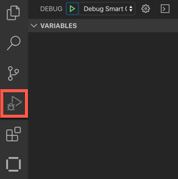

**IBM Blockchain Platform**

<h3 align='left'>← <a href='./a6.md'><b>A6: Upgrading a smart contract</b></a>

## **Tutorial A7: Debugging a smart contract**

---

Estimated time: `15 minutes`

In the last tutorial we upgraded our smart contract by adding a new transaction type to our smart contract called 'queryAllAssets'. In this tutorial we will:

* Understand the tools available in IBM Blockchain Platform to debug smart contracts
* Use the VS Code debugger to step through our new transaction and see how it works
* Use watches to see how we can monitor variables in smart contracts 

This tutorial is not intended to demonstrate all the features of the VS Code debugger. For more information, see the <a href="https://code.visualstudio.com/Docs/editor/debugging">VS Code debugger documentation</a>.

In order to successfully complete this tutorial, you must have first completed tutorial <a href='./a6.md'>A6: Upgrading a smart contract</a> in the active workspace.

 &nbsp;&nbsp;&nbsp;&nbsp; `A7.1`: &nbsp;&nbsp;&nbsp;&nbsp;
Expand the first section below to get started.

---

<b>Start a debug session</b>

The VS Code debugger contains four views in its own sidebar: Variables, Watch, Call Stack and Breakpoints.

 &nbsp;&nbsp;&nbsp;&nbsp; `A7.2`: &nbsp;&nbsp;&nbsp;&nbsp;
Click the Debugger icon to show the Debugger sidebar.

At the top of the sidebar is a dropdown list that shows the available debug configurations. IBM Blockchain Platform will have added a configuration to allow us to debug our DemoContract smart contracts.

 &nbsp;&nbsp;&nbsp;&nbsp; `A7.3`: &nbsp;&nbsp;&nbsp;&nbsp;
Click the drop-down list at the top of the Debugger sidebar and ensure that *'Debug Smart Contract (DemoContract)'* is selected.

We will now start a session to debug our DemoContract smart contract.

 &nbsp;&nbsp;&nbsp;&nbsp; `A7.4`: &nbsp;&nbsp;&nbsp;&nbsp;
Click the green Start arrow to the left of the drop-down list.

We now need to tell VS Code the location of the Fabric Environment in which we are going to debug our smart contract.

 &nbsp;&nbsp;&nbsp;&nbsp; `A7.5`: &nbsp;&nbsp;&nbsp;&nbsp;
In the command palette that appears, click '1 Org Local Fabric'.

After a brief pause, the bar at the bottom of VS Code will change color to indicate that a debug session has started.

If necessary, VS Code will prompt us to upgrade the smart contract at this time. If you are prompted to do this, just accept any defaults and let the upgrade complete.

 &nbsp;&nbsp;&nbsp;&nbsp; `A7.6`: &nbsp;&nbsp;&nbsp;&nbsp;
Expand the next section of the tutorial to continue.

---

<b>Step through a transaction</b>

We are now going to run our new *queryAllAssets* transaction in the debugger to see how it works. We will set a breakpoint in the smart contract to allow us to pause and step through the code.

To do this, we first need to ensure that our smart contract has focus in the editor.

 &nbsp;&nbsp;&nbsp;&nbsp; `A7.7`: &nbsp;&nbsp;&nbsp;&nbsp;
Click on the *my-asset-contract.ts* tab in the editor.

If the file is not loaded in the editor, you will need to click the Explorer sidebar, load the DemoContract -> src -> my-asset-contract.ts file, then click back to the Debugger sidebar.

We will now set a breakpoint.

 &nbsp;&nbsp;&nbsp;&nbsp; `A7.8`: &nbsp;&nbsp;&nbsp;&nbsp;
Scroll to the first statement of the *queryAllAssets* method and click the mouse just to the left of the line number. 

As with all debuggers, this causes execution to pause whenever this statement is reached.

We will now invoke a transaction to cause this method to be called.

 &nbsp;&nbsp;&nbsp;&nbsp; `A7.9`: &nbsp;&nbsp;&nbsp;&nbsp;
Click the blue IBM Blockchain Platform icon in the Debug bar at the top of the screen.

 &nbsp;&nbsp;&nbsp;&nbsp; `A7.10`: &nbsp;&nbsp;&nbsp;&nbsp;
Click 'Evaluate Transaction'.

 &nbsp;&nbsp;&nbsp;&nbsp; `A7.11`: &nbsp;&nbsp;&nbsp;&nbsp;
Click 'MyAssetContract - queryAllAssets'.

As you will recall, there are no arguments or transient data to supply to this transaction.

 &nbsp;&nbsp;&nbsp;&nbsp; `A7.12`: &nbsp;&nbsp;&nbsp;&nbsp;
Press Enter to specify no arguments on the transaction.

 &nbsp;&nbsp;&nbsp;&nbsp; `A7.13`: &nbsp;&nbsp;&nbsp;&nbsp;
Press Enter to specify no transient data.

The transaction will now start to run, but will pause at the breakpoint we set.

 &nbsp;&nbsp;&nbsp;&nbsp; `A7.14`: &nbsp;&nbsp;&nbsp;&nbsp;
Click 'Step Over' in the Debug bar multiple times to progress through the transaction's implementation.

As you step through, note that the Variables and Call Stack views change depending on the current scope.

You should also see that the *while* loop is called twice before finishing; this is because, as you may recall, there are two assets in the world state ('002' and '003').

 >  
   > <b>Transaction timeouts?</b> You might see a transaction timeout error while the debugger is paused. This is OK, and you can use the debugger to explore how errors are handled.  Click 'Continue' in the Debug bar and invoke the transaction again if you wish.
   >  &nbsp;

 &nbsp;&nbsp;&nbsp;&nbsp; `A7.15`: &nbsp;&nbsp;&nbsp;&nbsp;
When you have stepped through to the end of the transaction, click 'Continue' to unpause execution.

 &nbsp;&nbsp;&nbsp;&nbsp; `A7.16`: &nbsp;&nbsp;&nbsp;&nbsp;
Expand the next section of the tutorial to continue.

---

<b>Add a variable watch</b>

As with other debuggers, it is also possible to put watches on variables and expressions so that you can check if and when certain conditions hold.

 &nbsp;&nbsp;&nbsp;&nbsp; `A7.17`: &nbsp;&nbsp;&nbsp;&nbsp;
Select the first occurrence of *allResults* in the queryAllAssets method, where this variable is initialized.

 &nbsp;&nbsp;&nbsp;&nbsp; `A7.18`: &nbsp;&nbsp;&nbsp;&nbsp;
Right click over the selected text and select 'Debug: Add to Watch'.

You will now see 'allResults' appear in the Watch view.

 &nbsp;&nbsp;&nbsp;&nbsp; `A7.19`: &nbsp;&nbsp;&nbsp;&nbsp;
Click the blue IBM Blockchain Platform Debug icon in the debug bar a second time, and repeat the earlier steps to evaluate the *queryAllAssets* transaction again.

As you step through the debugger, look particularly at the Watch view to see how the *allResults* array is built up as the transaction progresses. Note that watch variable is shown as a tree, which you can expand for more details.

Try setting additional breakpoints on other transactions and running them through the debugger.

 &nbsp;&nbsp;&nbsp;&nbsp; `A7.20`: &nbsp;&nbsp;&nbsp;&nbsp;
When you are finished, click the Stop button in the debug bar to stop the debug session.

 >  
   > <b>Hot fixes</b> It is not possible to make changes to smart contracts while debugging. You must stop the debugger before your smart contract can be upgraded.
   >  &nbsp;
   
 <h3 align='left'>Summary</h3>

In this tutorial we have used the debugger that is built into VS Code to step through a smart contract that is deployed to our Fabric environment.

In the next tutorial we will see how we can generate functional tests for our smart contract's transactions.

---

<h3 align='right'> → <a href='./a8.md'><b>A8: Testing a smart contract</b></h3></a>
