**IBM Blockchain Platform**

<h3 align='left'>← <a href='./a7.md'><b>A7: Debugging a smart contract</b></a>


## **Tutorial A8: Testing a smart contract**

---

Estimated time: `20 minutes`

In the last tutorial we used the VS Code debugger to step through our smart contract. In this tutorial we will:

* Look at the features in IBM Blockchain Platform for generating functional tests
* Generate functional tests for our smart contract
* Customize and run a sample test

In order to successfully complete this tutorial, you must have first completed tutorial <a href='./a6.md'>A6: Upgrading a smart contract</a> in the active workspace. It is desirable (but not mandatory) to have also completed tutorial <a href='./a7.md'>A7: Debugging a smart contract</a>.

 &nbsp;&nbsp;&nbsp;&nbsp; `A8.1`: &nbsp;&nbsp;&nbsp;&nbsp;
Expand the first section below to get started.


---
<details>
<summary><b>Generate functional tests</b></summary>

Throughout these tutorials we've been submitting and evaluating transactions individually, using client applications and VS Code.

Of course, good practices for software development also apply to smart contracts and applications, which means that when you're developing real-world blockchain solutions it's important to use a framework to allow more formal testing of the code you write.

While discussion of these practices is beyond the scope of this tutorial, we will now look at the features in IBM Blockchain Platform and VS Code to faciliate the creation of functional tests for smart contracts.

 &nbsp;&nbsp;&nbsp;&nbsp; `A8.2`: &nbsp;&nbsp;&nbsp;&nbsp;
Ensure that the Fabric Gateways view is visible and that the local network is connected.

If necessary, click the IBM Blockchain Platform sidebar icon to show the Fabric Gateways view, and click '1 Org Local Fabric' to connect to the gateway. DemoContract@0.0.2 should be instantiated on the 'mychannel' network.

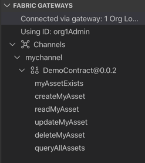

 &nbsp;&nbsp;&nbsp;&nbsp; `A8.3`: &nbsp;&nbsp;&nbsp;&nbsp;
Right-click 'DemoContract@0.0.2' and select 'Generate Tests for Smart Contract(s)'.

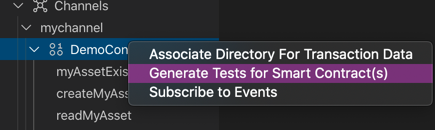

We want to generate tests for our smart contract.

 &nbsp;&nbsp;&nbsp;&nbsp; `A8.4`: &nbsp;&nbsp;&nbsp;&nbsp;
Click 'DemoContract'.

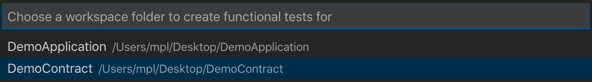

We will use the TypeScript language for our tests.

 &nbsp;&nbsp;&nbsp;&nbsp; `A8.5`: &nbsp;&nbsp;&nbsp;&nbsp;
Click 'TypeScript'.

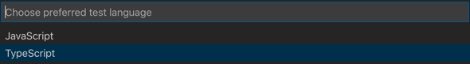

The test application will be generated in a new functionalTests folder and shown in the editor. You might need to wait a minute or so while VS Code attempts to build the tests.

Unfortunately, the tests will not build correctly because our DemoContract TypeScript project already contains a tsconfig.json file, which will need updating to include the new source file. When building has completed, if you click on the Problems tab you will see the following error:

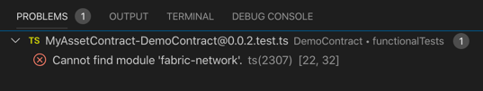

 &nbsp;&nbsp;&nbsp;&nbsp; `A8.6`: &nbsp;&nbsp;&nbsp;&nbsp;
Click on the Explorer sidebar icon and load the DemoContract -> tsconfig.json file.

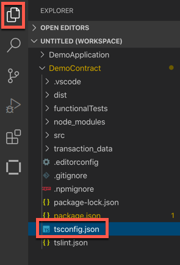

We need to add a reference to our new functional tests directory to this file.

 &nbsp;&nbsp;&nbsp;&nbsp; `A8.7`: &nbsp;&nbsp;&nbsp;&nbsp;
Inside the *include* clause, after the "./src/**/*" expression add a comma (`,`) and then insert the line `"./functionalTests/**/*"`.

The new clause should look like this:

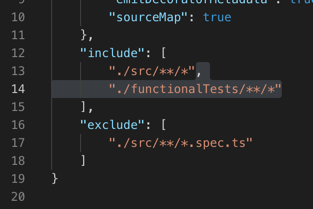

 &nbsp;&nbsp;&nbsp;&nbsp; `A8.8`: &nbsp;&nbsp;&nbsp;&nbsp;
Save the file ('File' -> 'Save').

After a pause for compilation, the errors will disappear.

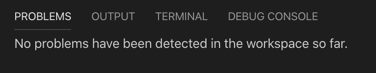

Take some time to review the generated *MyAssetContract-DemoContract@0.0.2.test.ts* file before continuing.

In addition to some standard code to connect to the Fabric gateway, the test application contains clauses for each of the transactions described in our smart contract, and these attempt to call the transaction and check the output.

 &nbsp;&nbsp;&nbsp;&nbsp; `A8.9`: &nbsp;&nbsp;&nbsp;&nbsp;
Expand the next section of the tutorial to continue.

</details>

---
<details>
<summary><b>Customize and run functional tests</b></summary>

If you look closely at the checks made by each of the transaction tests, you'll see that they simply make the assertion that true equals true. We need to replace each check with one that looks at the response from the transaction and compares it with the desired output.

In this section we'll update one of these test transactions and try it out.

 &nbsp;&nbsp;&nbsp;&nbsp; `A8.10`: &nbsp;&nbsp;&nbsp;&nbsp;
Scroll to the *myAssetExists* test.

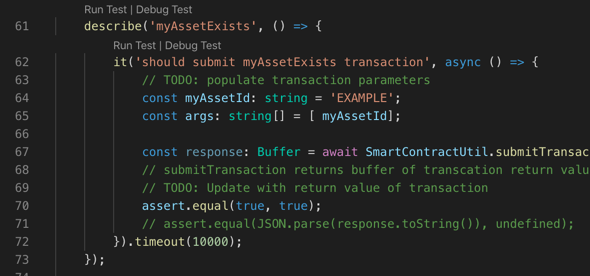

 &nbsp;&nbsp;&nbsp;&nbsp; `A8.11`: &nbsp;&nbsp;&nbsp;&nbsp;
Replace the *assert.equal(true, true);* statement with the line
```typescript
assert.equal(JSON.parse(response.toString()), true);
```

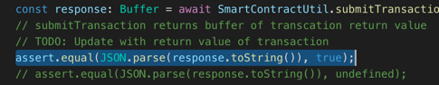

This is checking that the output of the 'myAssetExists' transaction is true for the value of the input parameter 'EXAMPLE'. In order words, it's checking to see if the asset with the key 'EXAMPLE' exists.

 &nbsp;&nbsp;&nbsp;&nbsp; `A8.12`: &nbsp;&nbsp;&nbsp;&nbsp;
Save the file ('File' -> 'Save').

 &nbsp;&nbsp;&nbsp;&nbsp; `A8.13`: &nbsp;&nbsp;&nbsp;&nbsp;
Click the 'Run Test' hyperlink that is just before the *describe('myAssetExists')* clause.

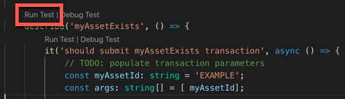

The test will now run. After a brief pause you will see the output in the terminal:

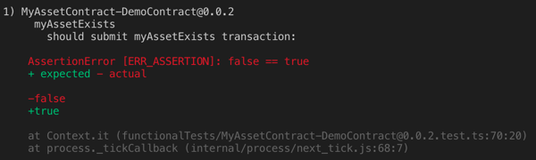

This test is failing as expected, because the 'EXAMPLE' key does not exist in our blockchain's world state.

We will now edit the test to check for a key that we know exists. As a result of earlier tutorials, you should have assets with keys '002' and '003' described in your world state. (If not, first try submitting a 'createMyAsset' transaction again.)

 &nbsp;&nbsp;&nbsp;&nbsp; `A8.14`: &nbsp;&nbsp;&nbsp;&nbsp;
Change 'EXAMPLE' in the *myAssetId* definition to `'002'`.

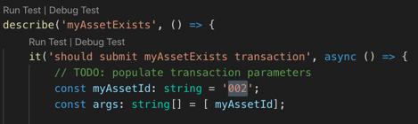

 &nbsp;&nbsp;&nbsp;&nbsp; `A8.15`: &nbsp;&nbsp;&nbsp;&nbsp;
Save the file ('File' -> 'Save').

 &nbsp;&nbsp;&nbsp;&nbsp; `A8.16`: &nbsp;&nbsp;&nbsp;&nbsp;
Click 'Run Test' again.

This time you will see that the test passes, because the asset with key '002' exists in the world state.

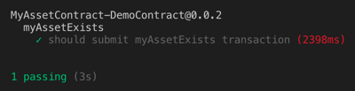

While we have just tested a single transaction here, the generated application can be run in its entirety so that all transactions in a smart contract can be functionally tested. You can add additional tests to the application, and the tests can also be combined with a more comprehensive testing framework and integrated into a build pipeline.

<br><h3 align='left'>Summary</h3>

In this tutorial we have seen how functional tests can be generated for our smart contracts. We have also seen how to customize these tests so that we can check that smart contracts are running correctly.

In the next tutorial we will see how we can update our smart contract to allow other applications to be notified when an interesting event occurs.

</details>

---

<h3 align='right'> → <a href='./a8.md'><b>A9: Publishing an event</b></h3></a>
