<!-- Standard Header Start -->
**IBM Blockchain Platform**
<h3 align='left'>← <a href='./a8.md'><b>A8: Testing a smart contract</b></a>
<!-- Standard Header End -->


## **Tutorial A9: Publishing an event**

---

Estimated time: `20 minutes`

<!-- Standard Header End -->

Using IBM Blockchain Platform it is possible to publish events from within smart contracts, so that subscribed applications can be made aware when things happen. In this tutorial we will:
- Update a transaction in our smart contract to emit an event
- Subscribe to the event in VS Code
- Submit a transaction and observe the event's output

In order to successfully complete this tutorial, you must have first completed tutorial <a href='./a3.md'>A3: Deploying a smart contract</a> in the active workspace. It is desirable (but not mandatory) to have completed up to tutorial <a href='./a8.md'>A8: Testing a smart contract</a>.

 &nbsp;&nbsp;&nbsp;&nbsp; `A9.1`: &nbsp;&nbsp;&nbsp;&nbsp;
Expand the first section below to get started.

---
<details>
<summary><b>Implement the event logic</b></summary>

So far in this tutorial series, our blockchain has closely coupled the transaction submitter (the client application) with the transaction implementor (the smart contract). For example, we saw that when each transaction completed it was only the client application that was notified of any updates.

It is a common and desirable pattern to allow other applications to *subscribe* to events that happen in the blockchain network. For example:
* an regulator might want to be notified of a trade
* an seller might want to use the acceptance of a new transaction to start a business process to fulill their contractual agreements
* an stock management system might want to keep count of a particular transaction type in order to manage internal inventory

Events can describe anything that happens within the smart contract: for example, when an update occurs to an asset.

The transaction style that implements these requirements is called *publish/subscribe*, as you have participants that *publish* events that are consumed by zero or more *subscribers*, which might be unknown to the publisher and whom can continually change. Each event has a *topic* which allows publishers and subscribers to distinguish between different types of information.

Publish/subscribe is a useful pattern because it decouples the producers of information from the consumers of it.

Hyperledger Fabric supports the publishing of events from within smart contracts and client applications subscribe to those events. The IBM Blockchain Platform VS Code Extension allows you to test the event framework.

<br><h3 align='left'>Updating the smart contract</h3>

Before we can subscribe, we first need a smart contract with a transaction that will emit an event. We will use the 'createMyAsset' transaction in our smart contract to do this.

 &nbsp;&nbsp;&nbsp;&nbsp; `A9.2`: &nbsp;&nbsp;&nbsp;&nbsp;
Switch to the 'my-asset-contract.ts' file in the editor.

If the file is not already open, use the Explorer sidebar to navigate to 'DemoContract' -> 'src' -> 'my-asset-contract.ts'.

 &nbsp;&nbsp;&nbsp;&nbsp; `A9.3`: &nbsp;&nbsp;&nbsp;&nbsp;
Navigate to the 'createMyAsset' method and use copy and paste to insert the following two lines at the end of the transaction's implementation:

```typescript
    const eventPayload: Buffer = Buffer.from('Some information from my event');
        ctx.stub.setEvent('myEvent', eventPayload);
```

The updated method should look like this:

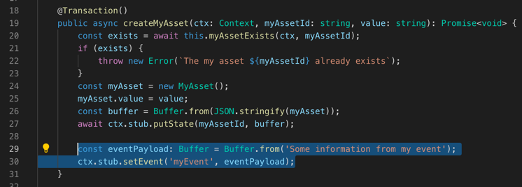


 &nbsp;&nbsp;&nbsp;&nbsp; `A9.5`: &nbsp;&nbsp;&nbsp;&nbsp;
Save the file ('File' -> 'Save').

The setEvent method takes two parameters: the name of the topic (which is a string), and a payload of data to be emitted alongside the event. In our example, the name of the topic is "myEvent" and the payload of the event is a buffer containing the text "some information from my event". We'll use this information again a little bit later.

<br><h3 align='left'>Upgrading the smart contract</h3>

We now need to upgrade our smart contract to include the event emission logic.

 &nbsp;&nbsp;&nbsp;&nbsp; `A9.6`: &nbsp;&nbsp;&nbsp;&nbsp;
Switch to the 'DemoContract' -> 'package.json' editor and update the value of the "version" field to `"0.0.3"`.

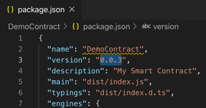

 &nbsp;&nbsp;&nbsp;&nbsp; `A9.7`: &nbsp;&nbsp;&nbsp;&nbsp;
Save the file ('File' -> 'Save').

 &nbsp;&nbsp;&nbsp;&nbsp; `A9.8`: &nbsp;&nbsp;&nbsp;&nbsp;
Hover over the Smart Contracts view in the IBM Blockchain Platform sidebar, click the ellipsis (...) and select 'Package Open Project' for the 'DemoContract' project.

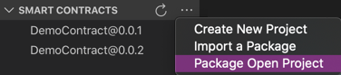

Wait a few seconds for the v0.0.3 smart contract to be built and shown in the Smart Contracts view.

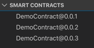


 &nbsp;&nbsp;&nbsp;&nbsp; `A9.9`: &nbsp;&nbsp;&nbsp;&nbsp;
In the Fabric Environments view, right click 'Smart Contracts' -> 'Instantiated' -> 'DemoContract@0.0.2' and select 'Upgrade Smart Contract'.

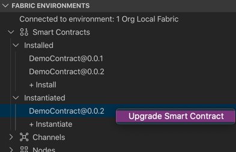

 &nbsp;&nbsp;&nbsp;&nbsp; `A9.10`: &nbsp;&nbsp;&nbsp;&nbsp;
Click 'DemoContract@0.0.3'.

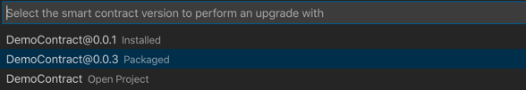

We'll now supply the remaining options on the upgrade.

 &nbsp;&nbsp;&nbsp;&nbsp; `A9.11`: &nbsp;&nbsp;&nbsp;&nbsp;
Press Enter to not call a function on upgrade; click 'No' to not provide a private data collection configuration file; click 'Default' to select the default endorsement policy.

You may need to wait a minute or so for the upgrade to complete.

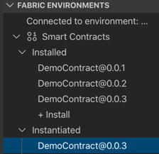

The upgraded smart contract is now ready to use.

 &nbsp;&nbsp;&nbsp;&nbsp; `A9.12`: &nbsp;&nbsp;&nbsp;&nbsp;
Expand the next section of the tutorial to continue.

</details>

---
<details>
<summary><b>Subscribe to the topic</b></summary>

With this change to the smart contract, every time the 'createMyAsset' transaction is run a single event on the 'myEvent' topic will be published to all subscribed applications.

Any authorized client application can subscribe to topics, and in order to test, it is possible to subscribe directly within the IBM Blockchain Platform VS Code extension too.

 &nbsp;&nbsp;&nbsp;&nbsp; `A9.13`: &nbsp;&nbsp;&nbsp;&nbsp;
In the Fabric Gateways view, ensure that the local gateway is connected.

If the gateway is disconnected, click on "1 Org Local Fabric - Org1" in this view to connect, and select 'org1Admin' as the identity.

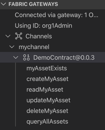

 &nbsp;&nbsp;&nbsp;&nbsp; `A9.14`: &nbsp;&nbsp;&nbsp;&nbsp;
Right click 'DemoContract@0.0.3' and select 'Subscribe to Events'.

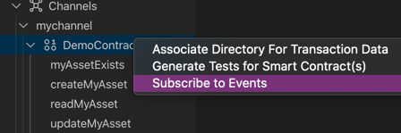

We need to specify which event(s) we are interested in. As you will recall from our event emission code, we named our topic 'myEvent'.

 &nbsp;&nbsp;&nbsp;&nbsp; `A9.15`: &nbsp;&nbsp;&nbsp;&nbsp;
Type `myEvent` and press Enter.

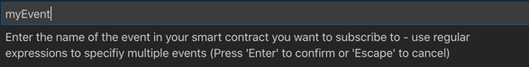

You will see a notification that confirms that the subscription has been registered.

> <br>
   > <b>Subscribing to multiple topics:</b>
   > <br> Regular expressions can be used to subscribe to multiple topics at once. For example, entering <b>.*</b> will subscribe to all events emitted from the smart contract.
   > <br>&nbsp;

 &nbsp;&nbsp;&nbsp;&nbsp; `A9.16`: &nbsp;&nbsp;&nbsp;&nbsp;
Expand the next section of the tutorial to continue.

</details>

---

<details>
<summary><b>Observe an emitted event</b></summary>

Now that we have successfully subscribed to the 'myEvent' topic, we'll be able to observe instances of those events in the output console of VS Code. 

In order to see one an event, we'll need to submit a createMyAsset transaction.

 &nbsp;&nbsp;&nbsp;&nbsp; `A9.17`: &nbsp;&nbsp;&nbsp;&nbsp;
In the Fabric Gateways view, right click the 'createMyAsset' transaction and select 'Submit Transaction'.

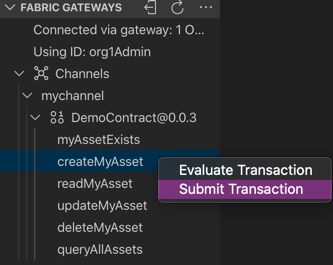

 &nbsp;&nbsp;&nbsp;&nbsp; `A9.18`: &nbsp;&nbsp;&nbsp;&nbsp;
Replace the input parameters with `["004","Dogs Playing Poker"]` and press Enter.

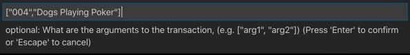

 &nbsp;&nbsp;&nbsp;&nbsp; `A9.19`: &nbsp;&nbsp;&nbsp;&nbsp;
Press Enter a second time to accept the transient data defaults and submit the transaction.

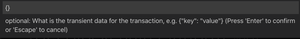

 &nbsp;&nbsp;&nbsp;&nbsp; `A9.20`: &nbsp;&nbsp;&nbsp;&nbsp;
Review the output of this transaction.

The output panel will show not just the transaction output, but also information about the event that was emitted. 

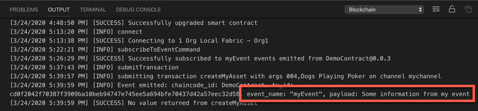

This information is only displayed because of the active subscription. The subscription will persist until the gateway is disconnected.

<br><h3 align='left'>Summary</h3>

In this tutorial we have updated one of the transactions in a smart contract to emit an event, subscribed to this event by specifying the correct topic string, and observed the event being output to the VS Code console.

Search the <a href="https://fabric-sdk-node.github.io">Hyperledger Fabric SDK documentation</a> for details on how to subscribe to events from within a client application.

In the final tutorial of this set we will summarize what we have covered so far.

</details>

<!-- Standard Footer Start -->

---

<h3 align='right'> → <a href='./a10.md'><b>A10: Claim your badge!</b></h3></a>
<!-- Standard Footer End -->