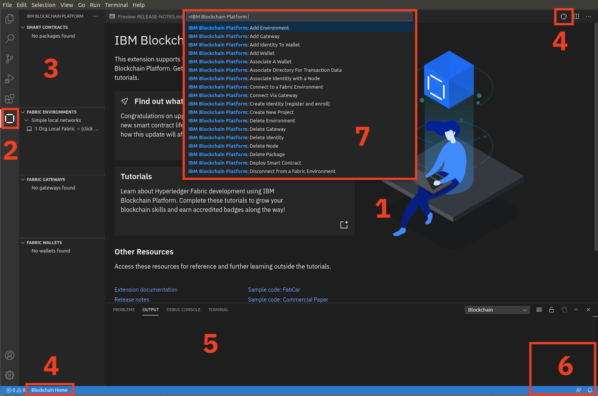

<!-- Test mdToPdf script -->
**IBM Blockchain Platform**

</img>
## **Tutorial A1: Introduction**

<!--

    <h2><b>Tutorial A1: Introduction</b></h2>
    

!-->

---

Estimated time: `10 minutes`

In this tutorial you will:
* Learn what blockchain is and why it is important
* Learn about the Linux Foundation Hyperledger Project and Hyperledger Fabric
* Learn about IBM Blockchain Platform and the VS Code extension
* Familiarize yourself with the integrated development environment

At the end of this tutorial you will be invited to gain the </img><a href="http://ibm.biz/BlockEssentials">IBM Blockchain Essentials</a> badge.

As you read these tutorials, look out for things that you need to do. They are always written on their own line, are numbered sequentially, and look like the following:

</img> &nbsp;&nbsp;&nbsp;&nbsp; `A1.1`: &nbsp;&nbsp;&nbsp;&nbsp;
Expand the 'What is blockchain' section below to get started.

If you run into problems, first check to make sure that you have completed all of these numbered steps in the correct order.

---

<b>What is blockchain?</b>

The generally accepted definition of a blockchain is a <i>distributed ledger</i> with <i>smart contracts</i>.

In business, whenever any object of value or importance changes, it is captured in a transaction. Transactions therefore describe how a company's essential assets move through a lifecycle; for example, their movement between their suppliers and consumers in a supply chain.

Traditionally, transactions are recorded in a business ledger. Unfortunately, a transaction which involves multiple organizations will be recorded differently by each business. Business processes which would benefit from a consistent, up-to-date and high integrity ledger are adversely affected organizations with different ledgers and technology recording essentially the same transactions. For example, if two organizations disagree on the state of a transaction then a dispute occurs, which can often be costly and time-consuming to resolve. A shared ledger can also introduce new possibilities; real-time tracking and tracing of products becomes possible when all the participants in a supply chain have access to a trusted source of transactions.

Blockchain transactions and ledgers are different. Blockchain introduces a new kind of transaction – a multiparty transaction - that is signed by everyone involved in the transaction. Blockchain ledgers are different too; the same ledger is replicated in every organization in the network, and kept synchronized using a process called *consensus*.  Moreover, these ledgers are *immutable* and *final*; once a multi-party transaction is written to the ledger, it cannot be reversed.

These tutorials will help you understand these ideas in more detail, and how to use them in practice.

 <h3 align='left'>Smart contracts</h3>

In business, transactions are generated according to *contracts* which define the exact conditions under which a transaction is generated. If I buy a car from you and it breaks down a month later, the terms of our contract might say that you are liable for the repair.

Blockchain introduces the idea of a *smart contract*. It describes in code what a transaction generated by the smart contract looks like. For example, a car contract might use logic to check that you're the current owner of the car, and that a purchaser has the required funds. If so, then a transaction will be generated that represents the transfer of the money to the seller and the car ownership to the buyer. 

Blockchains such as Hyperledger Fabric make it easy to write smart contracts, by maintaining the current value of every business object in a ledger. It means that smart contracts don't need to compute the cumulative effect of the history of transactions that involve your car -- they simply look up the current state of that car, and modify it as required. Hyperledger Fabric makes it easy to capture these object changes as transactions and recorded on the distributed blockchain ledger.  

In these tutorials we'll learn a lot more about smart contracts and how to write them.

 <h3 align='left'>Blockchain and Bitcoin</h3>

Blockchain is commonly associated with Bitcoin, the cryptocurrency and peer-to-peer payments system. Bitcoin uses a blockchain as the ledger to record its transactions and a resource-intensive method of consensus called *proof of work*. Bitcoin favors anonymity; even though the ledger is public, it's almost impossible to determine who is behind a Bitcoin transaction.

Businesses often have a different operating environment. For example, they are required to carry out Know Your Customer (KYC) and Anti-Money Laundering (AML) checks, which require businesses to know who they are dealing with.  This means that business blockchains require identifiable participants and favor features such as *privacy* and *confidentiality*. Knowing who's behind a transaction helps to remove incentives for fraud and as such, resource-intensive methods of consensus are not needed.

And of course, business ledgers also store more than cryptocurrency transactions; any object of value to a business could be subject to multi-party transactions, and will therefore also benefit from a business blockchain.

 

</img> &nbsp;&nbsp;&nbsp;&nbsp; `A1.2`: &nbsp;&nbsp;&nbsp;&nbsp;
Expand the 'Introduction to Hyperledger Fabric' section below to continue.

---

<b>Introduction to Hyperledger Fabric</b>

In early 2016, the Linux Foundation formally announced the creation of the *Hyperledger* project. Its aim continues to be to develop blockchain technologies that specifically cater for the requirements of businesses.

Hyperledger is more than a single technology; it is a collection of cross-industry frameworks and tools that come under a single open license and governance structure.

   >  
   > Find out more about the Hyperledger Project at <a href="https://www.hyperledger.org/">https://www.hyperledger.org/</a>
   >  &nbsp;

Hyperledger Fabric is the most widely implemented of these technologies. It provides a shared, replicated ledger implementation with support for smart contracts. It is designed as a pluggable framework so that it can evolve over time, for example as new privacy and consensus technologies emerge. It continues to be developed by hundreds of developers in the community representing dozens of different organizations.

   >  
   > Read the Hyperledger Fabric technical documentation at <a href="https://hyperledger-fabric.readthedocs.io/">https://hyperledger-fabric.readthedocs.io/</a>
   >  &nbsp;

Hyperledger Fabric underpins many of the world's most successful blockchain implementations, including <a href="https://www.ibm.com/blockchain/solutions/food-trust">IBM Food Trust</a>, <a href="https://www.tradelens.com/">TradeLens</a> and <a href="https://we-trade.com/">we.trade</a>.

 <h3 align='left'>Hyperledger Fabric technology</h3>

A Hyperledger Fabric network consists of three key types of components:

* **Peer node**: holds a copy of the ledger and is responsible for running smart contracts.
* **Orderer node**: part of a distributed ordering service that agrees the order that transactions are added to the ledger.
* **Certificate Authority**: responsible for issuing the certificates that identify users and organizations on the network.

Each organization that joins a Hyperledger Fabric network will typically own peers and certificate authorities. There needs to be one ordering service in each network, although this can be distributed between organizations.

As we progress through these tutorials, we will work with each of these components.

 

</img> &nbsp;&nbsp;&nbsp;&nbsp; `A1.3`: &nbsp;&nbsp;&nbsp;&nbsp;
Expand the 'Introduction to IBM Blockchain Platform' section below to continue.

---

<b>Introduction to IBM Blockchain Platform</b>

IBM Blockchain Platform is a set of tools and services that allow users to build and operate Hyperledger Fabric networks. Broadly, it consists of two main elements:

* **IBM Blockchain Platform Extension for Visual Studio Code**. This is the tool you are using now. It allows developers to create Hyperledger Fabric smart contracts and the applications that interact with them. Developers can test their applications using an embedded instance of Hyperledger Fabric, or connect to a remote Hyperledger Fabric network.

* **IBM Blockchain Platform Console**. This allows users to create and manage their Hyperledger Fabric components. The components can be run on IBM Cloud or on any OpenShift-based environment, including on-premises.

>  
   > Learn more about the IBM Blockchain Platform here: <a href="https://www.ibm.com/blockchain/platform">https://www.ibm.com/blockchain/platform</a>
   >  &nbsp;

In later tutorials you will learn more about the console. For now, you will start to familiarize yourself with the IBM Blockchain Platform developer tools.

</img> &nbsp;&nbsp;&nbsp;&nbsp; `A1.4`: &nbsp;&nbsp;&nbsp;&nbsp;
Expand the next section to continue.

---

<b>IBM Blockchain Platform Extension for Visual Studio Code</b>

In these tutorials you will be performing actions in VS Code, so begin by ensuring that you can comfortably see both this tutorial and VS Code. If you can, arrange the tutorial on a second window ('File' -> 'New Window') and move it to a second monitor. If this is not possible, you can click on the 'Split Editor' icon the top right of the VS Code editor to split within a single window.

Let's start with the basic elements of the IBM Blockchain Platform VS Code extension:

</img>

`1.` **Editor pane**: Used for editing smart contracts and application code. 
`2.` **The IBM Blockchain Platform icon in the VS Code activity bar**: Shows or hides the IBM Blockchain Platform side bar. 
`3.` **IBM Blockchain Platform side bar**: A set of views that show the Hyperledger Fabric resources you are working with: smart contracts, environments, gateways and wallets. 
`4.` **IBM Blockchain Platform home page**: At both the top and bottom of the screen are icons that allow you to return to the IBM Blockchain Platform welcome screen if you get lost. 
`5.` **Output**: The results of running any transaction are displayed here. Also note the neighboring tabs that allow you, among other things, to run Terminal commands in an embedded shell. 
`6.` **Notifications**: Timely information is displayed here, such as the results of deploying a new smart contract. If you click on the icon in the corner you can usually revisit any notifications you've missed. 
`7.` **Command palette**: When you tell VS Code to do something, such as package a smart contract, VS Code will invite you to enter any parameters here. You can also bring up the command palette before you invoke any command by selecting "View -> Command Palette"; if you type ">IBM Blockchain Platform" here you can quickly show all the commands implemented by the extension.

If you're not familiar with VS Code, it's worthwhile spending a few minutes clicking around to get yourself comfortable with it. When you are ready, continue on.

</img> &nbsp;&nbsp;&nbsp;&nbsp; `A1.5`: &nbsp;&nbsp;&nbsp;&nbsp;
Expand the next section to continue.

---

<b></img>&nbsp;IBM Blockchain Essentials</b>

In this tutorial we've covered the basics of blockchain; this is the term used to describe distributed ledger technology that uses smart contracts to share multi-party transactions with the member organizations of a business network. 

We introduced the Linux Foundation Hyperledger Project, which aims to develop blockchain technologies for business, and Hyperledger Fabric, which is a shared ledger implementation that underpins many blockchain projects.

Finally we looked at IBM Blockchain Platform, which is a set of tools and services for building and operating Hyperledger Fabric-based blockchains. The IBM Blockchain Platform VS Code extension is one such tool, and is what we will be using in these tutorials.

You've now completed the first tutorial and are now ready to pass the </img><a href="http://ibm.biz/BlockEssentials">IBM Blockchain Essentials</a> course.

Click on the link above to view the course. You'll consolidate what you've learned, take a short quiz to demonstrate your understanding and claim your badge on <a href='https://www.youracclaim.com/'>Acclaim</a>.

In the next tutorial you will create your first smart contract.

---

<h3 align='right'> → <a href='./a2.md'><b>A2: Creating a smart contract</b></h3></a>
