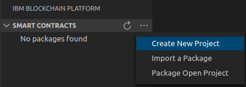
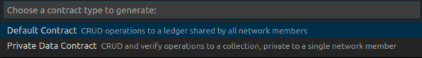
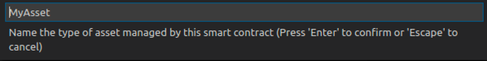
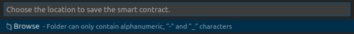
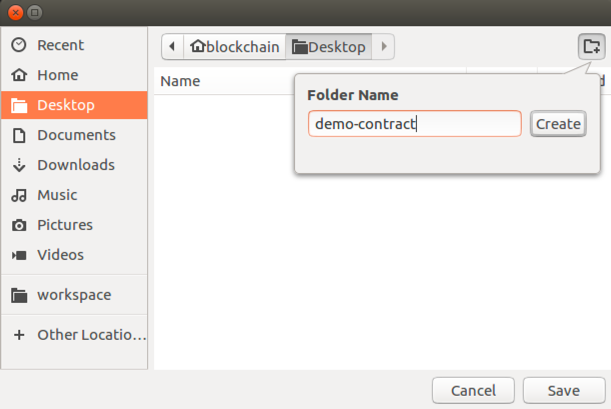
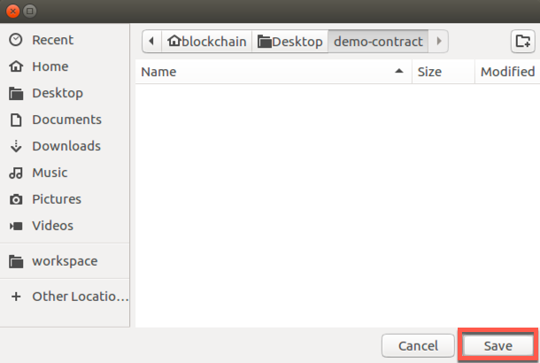
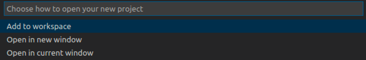
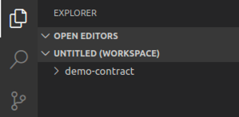
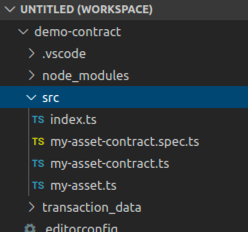
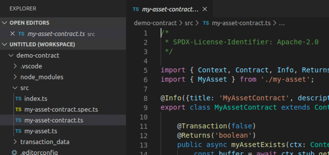

**IBM Blockchain Platform**

<h3 align='left'>← <a href='./a1.md'><b>A1: Introduction</b></a></h3>

</img>
## **Tutorial A2: Creating a smart contract**

---

Estimated time: `10 minutes`

A *smart contract* contains the business logic, expressed in code, used to generate a transaction response by a single organization. The response is digitally signed by that organization and contains the changes to a set of business objects. In Hyperledger Fabric, a smart contract uses a *state* database containing the current value of all business objects in the ledger to simplify transaction generation. Each smart contract can run on a set of peers in each organization.

Smart contracts can be built and tested using the IBM Blockchain Platform VS Code extension. In this tutorial you will:
* Create a new smart contract project
* Implement a basic smart contract using a standard template
* Understand what the smart contract does

In order to successfully complete this tutorial, you must have the IBM Blockchain Platform VS Code extension installed. You are recommended to start with an empty workspace.

Remember to complete every task that begins with a blue square like this one:

</img> &nbsp;&nbsp;&nbsp;&nbsp; `A2.1`: &nbsp;&nbsp;&nbsp;&nbsp;
Expand the first section below to get started.


---
<details>
<summary><b>Create a smart contract project</b></summary>

When working with Hyperledger Fabric components and files in the IBM Blockchain Platform VS Code extension, it is usually convenient to show the IBM Blockchain Platform side bar, which contains the Smart Contracts, Fabric Environments, Fabric Gateways and Fabric Wallets views.

You can show the side bar by clicking on the IBM Blockchain Platform icon in the VS Code activity bar. However, note that the icon is a toggle: if you click on it while the side bar is already shown, the side bar will be hidden.

</img> &nbsp;&nbsp;&nbsp;&nbsp; `A2.2`: &nbsp;&nbsp;&nbsp;&nbsp;
If the IBM Blockchain Platform side bar is not already shown, click on the IBM Blockchain Platform icon in the activity bar.

</img>

We will now create a smart contract project that will contain the files we need for our smart contract. IBM Blockchain Platform will create for us a skeleton smart contract that we can customize later.

</img> &nbsp;&nbsp;&nbsp;&nbsp; `A2.3`: &nbsp;&nbsp;&nbsp;&nbsp;
Move the mouse over the title bar of the Smart Contracts view, click the "..." that appears and select "Create New Project".

</img>

</img> &nbsp;&nbsp;&nbsp;&nbsp; `A2.4`: &nbsp;&nbsp;&nbsp;&nbsp;
Press Enter to accept the Default Contract type.

</img>

In this tutorial we will be using the TypeScript language.

</img> &nbsp;&nbsp;&nbsp;&nbsp; `A2.5`: &nbsp;&nbsp;&nbsp;&nbsp;
Click 'TypeScript'.

</img>

The skeleton smart contract provides us with the ability to generate transaction responses for a single business object type (or *asset* type), which can be stored on the blockchain. In this context, an asset type is a group of related objects which by convention begins with a capital letter. For example an `Artwork` type might describe `The Hay Wain by John Constable`, `La Gioconda by Leonardo da Vinci` or `Shot Marilyns by Andy Warhol`.

Later, we can extend the smart contract package with additional smart contracts and asset types if we wish. For now however, we will just accept the default asset type presented to us.

</img> &nbsp;&nbsp;&nbsp;&nbsp; `A2.6`: &nbsp;&nbsp;&nbsp;&nbsp;
Press Enter to accept the default asset type ("MyAsset").

</img>

</img> &nbsp;&nbsp;&nbsp;&nbsp; `A2.7`: &nbsp;&nbsp;&nbsp;&nbsp;
Click Browse to choose a target location of the project on the file system.

</img>

Navigate to the folder on your file system that you wish to use for development. (In the screenshots we will use the Desktop folder, for convenience.)

</img> &nbsp;&nbsp;&nbsp;&nbsp; `A2.8`: &nbsp;&nbsp;&nbsp;&nbsp;
Click "New folder" to create a new folder to store the smart contract project, and name it "demo-contract".

</img>

</img> &nbsp;&nbsp;&nbsp;&nbsp; `A2.9`: &nbsp;&nbsp;&nbsp;&nbsp;
Click Save to select the new folder as the project root.

</img>

</img> &nbsp;&nbsp;&nbsp;&nbsp; `A2.10`: &nbsp;&nbsp;&nbsp;&nbsp;
Select "Add to workspace" to tell IBM Blockchain Platform to add the project to your workspace.

</img>

Generating the smart contract project will take up to a minute to complete. When it has successfully finished, the IBM Blockchain Platform side bar will be hidden and the Explorer side bar will be shown. The Explorer side bar will show the new project that has been created.

</img>

</img> &nbsp;&nbsp;&nbsp;&nbsp; `A2.11`: &nbsp;&nbsp;&nbsp;&nbsp;
Expand the next section of the tutorial to continue.

</details>

---
<details>
<summary><b>Learn about the smart contract</b></summary>

We will now look at the files that have been created to see what they do.

</img> &nbsp;&nbsp;&nbsp;&nbsp; `A2.12`: &nbsp;&nbsp;&nbsp;&nbsp;
In the Explorer side bar, expand "demo-contract" -> "src".

</img>

The smart contract is contained within the 'my-asset-contract.ts' file. The file name has been generated from the asset type you gave earlier.

</img> &nbsp;&nbsp;&nbsp;&nbsp; `A2.13`: &nbsp;&nbsp;&nbsp;&nbsp;
Click on 'my-asset-contract.ts' to load it in the VS Code editor.

</img>

Have a read through the code.

The import statement at the top of the file makes the Hyperledger Fabric classes available.

```typescript
import { Context, Contract, Info, Returns, Transaction } from 'fabric-contract-api';
```

The smart contract is a standard piece of TypeScript. The only line that identifies it as a smart contract is in the class definition itself:

```typescript
export class MyAssetContract extends Contract {
```

The *extends* clause states that this is a Hyperledger Fabric smart contract using the Contract class imported earlier.

The rest of the file contains the implementation for each transaction type generated by the smart contract.


<br><h3 align='left'>Transactions</h3>

Imagine we had a ledger of cars: `myAssetExists('CAR001')` would return `true` or `false` depending on whether `CAR001` was in the ledger. Look at the first method signature in the MyAsset contract:

```typescript
@Transaction(false)
public async myAssetExists(ctx: Context, myAssetId: string): Promise<boolean> {
```

Any method that is prefixed with the *@Transaction()* decorator indicates that this method can be called to generate a transaction response for this smart contract.

We can see that myAssetExists() is prefixed with a slightly more descriptive decorator - @Transaction(*false*) - indicating that it only reads from the ledger. We'll see an example of a @Transaction(*true*) method that also writes to the ledger later in this tutorial.

The remainder of the myAssetExists() signature mostly shows the required inputs for this smart contract to generate a transaction response. The Context object is a special parameter; it is used by the smart contract to maintain user data across contract, and we'll see later how it simplifies the process of writing a smart contract.

<br><h3 align='left'>Working with the world state</h3>

Each method uses the world state to read the current value of a set of business objects and generate the corresponding new values for those objects. The Context object (ctx) gives you direct access to the world state:

```typescript
const buffer = await ctx.stub.getState(myAssetId);
```

The *getState* method returns from the world state the current value associated with the key described by *myAssetId*. This method only reads the value of business object, it does not change it. That's why the myAssetExists() method was decorated @Transaction(false).

Now take a look at the second method:

```typescript
@Transaction()
public async createMyAsset(ctx: Context, myAssetId: string, value: string): Promise<void> {
```
This ends with the line:

```typescript
await ctx.stub.putState(myAssetId, buffer);
```

The putState method changes the current value of a business object with the key myAssetId to the value buffer. That's why the createMyAsset method was decorated with @transaction(true).

The transaction response is generated automatically by Hyperledger Fabric when the smart contract execution completes.  It comprises the states that have been read and those that are to be written if the transaction is successfully committed to the ledger.

It's important not to confuse these transaction responses with the return value from the method; they are not the same thing.

> <br>
   > <b>Want to know more?</b><br>For more about transactions and responses, check out the <a href="https://hyperledger-fabric.readthedocs.io/en/latest/ledger/ledger.html">Hyperledger Fabric documentation</a>.
   > <br>&nbsp;


<br><h3 align='left'>Smart contract determinism</h3>

Whilst it may look like it, the effect of *putState* is not immediate. The business object identified by myAssetId will only be updated when every organization in the network agrees with the generated transaction response. This requires the consensus process to complete across the network.

As developers we generally don't need to worry about consensus. However, we do need to ensure that our smart contract transactions are *deterministic*; that is, each must always generate the same transaction response for a given set of transaction inputs. That's because our smart contract will be run by multiple organizations, each of whom must generate the *same* transaction response. If not, the resulting generated transaction will be captured in the ledger as *invalid*, and the world state will not be updated; the transaction will not have had an effect.

This means that attempting to update the world state with, for example, a random number, timestamp or some other transient value is not recommended.


<br><h3 align='left'>Summary</h3>

In this tutorial we have generated our first smart contract.

We saw how a smart contract contains different methods, each of which can generate a transaction response for a given set of inputs. Transactions are generated using the *getState* and *putState* methods, which provide keyed access to get and set the current value of a business object in the ledger. 

In order to test these transactions out, we must first deploy them to an instance of Hyperledger Fabric; we will do that in the next tutorial.

</details>

---

<h3 align='right'> → <a href='./a3.md'><b>A3: Deploying a smart contract</b></h3></a>
