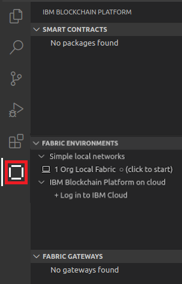
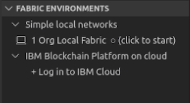
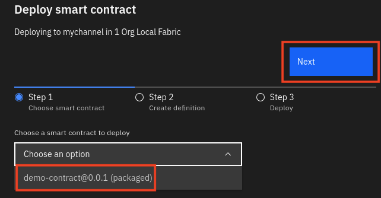

**IBM Blockchain Platform**

<h3 align='left'>← <a href='./a2.md'><b>A2: Creating a smart contract</b></a></h3> 

</img>
## **Tutorial A3: Deploying a smart contract**

---

Estimated time: `10 minutes`

Now that we've created our first smart contract, we'd like to try it out. In this tutorial we will:

* Start an instance of a Hyperledger Fabric network in the local workspace
* Package the smart contract we previously created
* Deploy the smart contract to the running Hyperledger Fabric network

In order to successfully complete this tutorial, you must have first completed tutorial <a href='./a2.md'>A2: Creating a smart contract</a>. The project must be active in your VS Code workspace.

</img> &nbsp;&nbsp;&nbsp;&nbsp; `A3.1`: &nbsp;&nbsp;&nbsp;&nbsp;
Expand the first section below to get started.

---

<b>Start the VS Code Hyperledger Fabric environment</b>

</img> &nbsp;&nbsp;&nbsp;&nbsp; `A3.2`: &nbsp;&nbsp;&nbsp;&nbsp;
Click on the IBM Blockchain Platform icon in the activity bar to show the blockchain side bar.

</img>

 <h3 align='left'>The Fabric Environments view</h3>

The IBM Blockchain Platform VS Code Extension helps you test your smart contracts in a Hyperledger Fabric network. The extension comes with a pre-configured one organization network that runs on your local machine ("1 Org Local Fabric"). You can connect to IBM Cloud and other remote networks too; we will do this in a later tutorial.

The available networks are shown in the Fabric Environments view.

</img>

If you do not have a "1 Org Local Fabric" environment, then click *+ Add local or remote environment* to create the environment. If creating the environment, click *Create new from template* and click *1 Org template*. Enter "1 Org local Fabric" as the name, and when you press *enter* the environment will start which may take up to 5 minutes.

We'll see later how this view also allows you to configure more realistic networks that also run entirely on your local machine. This allows you to check that your smart contract is functionally correct before you move to a more complex distributed network configuration. 

The required Hyperledger Fabric components are automatically downloaded and started when you select it.

</img> &nbsp;&nbsp;&nbsp;&nbsp; `A3.3`: &nbsp;&nbsp;&nbsp;&nbsp;
In the Fabric Environments view, click "*1 Org Local Fabric  O  (click to start)*"

This will download and start the embedded instance of Hyperledger Fabric, and may take up to five minutes to complete.

</img>

When Hyperledger Fabric has fully initialized, the view will change to show the smart contracts, channels, nodes and organizations in the local environment. You may need to click on the environment to see the details.

</img>

Each of these elements tells you what's configured in the connected environment:
* **Smart contracts** show the smart contracts that are available. They can be *installed*, which means that the code has been copied to the peers, and *instantiated*, which means that they are available to the network.
* **Channels** define the scope of each network, and form one method of choosing how organizations share data. We will look at channels in a later tutorial.
* **Nodes** are the Hyperledger Fabric components that make the system work. There are three types of nodes:
   * Peers which host ledgers and execute smart contracts
   * Orderers which assert transaction order and distribute blocks to peers
   * Certificate authorities which provide the means of identifying users and organizations on the network
* **Organizations** are the members of the blockchain network. Each organization will consist of many different users and types of users.

   >  
   > For more about the components that make up a Hyperledger Fabric network, see the <a href="https://hyperledger-fabric.readthedocs.io/en/latest/key_concepts.html">Hyperledger Fabric documentation</a>.
   >  &nbsp;
   
If you expand the various sections you'll see the various defaults for each of these elements:

* Four **nodes**: a single peer called *Org1Peer1*, an ordering node called *Orderer* and a certificate authority for each of the two organizations.
* Two **organizations**, with identifiers of 'OrdererMSP' and 'Org1MSP'. The former will own the orderer and the latter the peer; it is good practice to use separate organizations for orderer nodes and peers.
* There is a single default network **channel** called *mychannel*.
* By default there are no **smart contracts** installed or instantiated.

</img>

>  
   > <b>Starting again?</b>
   >   If you ever need to start with a new Hyperledger Fabric instance, hover over the Fabric Environments view, click the ellipsis ('...') and select 'Teardown Fabric Environment'. Use with caution: this will completely wipe the Hyperledger Fabric instance and anything deployed to it. Development files in your workspace (e.g. smart contract projects) will remain.
   >  &nbsp;

</img> &nbsp;&nbsp;&nbsp;&nbsp; `A3.4`: &nbsp;&nbsp;&nbsp;&nbsp;
Expand the next section of the tutorial to continue.

---

<b>Package, install and instantiate the smart contract</b>

We will now package, install and instantiate our smart contract into the local environment. It is possible to do this as three separate actions in the VS Code extension, or by just using the 'Instantiate' action, which will also do the package and install steps if necessary.

For simplicity, we will just use the single-step instantiate for now. When we explore the upgrade process in tutorial <a href='./a6.md'>A6: Upgrading a smart contract</a>, we will use the individual processes.

</img> &nbsp;&nbsp;&nbsp;&nbsp; `A3.5`: &nbsp;&nbsp;&nbsp;&nbsp;
In the Fabric Environments view, click "Smart Contracts" -> "Instantiated" -> "+ Instantiate".

</img>

IBM Blockchain Platform detects the smart contract project created in the previous tutorial.

</img> &nbsp;&nbsp;&nbsp;&nbsp; `A3.6`: &nbsp;&nbsp;&nbsp;&nbsp;
In the Command Palette, click 'demo-contract'.

</img>

It may take up to a minute to package and install the smart contract.

Before the smart contract is instantiated you will be prompted to enter the name of any required instantiation function.

</img> &nbsp;&nbsp;&nbsp;&nbsp; `A3.7`: &nbsp;&nbsp;&nbsp;&nbsp;
In the Command Palette, press Enter when prompted for an instantiate function name.

</img>

Private data is an advanced technique for sharing data between organizations. We will not be using that feature for now; it is the subject of a later tutorial.

</img> &nbsp;&nbsp;&nbsp;&nbsp; `A3.8`: &nbsp;&nbsp;&nbsp;&nbsp;
In the Command Palette, click 'No' to not provide a private data collection configuration file.

</img>

The endorsement policy determines which peers get to run the smart contract. As we only have one peer in our organization, we can accept the default.

</img> &nbsp;&nbsp;&nbsp;&nbsp; `A3.9`: &nbsp;&nbsp;&nbsp;&nbsp;
In the Command Palette, click 'Default' to accept the default smart contract endorsement policy.

</img>

Instantiation may take a further few minutes to complete.

When instantiation has completed you will see the new smart contract package listed in the Smart Contracts view, and also underneath the Instantiated section of the connected environment.

</img>

</img>

The text after the '@' sign is the version; note that it is set to '0.0.1'. For TypeScript smart contracts, both the name and version are taken from the <i>package.json</i> file in the root of the smart contract project:

</img>

We will update this in a later tutorial.

Congratulations! You've successfully deployed your first smart contract on a Hyperledger Fabric network. As we're going to see, there's much more to do - but this is a great start.

 <h3 align='left'>Summary</h3>

In this tutorial we started the built-in one organization Hyperledger Fabric network. We packaged our smart contract, installed it and instantiated it.

In the next tutorial we will exercise the smart contract, to see how it behaves inside the network.

---

<h3 align='right'> → <a href='./a4.md'><b>A4: Invoking a smart contract from VS Code</b></h3></a>
