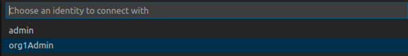
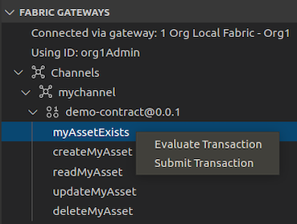
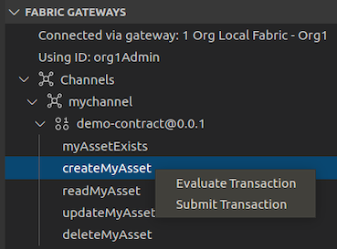
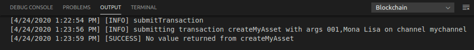

**IBM Blockchain Platform**

<h3 align='left'>← <a href='./a3.md'><b>A3: Deploying a smart contract</b></a></h3>

</img>
## **Tutorial A4: Invoking a smart contract from VS Code**

---

Estimated time: `15 minutes`

In the last tutorial we packaged, installed and instantiated our smart contract on a local Hyperledger Fabric network. In this tutorial we will:

* Learn about identities, wallets and gateways
* Exercise a smart contract directly from VS Code
* Understand the difference between evaluating and submitting transactions

In order to successfully complete this tutorial, you must have first completed tutorial <a href='./a3.md'>A3: Deploying a smart contract</a> in the active VS Code workspace.

</img> &nbsp;&nbsp;&nbsp;&nbsp; `A4.1`: &nbsp;&nbsp;&nbsp;&nbsp;
Expand the first section below to get started.

---

<b>Connect to the Hyperledger Fabric gateway</b>

In order to submit transactions in Hyperledger Fabric you will need an identity, a wallet and a gateway.

 <h3 align='left'>Identities, wallets and gateways</h3>

The resources that you can access in a Hyperledger Fabric network are determined according to your identity; that's why its called a permissioned blockchain. Your identity is typically represented by an X.509 certificate issued by your organization, and stored in your wallet. Once you have an identity and a wallet, you can create a gateway that allows you to submit transactions to a network.

A gateway represents a connection to a set of Hyperledger Fabric networks. If you want to submit a transaction, whether using VS Code or your own application, a gateway makes it easy to interact with a network: you configure a gateway, connect to it with an identity from your wallet, choose a particular network, and start submitting transactions using a smart contract that has been instantiated in that network.

A gateway is configured using a connection profile, which identifies a single peer in the network as an initial connection point. We're going to use a pre-configured gateway that was created when we started the one organization network.

>  
   > <b>Want to know more about gateways?</b> <a href="https://hyperledger-fabric.readthedocs.io/en/latest/developapps/gateway.html">Read about them in the Hyperledger Fabric documentation.</a>
   >  &nbsp;

Take care to understand the difference between **Fabric Environments** and **Fabric Gateways**: an *environment* gives an overview of all the resources available to you in a Hyperledger Fabric network; a *gateway* provides an access point to those resources.

 <h3 align='left'>Gateways and Wallets in VS Code</h3>

When the one organization network was created in the previous tutorial, a gateway was created for you at the same time; this is now shown in the Fabric Gateways view. This view allows you to add new gateways to submit transactions to both local and remote Hyperledger Fabric networks. 

</img>

Furthermore, every component in this network has an assigned identity, and these are shown in Fabric Wallets view. In this view you can see two wallets, each containing two identities:

</img>

These identities are used as follows:

* Orderer wallet
   * *admin*: this identity is associated with the Orderer node
   * *ordererAdmin*: this identity can be used to interact with the ordering service
* Org1 wallet
   * *admin*: this identity is associated with the Org1Peer1 node
   * *org1Admin*: this identity will be used to submit and evaluate transactions

It is the *org1Admin* identity that we will be using to exercise the smart contract.

 <h3 align='left'>Connecting to the Fabric Gateway in VS Code</h3>

We will now connect to a gateway using the *org1Admin* identity.

</img> &nbsp;&nbsp;&nbsp;&nbsp; `A4.2`: &nbsp;&nbsp;&nbsp;&nbsp;
In the Fabric Gateways view, click "1 Org Local Fabric > Org1".

If you can't see this view, remember to first click the IBM Blockchain Platform icon in the activity bar.

</img>

You will now be asked to select the identity that the gateway will use to connect to the network. As a reminder, we will be using the identity *org1Admin*.

</img> &nbsp;&nbsp;&nbsp;&nbsp; `A4.3`: &nbsp;&nbsp;&nbsp;&nbsp;
Click 'org1Admin'.

</img>

The IBM Blockchain Platform VS Code extension will now connect to the local Hyperledger Fabric gateway; this will only take a few seconds to complete.

Once connected, notice that the view changes to reflect the channels, smart contracts and transactions available to the connected gateway. 

</img> &nbsp;&nbsp;&nbsp;&nbsp; `A4.4`: &nbsp;&nbsp;&nbsp;&nbsp;
Fully expand the Channels tree in the Fabric Gateways view to show the available transactions.

</img>

The tree shows the *mychannel* network into which the smart contract was deployed, the *demo-contract* smart contract that was deployed (including its version), and the five transaction methods that are available to applications.

</img> &nbsp;&nbsp;&nbsp;&nbsp; `A4.5`: &nbsp;&nbsp;&nbsp;&nbsp;
Expand the next section of the tutorial to continue.

---

<b>Invoke transactions using the gateway</b>

We will now exercise your smart contract. Hyperledger Fabric can generate two different kinds of transactions:

* *Submitted* transactions are recorded on the blockchain ledger.  These are used when you want to update the current value of the ledger. Submitted transactions go through the full consensus process before they are recorded on the ledger. It is possible to submit read-only ledger transactions, but it's less common.

* *Evaluated* transactions are not recorded on the blockchain ledger. These transactions are typically used when you want to simply query the current value of the ledger. Evaluated transactions do not go through the consensus process; they are run on a single peer, and the result is returned to the caller. It is possible to evaluate read-write transactions, but it's less common. 

The VS Code extension allows you to both submit and evaluate transactions. 

We will start by evaluating the transaction 'myAssetExists'.

</img> &nbsp;&nbsp;&nbsp;&nbsp; `A4.6`: &nbsp;&nbsp;&nbsp;&nbsp;
Right-click 'myAssetExists' and select 'Evaluate Transaction'.

</img>

Transaction inputs are entered using JSON.

</img> &nbsp;&nbsp;&nbsp;&nbsp; `A4.7`: &nbsp;&nbsp;&nbsp;&nbsp;
Replace the input parameters with `["001"]` and press Enter.

</img>

Transient data is an advanced feature that we will cover in a later tutorial; we will not use it here.

</img> &nbsp;&nbsp;&nbsp;&nbsp; `A4.8`: &nbsp;&nbsp;&nbsp;&nbsp;
Press Enter again to accept the default transient data parameters.

</img>

The demo-contract smart contract will now run on the peer to generate a myAssetExists transaction response using the transaction input "001". As you will recall from the smart contract code, the contract will return true if the business object with key "001" exists in the state database, or false otherwise.

When the method completes, the Output tab will show the results of the evaluation.

</img> &nbsp;&nbsp;&nbsp;&nbsp; `A4.9`: &nbsp;&nbsp;&nbsp;&nbsp;
Move the mouse over the "Successfully evaluated transaction" notification to reveal the close icon, and click it to close it.

</img>

If you review the output from the command you can see the results of evaluating the transaction. In this case, the return value is false, because the key does not exist in the state database.

</img>

We will now create the business object with key "001". This time, we will add a new transaction to the ledger, so we need to submit a transaction rather than evaluate one.

</img> &nbsp;&nbsp;&nbsp;&nbsp; `A4.10`: &nbsp;&nbsp;&nbsp;&nbsp;
Right-click 'createMyAsset' and select 'Submit Transaction'.

</img>

As you may recall, the createMyAsset transaction takes two parameters: a key and its associated value.

</img> &nbsp;&nbsp;&nbsp;&nbsp; `A4.11`: &nbsp;&nbsp;&nbsp;&nbsp;
Replace the input parameters with `["001","Mona Lisa"]` and press Enter.

</img>

</img> &nbsp;&nbsp;&nbsp;&nbsp; `A4.12`: &nbsp;&nbsp;&nbsp;&nbsp;
Press Enter a second time to accept the transient data defaults and submit the transaction.

</img>

Review the output to ensure that the transaction was successful.

</img>

</img> &nbsp;&nbsp;&nbsp;&nbsp; `A4.13`: &nbsp;&nbsp;&nbsp;&nbsp;
Evaluate the "myAssetExists" transaction a second time with the "001" key to show that the asset now exists.

</img>

The returned value is now 'true'.

</img> &nbsp;&nbsp;&nbsp;&nbsp; `A4.14`: &nbsp;&nbsp;&nbsp;&nbsp;
Submit the "updateMyAsset" transaction to change the value of the "001" key to "The Hay Wain".

</img>

</img> &nbsp;&nbsp;&nbsp;&nbsp; `A4.15`: &nbsp;&nbsp;&nbsp;&nbsp;
Evaluate the "readMyAsset" transaction to return the updated value of the "001" key.

</img>

</img> &nbsp;&nbsp;&nbsp;&nbsp; `A4.16`: &nbsp;&nbsp;&nbsp;&nbsp;
Finally, submit the "deleteMyAsset" transaction to delete the "001" asset from the world state.

</img>

Note carefully this last transaction! We have added a delete transaction to the blockchain, which has resulted in an empty state database for key "001".  It is perfectly possible to delete assets from the world state, but submitted transactions are always added to the ledger. The blockchain records the changes that have happened to the world state database, which can include deleting records as well as adding and modifying them.

 <h3 align='left'>Summary</h3>

In this tutorial we have used identities, wallets and gateways to submit and evaluate smart contract transactions using the local default Hyperledger Fabric network provided with VS Code. 

In the next tutorial we will build and use a standalone application to transact with the blockchain.

---

<h3 align='right'> → <a href='./a5.md'><b>A5: Invoking a smart contract from an external application</b></h3></a>
