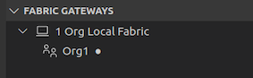
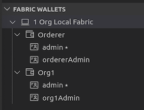
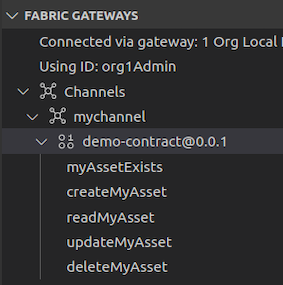
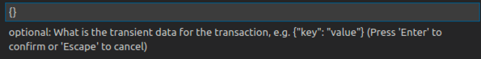
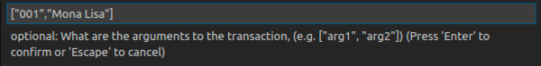

**IBM Blockchain Platform**

<h3 align='left'>← <a href='./a3.md'><b>A3: Deploying a smart contract</b></a>

</img>
## **Tutorial A4: Invoking a smart contract from VS Code**

---

Estimated time: `15 minutes`

In the last tutorial we packaged, installed and instantiated our smart contract on a locally defined instance of Hyperledger Fabric. In this tutorial we will:

* Learn about gateways and wallets
* Understand the different types of transactions
* Submit transactions that call the smart contract directly in VS Code

In order to successfully complete this tutorial, you must have first completed tutorial <a href='./a3.md'>A3: Deploying a smart contract</a> in the active VS Code workspace.

</img> &nbsp;&nbsp;&nbsp;&nbsp; `A4.1`: &nbsp;&nbsp;&nbsp;&nbsp;
Expand the first section below to get started.

---

<b>Connect to the Hyperledger Fabric gateway</b>

In order to submit transactions in Hyperledger Fabric you will need to use a *gateway*.

 <h3 align='left'>Fabric Gateways and Wallets</h3>

A gateway represents a connection to a Hyperledger Fabric network. 
Applications that call transactions, whether that's VS Code or your own application, use gateways to encapsulate the details of how and where they're connecting. 

Each gateway is built from within the client application and connects to a single peer on the network using a supplied identity. The credentials used to prove your identity are stored in *wallets* and passed to the gateway at connection time.

>  
   > <b>Want to know more about gateways?</b> <a href="https://hyperledger-fabric.readthedocs.io/en/latest/developapps/gateway.html">Read about them in the Hyperledger Fabric documentation.</a>
   >  &nbsp;

Take care to understand the difference between **Fabric Environments** and **Fabric Gateways**: While a Fabric *Environment* gives an overview of all the resources available to you in a Hyperledger Fabric network, a Fabric *Gateway* represents a single connection to it. Think of a view of the entire internet (Environment), compared to a view of a single connection to a web server (Gateway).

 <h3 align='left'>Gateways and Wallets in VS Code</h3>

The gateways that have been configured in the VS Code workspace are shown in the Fabric Gateways view in the IBM Blockchain Platform extension.

When the smart contract was deployed in the previous tutorial, a gateway was created for you at the same time; this is now shown in the Fabric Gateways view.

</img>

Furthermore, the available wallets and identities are shown in the Fabric Wallets view:

</img>

As you can see, four identities are listed in total: two each for the orderer and peer organizations that were created as part of the previous tutorial. The *'admin'* identities in each organization are responsible for running the Hyperledger Fabric component (peer or orderer). The other identities (*'ordererAdmin'* and *'org1Admin'*) are intended for client connections, and is what we will use for the gateway.

 <h3 align='left'>Connecting to the Fabric Gateway in VS Code</h3>

We will now connect to the local peer using the Fabric Gateway instance that is available to us. 

</img> &nbsp;&nbsp;&nbsp;&nbsp; `A4.2`: &nbsp;&nbsp;&nbsp;&nbsp;
In the Fabric Gateways view, click "1 Org Local Fabric - Org1".

If you can't see this view, remember to first click the IBM Blockchain Platform icon in the sidebar.

</img>

You will now be asked to select the identity that the gateway will use to connect to the network. Two are listed; these are the two identities in the wallet for the peer's organization (Org1). As a reminder, we will be using the identity *org1Admin*.

</img> &nbsp;&nbsp;&nbsp;&nbsp; `A4.3`: &nbsp;&nbsp;&nbsp;&nbsp;
Click 'org1Admin'.

</img>

The IBM Blockchain Platform will now connect to the locally running Hyperledger Fabric instance; this will only take a few seconds to complete.

Once connected, notice that the Fabric Gateways view changes to reflect the channels and transactions available to the connected gateway.

</img> &nbsp;&nbsp;&nbsp;&nbsp; `A4.4`: &nbsp;&nbsp;&nbsp;&nbsp;
Fully expand the Channels tree in the Fabric Gateways view to show the available transactions.

</img>

The tree shows the network into which the smart contract was deployed (mychannel), the name of the smart contract that was deployed (DemoContract@0.0.1), and the five transaction methods that were implemented as part of the smart contract.

</img> &nbsp;&nbsp;&nbsp;&nbsp; `A4.5`: &nbsp;&nbsp;&nbsp;&nbsp;
Expand the next section of the tutorial to continue.

---

<b>Invoke transactions using the gateway</b>

We will now invoke some of these transactions. Hyperledger Fabric distinguishes between read/write transactions that are logged on the blockchain ledger (*submitted* transactions), and read-only transactions that are not recorded on the blockchain ledger (*evaluated* transactions). IBM Blockchain Platform allows us to invoke both of these transaction types.

We will start by evaluating the transaction 'myAssetExists'.

</img> &nbsp;&nbsp;&nbsp;&nbsp; `A4.6`: &nbsp;&nbsp;&nbsp;&nbsp;
Right-click 'myAssetExists' and select 'Evaluate Transaction'.

</img>

Input parameters to transactions are entered in a JSON data format.

</img> &nbsp;&nbsp;&nbsp;&nbsp; `A4.7`: &nbsp;&nbsp;&nbsp;&nbsp;
Replace the input parameters with `["001"]` and press Enter.

</img>

Transient data is an advanced feature of Hyperledger Fabric which we will cover in a later tutorial; we will not use it here.

</img> &nbsp;&nbsp;&nbsp;&nbsp; `A4.8`: &nbsp;&nbsp;&nbsp;&nbsp;
Press Enter again to accept the default transient data parameters.

</img>

The peer will now run the myAssetExists method in our smart contract using an asset ID of "001". As you will recall from the implementation, this will return true if the key "001" exists in the world state, and false otherwise.

When the method completes, the Output tab will show the results of the evaluation.

</img> &nbsp;&nbsp;&nbsp;&nbsp; `A4.9`: &nbsp;&nbsp;&nbsp;&nbsp;
Move the mouse over the "Successfully evaluated transaction" notification to reveal the close icon, and click it to close it.

</img>

If you review the output from the command you can see the results of evaluating the transaction. In this case, the return value is false, because the key does not exist in the world state.

</img>

We will now create the asset. As this will modify the world state, we will need to *submit* a transaction this time rather than evaluate one.

</img> &nbsp;&nbsp;&nbsp;&nbsp; `A4.10`: &nbsp;&nbsp;&nbsp;&nbsp;
Right-click 'createMyAsset' and select 'Submit Transaction'.

</img>

As you may recall, the createMyAsset transaction takes two parameters: a key and its associated value.

</img> &nbsp;&nbsp;&nbsp;&nbsp; `A4.11`: &nbsp;&nbsp;&nbsp;&nbsp;
Replace the input parameters with `["001","Mona Lisa"]` and press Enter.

</img>

</img> &nbsp;&nbsp;&nbsp;&nbsp; `A4.12`: &nbsp;&nbsp;&nbsp;&nbsp;
Press Enter a second time to accept the transient data defaults and submit the transaction.

</img>

Review the output to ensure that the transaction was successful.

</img>

</img> &nbsp;&nbsp;&nbsp;&nbsp; `A4.13`: &nbsp;&nbsp;&nbsp;&nbsp;
Evaluate the "myAssetExists" transaction a second time with the "001" key to show that the asset now exists.

</img>

The returned value is now 'true'.

</img> &nbsp;&nbsp;&nbsp;&nbsp; `A4.14`: &nbsp;&nbsp;&nbsp;&nbsp;
Submit the "updateMyAsset" transaction to change the value of the "001" key to "The Hay Wain".

</img>

</img> &nbsp;&nbsp;&nbsp;&nbsp; `A4.15`: &nbsp;&nbsp;&nbsp;&nbsp;
Evaluate the "readMyAsset" transaction to return the updated value of the "001" key.

</img>

</img> &nbsp;&nbsp;&nbsp;&nbsp; `A4.16`: &nbsp;&nbsp;&nbsp;&nbsp;
Finally, submit the "deleteMyAsset" transaction to delete the "001" asset from the world state.

</img>

Note from this last transaction, that even though transactions in a blockchain's transaction log cannot be deleted, it is perfectly possible to delete assets from the world state. The log records the *changes* that have happened to the world state database, which can include deleting records as well as adding and modifying them.

 <h3 align='left'>Summary</h3>

In this tutorial we have used a gateway to connect to the Hyperledger Fabric instance running inside VS Code. We then used the IBM Blockchain Platform test capabilities to submit and evaluate transactions using the smart contract that we deployed.

In the next tutorial we will build and use a standalone application to transact with the blockchain.

---

<h3 align='right'> → <a href='./a5.md'><b>A5: Invoking a smart contract from an external application</b></h3></a>
