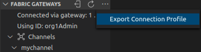
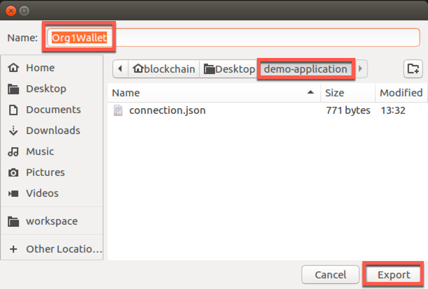
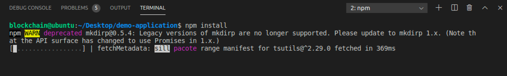
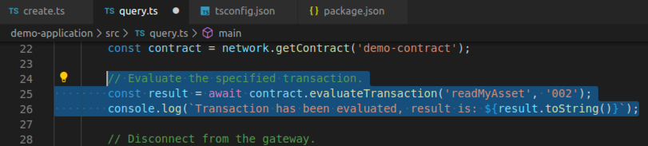

**IBM Blockchain Platform**

<h3 align='left'>← <a href='./a4.md'><b>A4: Invoking a smart contract from VS Code</b></a>

</img>
## **Tutorial A5: Invoking a smart contract from an external application**

---

Estimated time: `45 minutes`

In the last tutorial we learned about gateways and wallets and how they are used to provide our entry point into a Hyperledger Fabric network. We also used the IBM Blockchain Platform VS Code extension to connect to our network and call some transactions. In this tutorial we will:

* Build a new TypeScript application that can interact with Hyperledger Fabric
* Run the application to submit a transaction
* Modify the application and test the changes

In order to successfully complete this tutorial, you must have first completed tutorial <a href='./a4.md'>A4: Invoking a smart contract from VS Code</a> in the active workspace.

</img> &nbsp;&nbsp;&nbsp;&nbsp; `A5.1`: &nbsp;&nbsp;&nbsp;&nbsp;
Expand the first section below to get started.

---
<details>
<summary><b>Export the network details</b></summary>


When we build our application we will need to tell it how to connect to our Hyperledger Fabric network. To do this, we need to export two things from VS Code:
* the peer connection details
* the wallet containing our identity

We will start by exporting our connection details into a file called a *connection profile*.

</img> &nbsp;&nbsp;&nbsp;&nbsp; `A5.2`: &nbsp;&nbsp;&nbsp;&nbsp;
With the gateway connected, move the mouse over the Fabric Gateways view, click the ellipsis that appears and select "Export Connection Profile".

</img>

</img> &nbsp;&nbsp;&nbsp;&nbsp; `A5.3`: &nbsp;&nbsp;&nbsp;&nbsp;
Create a new folder called 'DemoApplication' as a peer of the DemoContract project we created earlier. Give the connection profile a convenient name ('connection.json') and export it into the new folder.

</img>

We will now export our wallet.

</img> &nbsp;&nbsp;&nbsp;&nbsp; `A5.4`: &nbsp;&nbsp;&nbsp;&nbsp;
In the Fabric Wallets view, right-click on "1 Org Local Fabric - Org1 Wallet" and select "Export Wallet".

Take care not to click on the Orderer organization's wallet by mistake.

</img>

</img> &nbsp;&nbsp;&nbsp;&nbsp; `A5.5`: &nbsp;&nbsp;&nbsp;&nbsp;
Select the 'DemoApplication' folder and click Export to save the wallet as 'Org1'.

</img>

</img> &nbsp;&nbsp;&nbsp;&nbsp; `A5.6`: &nbsp;&nbsp;&nbsp;&nbsp;
Expand the next section of the tutorial to continue.

</details>


---

<details>
<summary><b>Create the external application</b></summary>

We will now load the DemoApplication folder into VS Code for editing.


</img> &nbsp;&nbsp;&nbsp;&nbsp; `A5.7`: &nbsp;&nbsp;&nbsp;&nbsp;
From the VS Code menu bar click "File" -> "Add Folder to Workspace..."

</img>

</img> &nbsp;&nbsp;&nbsp;&nbsp; `A5.8`: &nbsp;&nbsp;&nbsp;&nbsp;
Highlight the 'DemoApplication' folder and click 'Add'.

</img>

After adding the folder to the workspace, VS Code will show the Explorer sidebar, with the new 'DemoApplication' folder underneath 'DemoContract'.

</img>

In order to build a working Typescript application we will now create three files in addition to the wallet and connection profile we exported earlier:
* **invoke.ts**: The Typescript file that is the implementation of our application: the logic to connect to the Hyperledger Fabric network and call transactions.
* **tsconfig.json**: Describes the TypeScript compiler options, including source and destination locations
* **package.json**: Describes the Node modules we require (including the Hyperledger Fabric client SDK), as well as the listing the various commands we will use to build and test.

We will start by creating *invoke.ts* inside a *src* folder.


</img> &nbsp;&nbsp;&nbsp;&nbsp; `A5.9`: &nbsp;&nbsp;&nbsp;&nbsp;
Right-click 'DemoApplication' and select 'New Folder'.

</img>

</img> &nbsp;&nbsp;&nbsp;&nbsp; `A5.10`: &nbsp;&nbsp;&nbsp;&nbsp;
Name the folder 'src'.

</img>

</img> &nbsp;&nbsp;&nbsp;&nbsp; `A5.11`: &nbsp;&nbsp;&nbsp;&nbsp;
Right-click 'src' and select 'New File'.

</img>

</img> &nbsp;&nbsp;&nbsp;&nbsp; `A5.12`: &nbsp;&nbsp;&nbsp;&nbsp;
Name the file '**invoke.ts**'.

</img>

</img> &nbsp;&nbsp;&nbsp;&nbsp; `A5.13`: &nbsp;&nbsp;&nbsp;&nbsp;
In the editor view for the new invoke.ts file, copy and paste the following text. (The contents are also <a href="./resources/invoke.ts">available here</a>).

```typescript
import { FileSystemWallet, Gateway } from 'fabric-network';
import * as path from 'path';

const ccpPath = path.resolve(__dirname, '..', 'connection.json');

async function main() {
    try {

        // Create a new file system based wallet for managing identities.
        const walletPath = path.join(process.cwd(), 'Org1');
        const wallet = new FileSystemWallet(walletPath);
        console.log(`Wallet path: ${walletPath}`);

        // Create a new gateway for connecting to our peer node.
        const gateway = new Gateway();
        await gateway.connect(ccpPath, { wallet, identity: 'org1Admin', discovery: { enabled: true, asLocalhost: true } });

        // Get the network (channel) our contract is deployed to.
        const network = await gateway.getNetwork('mychannel');

        // Get the contract from the network.
        const contract = network.getContract('DemoContract');

        // Submit the specified transaction.
        await contract.submitTransaction('createMyAsset', '002', 'Night Watch');
        console.log(`Transaction has been submitted`);

        // Disconnect from the gateway.
        await gateway.disconnect();

    } catch (error) {
        console.error(`Failed to submit transaction: ${error}`);
        process.exit(1);
    }
}
main();
```

Your file should be 36 lines long. We will look through what the application is doing later on in this tutorial. 

</img> &nbsp;&nbsp;&nbsp;&nbsp; `A5.14`: &nbsp;&nbsp;&nbsp;&nbsp;
Save the file ('File' -> 'Save').

Saving the file will change the tab for the editor to show a cross; a solid circle here means that you have unsaved changes.

</img>

You will see various errors reported by VS Code, because we have not yet configured the set of external dependencies. 

</img>

We will next create the *tsconfig.json* file.

</img> &nbsp;&nbsp;&nbsp;&nbsp; `A5.15`: &nbsp;&nbsp;&nbsp;&nbsp;
Right-click 'DemoApplication' (NOT 'src') and select 'New File'.

</img>

</img> &nbsp;&nbsp;&nbsp;&nbsp; `A5.16`: &nbsp;&nbsp;&nbsp;&nbsp;
Name the file '**tsconfig.json**'.

</img>

</img> &nbsp;&nbsp;&nbsp;&nbsp; `A5.17`: &nbsp;&nbsp;&nbsp;&nbsp;
In the editor view for the new tsconfig.json file, copy and paste the following text. (The contents are also <a href="./resources/tsconfig.json">available here</a>).

```json
{
    "compilerOptions": {
      "target": "es6",
      "module": "commonjs",
      "allowJs": true,
      "sourceMap": true,
      "outDir": "./dist/",
      "strict": true,
      "noImplicitAny": true,
      "strictNullChecks": true,
      "strictFunctionTypes": true,
      "strictBindCallApply": true,
      "strictPropertyInitialization": true,
      "noImplicitThis": true,
      "alwaysStrict": true,
      "esModuleInterop": true,
      "forceConsistentCasingInFileNames": true
    },
    "include": [
      "./src/**/*"
    ],
    "exclude": [
      "node_modules"
    ]
}  
```

Your file should be 25 lines long.

Importantly, the tsconfig.json file specifies the source and output folders (src and dist respectively), and enables compiler options for strict syntax checking of our Typescript.


</img> &nbsp;&nbsp;&nbsp;&nbsp; `A5.18`: &nbsp;&nbsp;&nbsp;&nbsp;
Save the file ('File' -> 'Save').

Finally, we will create the *package.json* file.

</img> &nbsp;&nbsp;&nbsp;&nbsp; `A5.19`: &nbsp;&nbsp;&nbsp;&nbsp;
Right-click 'DemoApplication' (NOT 'src') and select 'New File'.

</img>

</img> &nbsp;&nbsp;&nbsp;&nbsp; `A5.20`: &nbsp;&nbsp;&nbsp;&nbsp;
Name the file '**package.json**'.

</img>

</img> &nbsp;&nbsp;&nbsp;&nbsp; `A5.21`: &nbsp;&nbsp;&nbsp;&nbsp;
In the editor view for the new package.json file, copy and paste the following text. (The contents are also <a href="./resources/package.json">available here</a>).

```json
{
    "name": "demoapplication",
    "version": "1.0.0",
    "description": "Demo application implemented in TypeScript",
    "engines": {
        "node": ">=8",
        "npm": ">=5"
    },
    "scripts": {
        "lint": "tslint -c tslint.json 'src/**/*.ts'",
        "pretest": "npm run lint",
        "test": "nyc mocha -r ts-node/register src/**/*.spec.ts",
        "build": "tsc",
        "build:watch": "tsc -w",
        "prepublishOnly": "npm run build",
        "start": "node ./dist/invoke.js"
    },
    "engineStrict": true,
    "author": "Hyperledger",
    "license": "Apache-2.0",
    "dependencies": {
        "fabric-ca-client": "~1.4.0",
        "fabric-network": "~1.4.0"
    },
    "devDependencies": {
        "@types/chai": "^4.1.7",
        "@types/mocha": "^5.2.5",
        "@types/node": "^10.12.10",
        "@types/sinon": "^5.0.7",
        "@types/sinon-chai": "^3.2.1",
        "chai": "^4.2.0",
        "mocha": "^5.2.0",
        "nyc": "^13.1.0",
        "sinon": "^7.1.1",
        "sinon-chai": "^3.3.0",
        "ts-node": "^7.0.1",
        "tslint": "^5.11.0",
        "typescript": "^3.1.6"
    },
    "nyc": {
        "extension": [
            ".ts",
            ".tsx"
        ],
        "exclude": [
            "coverage/**",
            "dist/**"
        ],
        "reporter": [
            "text-summary",
            "html"
        ],
        "all": true,
        "check-coverage": true,
        "statements": 100,
        "branches": 100,
        "functions": 100,
        "lines": 100
    }
}
```

Your file should be 60 lines long. It describes the module dependencies of our application, including any required versions.

</img> &nbsp;&nbsp;&nbsp;&nbsp; `A5.22`: &nbsp;&nbsp;&nbsp;&nbsp;
Save the file ('File' -> 'Save').

At this stage, your application structure should contain a wallet folder ('Org1'), a source folder ('src') which contains a single file ('invoke.ts'), a connection profile ('connection.json'), package.json and tsconfig.json. If this is not the case, check the instructions and move and edit files as necessary.

</img>


In the next section we will build the application.

</img> &nbsp;&nbsp;&nbsp;&nbsp; `A5.23`: &nbsp;&nbsp;&nbsp;&nbsp;
Expand the next section to continue.

</details>

---

<details>
<summary><b>Build the external application</b></summary>

Even though we've specified our application's dependencies inside package.json, we haven't yet loaded the required modules into our workspace and so errors remain. The next step is to install these modules so that the errors disappear and allow our application to be built and run.

</img> &nbsp;&nbsp;&nbsp;&nbsp; `A5.24`: &nbsp;&nbsp;&nbsp;&nbsp;
Right-click 'DemoApplication' and select 'Open in Terminal'.

</img>

This will bring to focus a terminal prompt inside VS Code.

</img>

</img> &nbsp;&nbsp;&nbsp;&nbsp; `A5.25`: &nbsp;&nbsp;&nbsp;&nbsp;
In the terminal window type ``npm install`` and press Enter.

</img>

This will download the module dependencies into our project folder and may take a minute or so to complete. When it has finished, the prompt will return.

</img>

The errors that were previously reported will now all vanish, and the DemoApplication folder will now contain a new 'node_modules' folder that contains the imported dependencies.

</img>

With our dependencies resolved we can now build our application.

</img> &nbsp;&nbsp;&nbsp;&nbsp; `A5.26`: &nbsp;&nbsp;&nbsp;&nbsp;
In the main VS Code menu, click 'Terminal' -> 'Run Build Task...'.

</img>

</img> &nbsp;&nbsp;&nbsp;&nbsp; `A5.27`: &nbsp;&nbsp;&nbsp;&nbsp;
In the command palette, find and click 'tsc: watch - tsconfig.json DemoApplication'.

Take care to select the correct option as there will be similar looking alternatives (build options for our smart contract project, for example).

</img>

After a few seconds, the application will have been built and the compiler will enter *'watch'* mode, which means that any changes to the source will cause an automatic recompilation. Using watch mode is useful as it means you do not have to force a rebuild each time you make a change.

</img>

You will also see a new 'dist' folder underneath the DemoApplication project. This contains the built version of the application, which is what we will run in the next section.

</img>

</img> &nbsp;&nbsp;&nbsp;&nbsp; `A5.28`: &nbsp;&nbsp;&nbsp;&nbsp;
Expand the next section to continue.

</details>

---

<details>
<summary><b>Run the external application</b></summary>

We can run our application wherever we choose - it is just a standard node application. VS Code provides a useful run time environment for applications as it is integrated with the rest of the tools we have been using, and is what we will do now.

</img> &nbsp;&nbsp;&nbsp;&nbsp; `A5.29`: &nbsp;&nbsp;&nbsp;&nbsp;
In the main VS Code menu, click 'Terminal' -> 'Run Task...'.

</img>

</img> &nbsp;&nbsp;&nbsp;&nbsp; `A5.30`: &nbsp;&nbsp;&nbsp;&nbsp;
Find and select the task 'npm: start DemoApplication'.

Again, take care to select the correct task as there might be alternatives that look very similar.

</img>

VS Code will offer to automatically scan the task output for us, but we will not do that here.

</img> &nbsp;&nbsp;&nbsp;&nbsp; `A5.31`: &nbsp;&nbsp;&nbsp;&nbsp;
Click 'Continue without scanning the task output'.

</img>


The task will now run. What it will do is run the *start* script that is defined in DemoApplication's package.json, which is the command `node ./dist/invoke.js`. You could run the same node command in any appropriately configured environment and achieve the same output.

</img>

The task will be run inside VS Code and, after a brief pause, you will see it complete successfully.

</img>

> <br>
    > <b>Running the command a second time?</b>
    > <br> If you run the command again you will see errors like 'The my asset 002 already exists' and 'Endorsement has failed'.
    > <br>
    > If you review the implementation of the <i>createMyAsset</i> transaction, you'll see that this is intentional. You can quickly fix this by submitting the appropriate <i>deleteMyAsset</i> transaction in the Fabric Gateways view.
> <br>&nbsp;


</img> &nbsp;&nbsp;&nbsp;&nbsp; `A5.32`: &nbsp;&nbsp;&nbsp;&nbsp;
Press any key in the terminal window to free it up for other tasks.

The Terminal window will switch back to what was there previously.

<br><h3 align='left'>Reviewing the application</h3>

At this stage it is worthwhile reviewing what the application actually did.

</img> &nbsp;&nbsp;&nbsp;&nbsp; `A5.33`: &nbsp;&nbsp;&nbsp;&nbsp;
Click on the 'invoke.ts' tab in the VS Code editor (or load it from the Explorer view).

</img>

You can see the sequence of steps in the source file. It's largely self-explanatory, but the key elements are:
1. Specify the file system location of the wallet and connection profile, which we exported previously.
2. Instantiate a Gateway object and pass to it the connection profile, an identity from the wallet and some additional connection options.
3. Select the channel (network) to work with.
4. Select the smart contract to work with.
5. Submit a transaction with a given set of parameters and wait for it to finish.
6. Disconnect from the gateway.

We will now make a small change to the external application to invoke a different transaction.

</img> &nbsp;&nbsp;&nbsp;&nbsp; `A5.34`: &nbsp;&nbsp;&nbsp;&nbsp;
Expand the next section of the tutorial to continue.

</details>

---

<details>
<summary><b>Modify the external application</b></summary>


To verify that the createMyAsset transaction worked correctly from within our application, we will modify the application to display the new value of the key. (Of course, it is also possible to do this from the Fabric Gateways view as it is the same blockchain instance.)

</img> &nbsp;&nbsp;&nbsp;&nbsp; `A5.35`: &nbsp;&nbsp;&nbsp;&nbsp;
In the *invoke.ts* editor, find the lines that submit the transaction and log the success message to the console:

</img>

Our new application will attempt to evaluate the readMyAsset transaction and display the result.

</img> &nbsp;&nbsp;&nbsp;&nbsp; `A5.36`: &nbsp;&nbsp;&nbsp;&nbsp;
Use copy and paste to replace these lines with the following:

```typescript
// Evaluate the specified transaction.
const result = await contract.evaluateTransaction('readMyAsset', '002');
console.log(`Transaction has been evaluated, result is: ${result.toString()}`);
```


</img> &nbsp;&nbsp;&nbsp;&nbsp; `A5.37`: &nbsp;&nbsp;&nbsp;&nbsp;
Save the file ('File' -> 'Save').

As we previously enabled watch mode in the compiler, saving the file will automatically cause a recompilation of the application. This will take a few seconds.

When the modifications have been built, we can test them by running the application again.

</img> &nbsp;&nbsp;&nbsp;&nbsp; `A5.38`: &nbsp;&nbsp;&nbsp;&nbsp;
In the main VS Code menu, click 'Terminal' -> 'Run Task...'.

</img>

</img> &nbsp;&nbsp;&nbsp;&nbsp; `A5.39`: &nbsp;&nbsp;&nbsp;&nbsp;
Find and select the task 'npm: start DemoApplication'.

</img>

</img> &nbsp;&nbsp;&nbsp;&nbsp; `A5.40`: &nbsp;&nbsp;&nbsp;&nbsp;
Click 'Continue without scanning the task output'.

</img>

The task will be run and again, after a brief pause, you will see it complete successfully.

</img>

Note that the output now shows the current value of the '002' key we entered earlier.

<br><h3 align='left'>Summary</h3>

In this tutorial we have built a client application that can submit and evaluate transactions on a Hyperledger Fabric blockchain.

While the Fabric instance we've been working with is part of our VS Code environment, the same concept applies to all IBM Blockchain Platform-based blockchains: you export the wallet and connection profile for the target network and supply it to the Gateway object you instantiate in your application.

Just like we modified our client application, smart contracts can change too. In the next tutorial we will try modifying our smart contract to see how the upgrade process works.

</details>

---


<h3 align='right'> → <a href='./a6.md'><b>A6: Upgrading a smart contract</b></h3></a>
