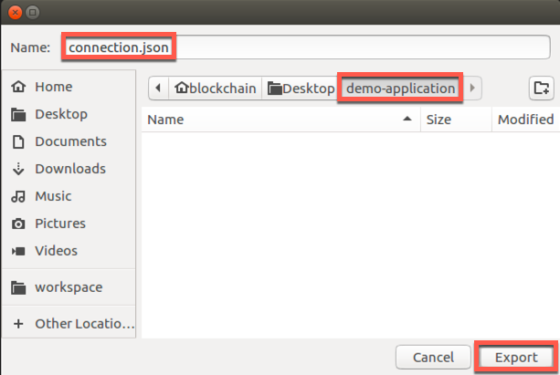
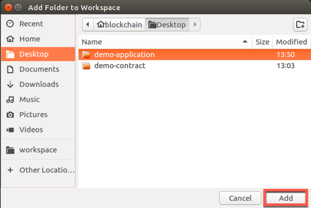
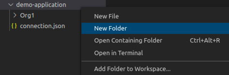
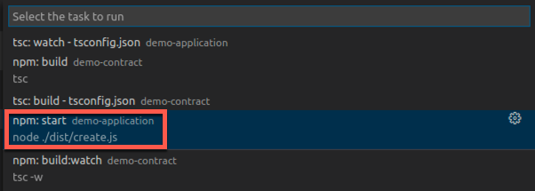
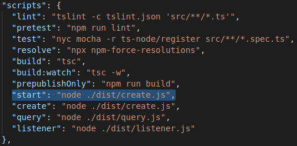
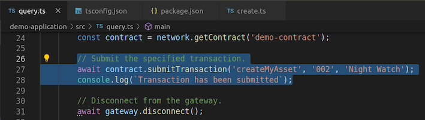

**IBM Blockchain Platform**

<h3 align='left'>← <a href='./a4.md'><b>A4: Invoking a smart contract from VS Code</b></a></h3>

</img>
## **Tutorial A5: Invoking a smart contract from an external application**

---

Estimated time: `45 minutes`

In the last tutorial we learned how an identity, wallet and gateway are used to access a Hyperledger Fabric network. We also used the IBM Blockchain Platform VS Code extension to connect to a sample network and call a smart contract to query the ledger and submit new transactions. In this tutorial we will:

* Build a new TypeScript application that interacts with Hyperledger Fabric
* Run the application to submit a new transaction
* Modify the application and test the changes

In order to successfully complete this tutorial, you must have first completed tutorial <a href='./a4.md'>A4: Invoking a smart contract from VS Code</a> in the active workspace.

</img> &nbsp;&nbsp;&nbsp;&nbsp; `A5.1`: &nbsp;&nbsp;&nbsp;&nbsp;
Expand the first section below to get started.

---
<details>
<summary><b>Export the network details</b></summary>


As we have seen, to interact with a Hyperledger Fabric network it is necessary to have:
* a connection profile
* a wallet containing one or more identities

Our sample application will use the same identity and connection profile used by VS Code to interact with the sample network.

We will start by exporting a *connection profile*.

</img> &nbsp;&nbsp;&nbsp;&nbsp; `A5.2`: &nbsp;&nbsp;&nbsp;&nbsp;
With the gateway connected, move the mouse over the Fabric Gateways view, click the ellipsis that appears and select "Export Connection Profile".

</img>

</img> &nbsp;&nbsp;&nbsp;&nbsp; `A5.3`: &nbsp;&nbsp;&nbsp;&nbsp;
Create a new folder called 'demo-application' as a peer of the demo-contract project we created earlier. Give the connection profile a convenient name ('connection.json') and export it into the new folder.

</img>

We will now export our wallet.

</img> &nbsp;&nbsp;&nbsp;&nbsp; `A5.4`: &nbsp;&nbsp;&nbsp;&nbsp;
In the Fabric Wallets view, expand '1 Org Local Fabric', right click 'Org1' and select 'Export Wallet'.

Take care not to click on the Orderer organization's wallet by mistake.

</img>

</img> &nbsp;&nbsp;&nbsp;&nbsp; `A5.5`: &nbsp;&nbsp;&nbsp;&nbsp;
Navigate into the 'demo-application' folder, change the name to 'Org1Wallet' and click Export to save the wallet.

</img>

</img> &nbsp;&nbsp;&nbsp;&nbsp; `A5.6`: &nbsp;&nbsp;&nbsp;&nbsp;
Expand the next section of the tutorial to continue.

</details>


---

<details>
<summary><b>Create the external application</b></summary>

Let's start by adding the demo-application folder to the VS Code workspace.

</img> &nbsp;&nbsp;&nbsp;&nbsp; `A5.7`: &nbsp;&nbsp;&nbsp;&nbsp;
From the VS Code menu bar click "File" -> "Add Folder to Workspace..."

</img>

</img> &nbsp;&nbsp;&nbsp;&nbsp; `A5.8`: &nbsp;&nbsp;&nbsp;&nbsp;
Highlight the 'demo-application' folder and click 'Add'.

</img>

After adding the folder to the workspace, VS Code will show the Explorer side bar, with the new 'demo-application' folder underneath 'demo-contract'.

The demo-application folder should contain a subfolder called 'Org1Wallet' (the wallet) and a connection profile called 'connection.json'.

</img>

In order to build a working Typescript application we will now create three files in addition to the wallet and connection profile:
* **create.ts**: The TypeScript application containing the logic required to connect to the Hyperledger Fabric sample network and submit a new transaction.
* **tsconfig.json**: TypeScript compiler options, including source and destination locations
* **package.json**: Application metadata, including the Hyperledger Fabric client SDK dependencies, and commands to build and test the application.

We will start by creating *create.ts* inside a *src* folder.


</img> &nbsp;&nbsp;&nbsp;&nbsp; `A5.9`: &nbsp;&nbsp;&nbsp;&nbsp;
Right-click 'demo-application' and select 'New Folder'.

</img>

</img> &nbsp;&nbsp;&nbsp;&nbsp; `A5.10`: &nbsp;&nbsp;&nbsp;&nbsp;
Name the folder 'src'.

</img>

</img> &nbsp;&nbsp;&nbsp;&nbsp; `A5.11`: &nbsp;&nbsp;&nbsp;&nbsp;
Right-click 'src' and select 'New File'.

</img>

</img> &nbsp;&nbsp;&nbsp;&nbsp; `A5.12`: &nbsp;&nbsp;&nbsp;&nbsp;
Name the file '**create.ts**'.

</img>

</img> &nbsp;&nbsp;&nbsp;&nbsp; `A5.13`: &nbsp;&nbsp;&nbsp;&nbsp;
In the editor view for the new create.ts file, copy and paste the following text. (The contents are also <a href="./resources/create.ts">available here</a>).

```typescript
import { FileSystemWallet, Gateway } from 'fabric-network';
import * as path from 'path';

async function main() {
    try {

        // Create a new file system based wallet for managing identities.
        const walletPath = path.join(process.cwd(), 'Org1Wallet');
        const wallet = new FileSystemWallet(walletPath);
        console.log(`Wallet path: ${walletPath}`);

        // Create a new gateway for connecting to our peer node.
        const gateway = new Gateway();
        const connectionProfile = path.resolve(__dirname, '..', 'connection.json');
        let connectionOptions = { wallet, identity: 'org1Admin', discovery: { enabled: true, asLocalhost: true }};
        await gateway.connect(connectionProfile, connectionOptions);

        // Get the network (channel) our contract is deployed to.
        const network = await gateway.getNetwork('mychannel');

        // Get the contract from the network.
        const contract = network.getContract('demo-contract');

        // Submit the specified transaction.
        await contract.submitTransaction('createMyAsset', '002', 'Night Watch');
        console.log(`Transaction has been submitted`);

        // Disconnect from the gateway.
        await gateway.disconnect();

    } catch (error) {
        console.error(`Failed to submit transaction: ${error}`);
        process.exit(1);
    }
}
main();
```

<!-- If the above file is updated, please remember to also update the copy in the resources folder. -->

Your file should be 36 lines long. We will look through what the application is doing later on in this tutorial. 

</img> &nbsp;&nbsp;&nbsp;&nbsp; `A5.14`: &nbsp;&nbsp;&nbsp;&nbsp;
Save the file ('File' -> 'Save').

Saving the file will change the tab for the editor to show a cross; a solid circle here means that you have unsaved changes:

</img>

When you save, you will see various errors reported by VS Code. This is because we have not yet configured the set of external dependencies. 

</img>

We will next create the *tsconfig.json* file.

</img> &nbsp;&nbsp;&nbsp;&nbsp; `A5.15`: &nbsp;&nbsp;&nbsp;&nbsp;
Right-click 'demo-application' (NOT 'src') and select 'New File'.

</img>

</img> &nbsp;&nbsp;&nbsp;&nbsp; `A5.16`: &nbsp;&nbsp;&nbsp;&nbsp;
Name the file '**tsconfig.json**'.

</img>

</img> &nbsp;&nbsp;&nbsp;&nbsp; `A5.17`: &nbsp;&nbsp;&nbsp;&nbsp;
In the editor view for the new tsconfig.json file, copy and paste the following text. (The contents are also <a href="./resources/tsconfig.json">available here</a>).

```json
{
    "compilerOptions": {
      "target": "es6",
      "module": "commonjs",
      "allowJs": true,
      "sourceMap": true,
      "outDir": "./dist/",
      "strict": true,
      "noImplicitAny": true,
      "strictNullChecks": true,
      "strictFunctionTypes": true,
      "strictBindCallApply": true,
      "strictPropertyInitialization": true,
      "noImplicitThis": true,
      "alwaysStrict": true,
      "esModuleInterop": true,
      "forceConsistentCasingInFileNames": true
    },
    "include": [
      "./src/**/*"
    ],
    "exclude": [
      "node_modules"
    ]
}
```

<!-- If the above file is updated, please remember to also update the copy in the resources folder. -->

Your file should be 25 lines long.

Importantly, the tsconfig.json file specifies the source and output folders ('src' and 'dist' respectively), and enables compiler options for strict syntax checking of our Typescript.


</img> &nbsp;&nbsp;&nbsp;&nbsp; `A5.18`: &nbsp;&nbsp;&nbsp;&nbsp;
Save the file ('File' -> 'Save').

Finally, we will create the *package.json* file.

</img> &nbsp;&nbsp;&nbsp;&nbsp; `A5.19`: &nbsp;&nbsp;&nbsp;&nbsp;
Right-click 'demo-application' (NOT 'src') and select 'New File'.

</img>

</img> &nbsp;&nbsp;&nbsp;&nbsp; `A5.20`: &nbsp;&nbsp;&nbsp;&nbsp;
Name the file '**package.json**'.

</img>

</img> &nbsp;&nbsp;&nbsp;&nbsp; `A5.21`: &nbsp;&nbsp;&nbsp;&nbsp;
In the editor view for the new package.json file, copy and paste the following text. (The contents are also <a href="./resources/package.json">available here</a>).

```json
{
  "name": "demo-application",
  "version": "1.0.0",
  "description": "Demo Application implemented in TypeScript",
  "main": "dist/index.js",
  "typings": "dist/index.d.ts",
  "engines": {
    "node": ">=8",
    "npm": ">=5"
  },
  "scripts": {
    "lint": "tslint -c tslint.json 'src/**/*.ts'",
    "pretest": "npm run lint",
    "test": "nyc mocha -r ts-node/register src/**/*.spec.ts",
    "resolve": "npx npm-force-resolutions",
    "build": "tsc",
    "build:watch": "tsc -w",
    "prepublishOnly": "npm run build",
    "start": "node ./dist/create.js",
    "create": "node ./dist/create.js",
    "query": "node ./dist/query.js",
    "listener": "node ./dist/listener.js"
  },
  "engineStrict": true,
  "author": "Hyperledger",
  "license": "Apache-2.0",
  "dependencies": {
    "fabric-network": "~1.4.0"
  },
  "devDependencies": {
    "@types/chai": "^4.2.0",
    "@types/mocha": "^5.2.7",
    "@types/node": "^10.12.10",
    "@types/sinon": "^7.0.13",
    "@types/sinon-chai": "^3.2.3",
    "chai": "^4.2.0",
    "chai-as-promised": "^7.1.1",
    "jsrsasign": "^8.0.13",
    "minimist": "^1.2.5",
    "mocha": "^6.2.0",
    "nyc": "^14.1.1",
    "sinon": "^7.4.1",
    "sinon-chai": "^3.3.0",
    "ts-node": "^8.3.0",
    "tslint": "^5.19.0",
    "typescript": "^3.6.2"
  },
  "nyc": {
    "extension": [
      ".ts",
      ".tsx"
    ],
    "exclude": [
      "coverage/**",
      "dist/**"
    ],
    "reporter": [
      "text-summary",
      "html"
    ],
    "all": true,
    "check-coverage": true,
    "statements": 100,
    "branches": 100,
    "functions": 100,
    "lines": 100
  },
  "resolutions": {
    "minimist": "^1.2.5",
    "mkdirp": "^1.0.4",
    "jsrsasign": "^8.0.13"
  }
}
```

<!-- If the above file is updated, please remember to also update the copy in the resources folder. -->

Your file should be 73 lines long. It describes the module dependencies of our application, including any required versions. It also configures a few scripts that we will run during the course of these tutorials.

</img> &nbsp;&nbsp;&nbsp;&nbsp; `A5.22`: &nbsp;&nbsp;&nbsp;&nbsp;
Save the file ('File' -> 'Save').

At this stage, your application structure should contain a wallet folder ('Org1Wallet'), a source folder ('src') which contains a single file ('create.ts'), a connection profile ('connection.json'), package.json and tsconfig.json. If this is not the case, check the instructions and move and edit files as necessary.

</img>

In the next section we will build the application.

</img> &nbsp;&nbsp;&nbsp;&nbsp; `A5.23`: &nbsp;&nbsp;&nbsp;&nbsp;
Expand the next section to continue.

</details>

---

<details>
<summary><b>Build the external application</b></summary>

Even though we've specified our application's dependencies inside package.json, we haven't yet loaded the required modules into our workspace and so errors remain. The next step is to install these modules so that the errors disappear and allow our application to be built and run.

</img> &nbsp;&nbsp;&nbsp;&nbsp; `A5.24`: &nbsp;&nbsp;&nbsp;&nbsp;
Right-click 'demo-application' and select 'Open in Terminal'.

</img>

This will bring to focus a terminal prompt inside VS Code.

</img>

</img> &nbsp;&nbsp;&nbsp;&nbsp; `A5.25`: &nbsp;&nbsp;&nbsp;&nbsp;
In the terminal window type ``npm install`` and press Enter.

</img>

This will download the module dependencies into our project folder and may take a minute or so to complete. When it has finished, the prompt will return.

</img>

The errors that were previously reported will now all vanish, and the demo-application folder will now contain a new 'node_modules' folder that contains the imported dependencies.

</img>

   > <br>
   > <b>Resolving vulnerabilities</b>
   > <br>
   > Depending on the versions of your installed components, you might see software vulnerabilities reported in the terminal after installation and it is good practice to fix these. We recommend running the <i>npm run resolve</i> command in the same terminal window. This runs the <i>resolve</i> script described in our package.json.
   > <br>&nbsp;
   > 
   > <br>&nbsp;

With our dependencies resolved we can now build our application.

</img> &nbsp;&nbsp;&nbsp;&nbsp; `A5.26`: &nbsp;&nbsp;&nbsp;&nbsp;
In the main VS Code menu, click 'Terminal' -> 'Run Build Task...'.

</img>

</img> &nbsp;&nbsp;&nbsp;&nbsp; `A5.27`: &nbsp;&nbsp;&nbsp;&nbsp;
In the command palette, find and click 'tsc: watch - tsconfig.json demo-application'.

Take care to select the correct option as there will be similar looking alternatives (build options for our smart contract project, for example). You might need to scroll the list to find the correct task.

</img>

After a few seconds, the application will have been built and the compiler will enter *'watch'* mode, which means that any changes to the source will cause an automatic recompilation. Using watch mode is useful as it means you do not have to force a rebuild each time you make a change.

</img>

You will also see a new 'dist' folder underneath the demo-application project. This contains the built version of the application, which is what we will run in the next section.

</img>

</img> &nbsp;&nbsp;&nbsp;&nbsp; `A5.28`: &nbsp;&nbsp;&nbsp;&nbsp;
Expand the next section to continue.

</details>

---

<details>
<summary><b>Run the external application</b></summary>

We can run our application wherever we choose - it is just a standard Node.js application. However, VS Code additionally provides an integrated terminal facility whereby different tasks can be run in different terminals. We'll use that now to make all our outputs easily accessible within VS Code.

</img> &nbsp;&nbsp;&nbsp;&nbsp; `A5.29`: &nbsp;&nbsp;&nbsp;&nbsp;
In the main VS Code menu, click 'Terminal' -> 'Run Task...'.

</img>

</img> &nbsp;&nbsp;&nbsp;&nbsp; `A5.30`: &nbsp;&nbsp;&nbsp;&nbsp;
Find and select the task 'npm: start demo-application'.

Again, take care to select the correct task as there might be alternatives that look very similar. You might need to scroll the list to find the correct task.

</img>

VS Code will offer to automatically scan the task output for us, but we will not do that here.

</img> &nbsp;&nbsp;&nbsp;&nbsp; `A5.31`: &nbsp;&nbsp;&nbsp;&nbsp;
Click 'Continue without scanning the task output'.

</img>


The task will now run. What it will do is run the *start* script that is defined in demo-application's package.json, which is the command `node ./dist/create.js`. You could run the same node command in any appropriately configured environment and achieve the same output.

(Note that the *start* script is identical to *create*; while convention is to name our default script *start*, having *create* also allows us to be more explicit about the application we are running.)


</img>

The task will be run inside a VS Code terminal and, after a brief pause, you will see it complete successfully.

</img>

> <br>
    > <b>Running the command a second time?</b>
    > <br> If you run the command again you will see errors like 'The my asset 002 already exists' and 'Endorsement has failed'.
    > <br>
    > If you review the implementation of the <i>createMyAsset</i> transaction, you'll see that this is intentional. You can quickly fix this by submitting the appropriate <i>deleteMyAsset</i> transaction in the Fabric Gateways view.
> <br>&nbsp;


</img> &nbsp;&nbsp;&nbsp;&nbsp; `A5.32`: &nbsp;&nbsp;&nbsp;&nbsp;
Press any key in the terminal window to free it up for other tasks.

The Terminal window will switch back to what was there previously.

<br><h3 align='left'>Reviewing the application</h3>

At this stage it is worthwhile reviewing what the application actually did.

</img> &nbsp;&nbsp;&nbsp;&nbsp; `A5.33`: &nbsp;&nbsp;&nbsp;&nbsp;
Click on the 'create.ts' tab in the VS Code editor (or load it from the Explorer view).

</img>

You can see the sequence of steps in the source file. The key elements are:
1. The wallet location on the local file system is specified using `FileSystemWallet()`
2. A gateway is connected to using `gateway.connect()`. The gateway uses a set of connection options that control how it interacts with the network channels accessed via the connection profile. A gateway has a fixed set of options which include the identity, and whether or not it uses service discovery for example.
3. The gateway provides access to a set of network channels using `gateway.getNetwork()`.
4. The network channel provides access to a set of smart contracts using `network.getContract()`.
5. A new transaction is submitted using `contract.submitTransaction()`.
6. Control is returned to the application only when consensus is complete and the distributed ledger has been updated. 

We will now make a small change to the external application to call a different transaction.

</img> &nbsp;&nbsp;&nbsp;&nbsp; `A5.34`: &nbsp;&nbsp;&nbsp;&nbsp;
Expand the next section of the tutorial to continue.

</details>

---

<details>
<summary><b>Modify the external application</b></summary>

Although submitting a transaction is the most important blockchain application operation, querying the ledger is the most common.

We're now going to query the ledger to verify that the createMyAsset transaction was added to the ledger correctly. To do this, we'll create a new query application based on our existing application.

</img> &nbsp;&nbsp;&nbsp;&nbsp; `A5.35`: &nbsp;&nbsp;&nbsp;&nbsp;
In the Explorer view, right click 'create.ts' and select 'Copy'.

</img>

</img> &nbsp;&nbsp;&nbsp;&nbsp; `A5.36`: &nbsp;&nbsp;&nbsp;&nbsp;
Select the 'src' folder, right click and select 'Paste'.

</img>

This will create a new file inside the 'src' folder called 'create copy.ts'.

</img>

</img> &nbsp;&nbsp;&nbsp;&nbsp; `A5.37`: &nbsp;&nbsp;&nbsp;&nbsp;
Right click the new file and select 'Rename'.

</img>

</img> &nbsp;&nbsp;&nbsp;&nbsp; `A5.38`: &nbsp;&nbsp;&nbsp;&nbsp;
Rename the file to 'query.ts', and press Enter to confirm.

</img>

</img> &nbsp;&nbsp;&nbsp;&nbsp; `A5.39`: &nbsp;&nbsp;&nbsp;&nbsp;
With query.ts loaded in the editor, find and select the lines that submit the transaction:

</img>

Our new application will attempt to evaluate the readMyAsset transaction and display the result.

</img> &nbsp;&nbsp;&nbsp;&nbsp; `A5.40`: &nbsp;&nbsp;&nbsp;&nbsp;
Use copy and paste to replace these lines with the following:

```typescript
// Evaluate the specified transaction.
const result = await contract.evaluateTransaction('readMyAsset', '002');
console.log(`Transaction has been evaluated, result is: ${result.toString()}`);
```

</img> &nbsp;&nbsp;&nbsp;&nbsp; `A5.41`: &nbsp;&nbsp;&nbsp;&nbsp;
Save the file ('File' -> 'Save').

As we previously enabled watch mode in the compiler, saving the file will automatically cause a recompilation. This will take a few seconds.

We can test the new application by running the correct task in npm. To save time, we created the query task when we implemented the package.json file earlier:

</img>

</img> &nbsp;&nbsp;&nbsp;&nbsp; `A5.42`: &nbsp;&nbsp;&nbsp;&nbsp;
In the main VS Code menu, click 'Terminal' -> 'Run Task...'.

</img>

</img> &nbsp;&nbsp;&nbsp;&nbsp; `A5.43`: &nbsp;&nbsp;&nbsp;&nbsp;
Find and select the task 'npm: query demo-application'.

</img>

</img> &nbsp;&nbsp;&nbsp;&nbsp; `A5.44`: &nbsp;&nbsp;&nbsp;&nbsp;
Click 'Continue without scanning the task output'.

</img>

The task will be run and again, after a brief pause, you will see it complete successfully.

</img>

Note that the output now shows the current value of the '002' key we entered earlier.

Congratulations! You've now written two applications: one that submits new transactions to the ledger and another that queries the current value of the ledger.

<br><h3 align='left'>Summary</h3>

In this tutorial we have built client applications that can submit and evaluate transactions on a Hyperledger Fabric blockchain.

Although the Fabric instance we've been working with is part of our VS Code environment, these applications can connect to any Hyperledger Fabric blockchain: you simply use the identity and connection profile for the target network when you create a gateway object you instantiate in your application.

In the same way as applications can change, smart contracts can evolve too. In the next tutorial we will try modifying our smart contract to see how the upgrade process works.

</details>

---


<h3 align='right'> → <a href='./a6.md'><b>A6: Upgrading a smart contract</b></h3></a>
