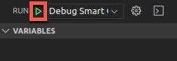
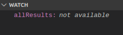

**IBM Blockchain Platform**

<h3 align='left'>← <a href='./a6.md'><b>A6: Upgrading a smart contract</b></a></h3>

</img>
## **Tutorial A7: Debugging a smart contract**

---

Estimated time: `15 minutes`

In the previous tutorial, we upgraded our smart contract by adding a new transaction method to our smart contract called 'queryAllAssets'. In this tutorial we will:

* Understand the tools to debug smart contracts
* Use the VS Code debugger to step through our newly added transaction to see how it works
* Use 'watches' to monitor variables in smart contracts

This tutorial is not intended to demonstrate all the features of the VS Code debugger. For more information, see the <a href="https://code.visualstudio.com/Docs/editor/debugging">VS Code debugger documentation</a>.

In order to successfully complete this tutorial, you must have first completed tutorial <a href='./a6.md'>A6: Upgrading a smart contract</a> in the active workspace.

</img> &nbsp;&nbsp;&nbsp;&nbsp; `A7.1`: &nbsp;&nbsp;&nbsp;&nbsp;
Expand the first section below to get started.

---

<b>Start a debug session</b>

The VS Code debugger contains four views in its own side bar: Variables, Watch, Call Stack and Breakpoints.

</img> &nbsp;&nbsp;&nbsp;&nbsp; `A7.2`: &nbsp;&nbsp;&nbsp;&nbsp;
Click the Debugger icon in the VS Code activity bar to show the Debugger side bar.

</img>

At the top of the side bar is a drop-down list that shows the available debug configurations. The IBM Blockchain Platform has added a configuration to allow us to debug our demo-contract smart contract package.

</img> &nbsp;&nbsp;&nbsp;&nbsp; `A7.3`: &nbsp;&nbsp;&nbsp;&nbsp;
Click the drop-down list at the top of the Debugger side bar and ensure that *'Debug Smart Contract (demo-contract)'* is selected.

</img>

We will now start a session to debug our demo-contract smart contract.

</img> &nbsp;&nbsp;&nbsp;&nbsp; `A7.4`: &nbsp;&nbsp;&nbsp;&nbsp;
Click the green Start arrow to the left of the drop-down list.

</img>

We now need to tell VS Code the location of the Fabric Environment in which we are going to debug our smart contract.

</img> &nbsp;&nbsp;&nbsp;&nbsp; `A7.5`: &nbsp;&nbsp;&nbsp;&nbsp;
In the command palette that appears, click '1 Org Local Fabric'.

</img>

After a brief pause, the bar at the bottom of VS Code will change color to indicate that a debug session has started for the 1 Org Local Fabric environment.

</img>

If necessary, VS Code will prompt us to upgrade the smart contract at this time. If you are prompted to do this, just accept any defaults and let the upgrade complete.

</img> &nbsp;&nbsp;&nbsp;&nbsp; `A7.6`: &nbsp;&nbsp;&nbsp;&nbsp;
Expand the next section of the tutorial to continue.

---

<b>Step through a smart contract transaction method</b>

We are now going to run our new *queryAllAssets* transaction method in the debugger to see how it works. We will set a breakpoint in the smart contract to allow us to pause and step through the code.

To do this, we first need to ensure that our smart contract has focus in the editor.

</img> &nbsp;&nbsp;&nbsp;&nbsp; `A7.7`: &nbsp;&nbsp;&nbsp;&nbsp;
Click on the *my-asset-contract.ts* tab in the editor.

If the file is not loaded in the editor, you will need to use the Explorer side bar to load the demo-contract -> src -> my-asset-contract.ts file, then switch back to the Debugger side bar.

</img>

We will now set a breakpoint.

</img> &nbsp;&nbsp;&nbsp;&nbsp; `A7.8`: &nbsp;&nbsp;&nbsp;&nbsp;
Scroll to the first statement of the *queryAllAssets* method and click the mouse just to the left of the line number; a red dot will appear. 

</img>

As with all debuggers, this causes execution to pause whenever this statement is reached. You can see all breakpoints listed in the Breakpoints view.

We will now evaluate a transaction to debug this method.

</img> &nbsp;&nbsp;&nbsp;&nbsp; `A7.9`: &nbsp;&nbsp;&nbsp;&nbsp;
Click the blue IBM Blockchain Platform icon in the Debug bar at the top of the screen.

</img>

</img> &nbsp;&nbsp;&nbsp;&nbsp; `A7.10`: &nbsp;&nbsp;&nbsp;&nbsp;
Click 'Evaluate Transaction'.

</img>

</img> &nbsp;&nbsp;&nbsp;&nbsp; `A7.11`: &nbsp;&nbsp;&nbsp;&nbsp;
Click 'MyAssetContract - queryAllAssets'.

</img>

As you will recall, there are no arguments or transient data to supply to this transaction.

</img> &nbsp;&nbsp;&nbsp;&nbsp; `A7.12`: &nbsp;&nbsp;&nbsp;&nbsp;
Press Enter to specify no arguments on the transaction.

</img>

</img> &nbsp;&nbsp;&nbsp;&nbsp; `A7.13`: &nbsp;&nbsp;&nbsp;&nbsp;
Press Enter to specify no transient data.

</img>

The smart contract will now run and pause at the breakpoint we previously set.

</img>

</img> &nbsp;&nbsp;&nbsp;&nbsp; `A7.14`: &nbsp;&nbsp;&nbsp;&nbsp;
Click 'Step Over' in the Debug bar multiple times to progress through the transaction's implementation.

</img>

As you step through the smart contract, note that the Variables and Call Stack views change depending on the current scope.

You should also see that the *while* loop is called twice before finishing; this is because, as you may recall, there are two assets in the world state ('002' and '003').

 >  
   > <b>Transaction timeouts?</b> You might see a transaction timeout error while the debugger is paused. This is OK, and you can use the debugger to explore how errors are handled.  Click 'Continue' in the Debug bar and invoke the transaction again if you wish.
   >  &nbsp;

</img> &nbsp;&nbsp;&nbsp;&nbsp; `A7.15`: &nbsp;&nbsp;&nbsp;&nbsp;
When you have stepped through to the end of the transaction, click 'Continue' to unpause execution.

</img>

</img> &nbsp;&nbsp;&nbsp;&nbsp; `A7.16`: &nbsp;&nbsp;&nbsp;&nbsp;
Expand the next section of the tutorial to continue.

---

<b>Add a variable watch</b>

It is also possible to put a watch on a smart contract variable or expression to check if and when certain conditions hold. This can be helpful if your smart contract is producing unexpected results.

</img> &nbsp;&nbsp;&nbsp;&nbsp; `A7.17`: &nbsp;&nbsp;&nbsp;&nbsp;
Select the first occurrence of *allResults* in the queryAllAssets method, where this variable is initialized.

</img>

</img> &nbsp;&nbsp;&nbsp;&nbsp; `A7.18`: &nbsp;&nbsp;&nbsp;&nbsp;
Right-click over the selected text and select 'Debug: Add to Watch'.

</img>

You will now see 'allResults' appear in the Watch view.

</img>

</img> &nbsp;&nbsp;&nbsp;&nbsp; `A7.19`: &nbsp;&nbsp;&nbsp;&nbsp;
Click the blue IBM Blockchain Platform Debug icon in the debug bar a second time, and repeat the earlier steps to evaluate the *queryAllAssets* transaction again.

As you step through the debugger, look particularly at the Watch view to see how the *allResults* array is built up as the transaction progresses. Note that watch variable is shown as a tree, which you can expand for more details.

</img>

Try setting additional breakpoints or watches and run them through the debugger.

</img> &nbsp;&nbsp;&nbsp;&nbsp; `A7.20`: &nbsp;&nbsp;&nbsp;&nbsp;
When you are finished, click the Stop button in the debug bar to stop the debug session.

</img>

 >  
   > <b>Hot fixes</b> It is not possible to make changes to smart contracts while debugging. You must stop the debugger before your smart contract can be upgraded.
   >  &nbsp;
   
 <h3 align='left'>Summary</h3>

In this tutorial we have used the VS Code debugger to step through a smart contract that is deployed to our Fabric environment.

In the next tutorial we will see how we can generate functional tests for our smart contract.

---

<h3 align='right'> → <a href='./a8.md'><b>A8: Testing a smart contract</b></h3></a>
