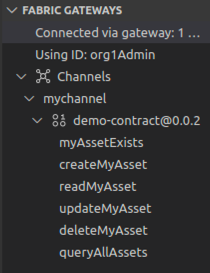
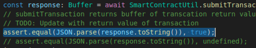
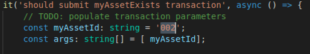

**IBM Blockchain Platform**

<h3 align='left'>← <a href='./a7.md'><b>A7: Debugging a smart contract</b></a></h3>

</img>
## **Tutorial A8: Testing a smart contract**

---

Estimated time: `20 minutes`

In the previous tutorial we used the VS Code debugger to step through our smart contract. In this tutorial we will:

* Look at the features for generating functional tests
* Generate functional tests for our smart contract
* Customize and run a sample test

In order to successfully complete this tutorial, you must have first completed tutorial <a href='./a6.md'>A6: Upgrading a smart contract</a> in the active workspace. It is desirable (but not mandatory) to have also completed tutorial <a href='./a7.md'>A7: Debugging a smart contract</a>.

</img> &nbsp;&nbsp;&nbsp;&nbsp; `A8.1`: &nbsp;&nbsp;&nbsp;&nbsp;
Expand the first section below to get started.


---
<details>
<summary><b>Generate functional tests</b></summary>

Throughout these tutorials we've been submitting and evaluating transactions in an ad-hoc manner using client applications and VS Code. This has helped us understand how blockchain smart contracts and applications work.

Of course, good practices for software development also apply to smart contracts and applications, which means that when you're developing real-world blockchain solutions it's important to use a structured framework to allow more formal testing of the code you write.

While an exhaustive discussion of these practices is beyond the scope of this tutorial, we will now look at the features in IBM Blockchain Platform and VS Code which facilitate smart contract functional testing.

Let's start by creating some functional tests for our smart contract package.

</img> &nbsp;&nbsp;&nbsp;&nbsp; `A8.2`: &nbsp;&nbsp;&nbsp;&nbsp;
Ensure that the Fabric Gateways view is visible and that the local network is connected.

If necessary, click the IBM Blockchain Platform activity bar icon to show the Fabric Gateways view, and click '1 Org Local Fabric' to connect to the gateway. The smart contract 'demo-contract@0.0.2' should be instantiated on the 'mychannel' network.

</img>

</img> &nbsp;&nbsp;&nbsp;&nbsp; `A8.3`: &nbsp;&nbsp;&nbsp;&nbsp;
Right-click 'demo-contract@0.0.2' and select 'Generate Tests for Smart Contract(s)'.

</img>

We want to generate tests for our smart contract.

</img> &nbsp;&nbsp;&nbsp;&nbsp; `A8.4`: &nbsp;&nbsp;&nbsp;&nbsp;
Click 'demo-contract'.

</img>

We will use the TypeScript language for our tests.

</img> &nbsp;&nbsp;&nbsp;&nbsp; `A8.5`: &nbsp;&nbsp;&nbsp;&nbsp;
Click 'TypeScript'.

</img>

A test application called 'MyAssetContract-demo-contract@0.0.2.test.ts' will be generated in a 'functionalTests' folder and shown in the editor. You might need to wait a minute or so while VS Code attempts to build the tests.

Some errors will appear and subsequently disappear during the build process.

> <br>
   > <b>Cannot find module?</b>
   > <br>You might be left with a single error that suggests that the 'fabric-network' module cannot be found:
   > <br>&nbsp;
   > 
   > <br>&nbsp;
   > This is a dependency that was resolved during the build process, but the reported error is not always removed automatically.
   > <br>&nbsp;<br>&nbsp;
   > To tidy up the error, either close and re-open the <i>'MyAssetContract-demo-contract@0.0.2.test.ts'</i> editor, or select 'View' -> 'Command Palette' and run the 'Developer: Reload Window' command.
   > <br>&nbsp;<br>&nbsp;
   > After doing this, you should see no errors reported.
   > <br>&nbsp;
   
The application contains a set of tests for the 'MyAsset' smart contract using the <a href="https://mochajs.org/">Mocha</a> testing framework. Of course you may wish to use your own testing framework. Let's use Mocha and our sample test application to understand the principles of functional testing:

* Tests are grouped together using a `describe()` expression
* Individual tests within a group are identified with an `it()` expression
* Each smart contract method has a specific test `describe` group with one or more `it()` functional tests within it
* Each test runs executes a smart contract transaction method and checks the result with an `assert()` expression. 
* The initial `describe` group sets up Mocha hooks for all subsequent test groups. These hooks run `before()` each subsequent `describe()` group and `beforeEach()` and `afterEach()` functional `it() ` test. The hooks are used to set up a new gateway for each group of tests, and reuse the same gateway within a group of tests. In this way the individual functional test can focus on smart contract method testing.

Take some time to review the generated *MyAssetContract-demo-contract@0.0.2.test.ts* file before continuing.

In addition to some standard code to connect to a Fabric gateway using an identity specified near the top of the file, the test application contains clauses for each of the transactions described in our smart contract, and these attempt to call the transaction and check the output.

</img> &nbsp;&nbsp;&nbsp;&nbsp; `A8.6`: &nbsp;&nbsp;&nbsp;&nbsp;
Expand the next section of the tutorial to continue.

</details>

---
<details>
<summary><b>Customize and run functional tests</b></summary>

If you look closely at the checks made by each of the transaction tests, you'll see that they simply make the assertion that true equals true. We need to customize these tests, replacing each check with one that compares the response from the transaction with the desired output.

In this section we'll update one of these test transactions and try it out.

</img> &nbsp;&nbsp;&nbsp;&nbsp; `A8.7`: &nbsp;&nbsp;&nbsp;&nbsp;
Scroll to the *myAssetExists* test.

</img>

</img> &nbsp;&nbsp;&nbsp;&nbsp; `A8.8`: &nbsp;&nbsp;&nbsp;&nbsp;
Replace the *assert.equal(true, true);* statement with the line:
```typescript
assert.equal(JSON.parse(response.toString()), true);
```

The new section of code should look like this:

</img>

It is checking that the output of the 'myAssetExists' transaction is true for the value of the input parameter 'EXAMPLE'. In order words, it is checking to see if the asset with the key 'EXAMPLE' exists.

</img> &nbsp;&nbsp;&nbsp;&nbsp; `A8.9`: &nbsp;&nbsp;&nbsp;&nbsp;
Save the file ('File' -> 'Save').

</img> &nbsp;&nbsp;&nbsp;&nbsp; `A8.10`: &nbsp;&nbsp;&nbsp;&nbsp;
Click the 'Run Test' hyperlink that is just before the *describe('myAssetExists')* clause.

</img>

The test will now run. After a brief pause you will see the output in the terminal:

</img>

This test is failing as expected, because the 'EXAMPLE' key does not exist.

We will now edit the test to check for a key that we know exists. As a result of earlier tutorials, you should have assets with keys '002' and '003' described in your world state. (If not, first try submitting a 'createMyAsset' transaction again.)

</img> &nbsp;&nbsp;&nbsp;&nbsp; `A8.11`: &nbsp;&nbsp;&nbsp;&nbsp;
Change 'EXAMPLE' in the *myAssetId* definition to `'002'`.

</img>

</img> &nbsp;&nbsp;&nbsp;&nbsp; `A8.12`: &nbsp;&nbsp;&nbsp;&nbsp;
Save the file ('File' -> 'Save').

</img> &nbsp;&nbsp;&nbsp;&nbsp; `A8.13`: &nbsp;&nbsp;&nbsp;&nbsp;
Click 'Run Test' again.

This time you will see that the test passes, because the asset with key '002' exists in the world state.

</img>

While we have just tested a single smart contract method, the generated application can be run in its entirety so that all transactions in a smart contract can be functionally tested. You can see the command to do run the tests under the mocha framework in the Terminal:

```
node_modules/.bin/mocha functionalTests/MyAssetContract-demo-contract@0.0.2.test.ts --grep="myAssetExists" -r ts-node/register
```

</img>

You can add additional tests to the application, and incorporate other testing frameworks with Mocha to build a comprehensive set of tests for your smart contract. Using the underlying commands also helps you integrate your tests in a CI/CD pipeline.

<br><h3 align='left'>Summary</h3>

In this tutorial, we have seen how functional tests can be generated for our smart contracts. We have also seen how to customize these tests so that we can check that smart contracts are running correctly.

In the next tutorial, we will see how we can update our smart contract to generate an event, and how applications can register and receive event notifications.

</details>

---

<h3 align='right'> → <a href='./a9.md'><b>A9: Publishing an event</b></h3></a>
