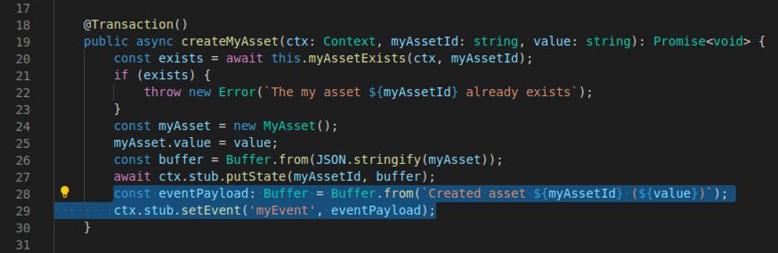
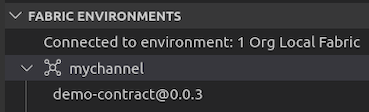
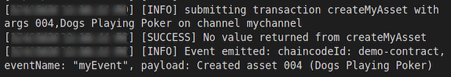
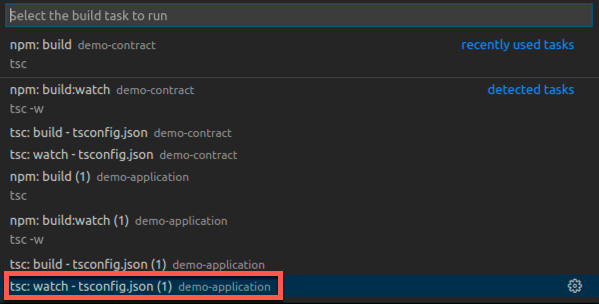
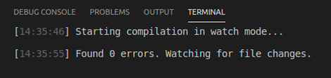
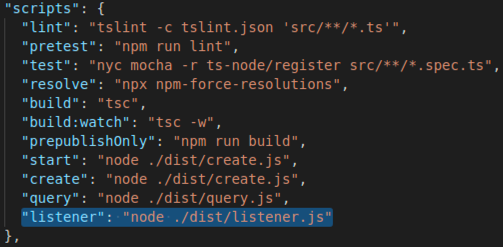
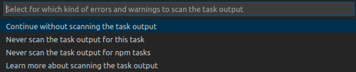

<!-- Standard Header Start -->
**IBM Blockchain Platform**
<h3 align='left'>← <a href='./a8.md'><b>A8: Testing a smart contract</b></a></h3>
<!-- Standard Header End -->

</img>
## **Tutorial A9: Publishing an event**

---

Estimated time: `30 minutes`

<!-- Standard Header End -->

In Hyperledger Fabric, smart contracts can generate events that can be received by applications that have registered for event notifications. In this tutorial we will:
- Update a smart contract to emit an event
- Subscribe to an event notification in the IBM Blockchain Platform VS Code extension
- Submit a transaction and receive the resulting event notification
- Subscribe to the same event notification in a client application

In order to successfully complete this tutorial, you must have first completed tutorial <a href='./a5.md'>A5: Invoking a smart contract from an external application</a> in the active workspace. It is desirable to have completed up to tutorial <a href='./a8.md'>A8: Testing a smart contract</a>.

</img> &nbsp;&nbsp;&nbsp;&nbsp; `A9.1`: &nbsp;&nbsp;&nbsp;&nbsp;
Expand the first section below to get started.

---
<details>
<summary><b>Implement the event logic</b></summary>

So far in this tutorial series, applications that submit new transactions are closely coupled to applications that query the ledger. For example, one application has to submit a transaction and let consensus complete before another application can query the ledger to confirm the result of that transaction.

An alternative pattern to couple applications connected to a Hyperledger Fabric network is using *events* and *notifications*. Applications can call smart contracts which generate transactions containing an event, and when that transaction is successfully committed to the ledger, a  notification can be received by one or more applications that have registered for event notification. This is a loosely coupled paradigm; the event consumer is unaware of the event producer.

An event is used to describe any significant situation that will be of interest to one or more applications; for example, when an update to an asset has occurred. Indeed, it can be appropriate to use this style of application coupling in many different scenarios:

* a regulator might want to be notified of a trade in near real time
* a supplier might want to use the acceptance of a new customer order to start a new business process to fulfill their contractual agreements
* a stock management system might want to keep an up-to-the-second accurate count of a particular transaction type in order to manage internal inventory

A transaction generated by a smart contract can include an event. When the transaction is committed to the ledger, all applications that are connected a suitable peer will receive a notification of this event. This is the publish/subscribe metaphor; a smart contract generates an event that can be consumed by zero or more applications. Applications can come and go; the event consumer and event producer are said to be loosely coupled to each other. 

As well as smart contract events, Hyperledger Fabric components can also publish system events when interesting things occur, such as when a block is committed.

<br><h3 align='left'>Modifying the smart contract</h3>

Before we can register for event notifications, we first need a smart contract with a transaction containing an event. We will use the 'createMyAsset' transaction in the smart contract we previously created to do this.

</img> &nbsp;&nbsp;&nbsp;&nbsp; `A9.2`: &nbsp;&nbsp;&nbsp;&nbsp;
Switch to the 'my-asset-contract.ts' file in the editor.

If the file is not already open, use the Explorer side bar to navigate to 'demo-contract' -> 'src' -> 'my-asset-contract.ts'.

</img> &nbsp;&nbsp;&nbsp;&nbsp; `A9.3`: &nbsp;&nbsp;&nbsp;&nbsp;
Navigate to the 'createMyAsset' method and use copy and paste to insert the following two lines at the end of the transaction's implementation:

```typescript
const eventPayload: Buffer = Buffer.from(`Created asset ${myAssetId} (${value})`);
ctx.stub.setEvent('myEvent', eventPayload);
```

The updated method should look like this:

</img>


</img> &nbsp;&nbsp;&nbsp;&nbsp; `A9.4`: &nbsp;&nbsp;&nbsp;&nbsp;
Save the file ('File' -> 'Save').

The setEvent method takes two parameters: in our example, we see an event name (the string "myEvent") and the event payload (a buffer containing the text "Created asset" and some details of the asset. We'll refer to this information again a little later.

<br><h3 align='left'>Upgrading the smart contract</h3>

We now need to upgrade our smart contract package to include the event emission logic.

</img> &nbsp;&nbsp;&nbsp;&nbsp; `A9.5`: &nbsp;&nbsp;&nbsp;&nbsp;
Switch to the 'demo-contract' -> 'package.json' editor.

</img> &nbsp;&nbsp;&nbsp;&nbsp; `A9.6`: &nbsp;&nbsp;&nbsp;&nbsp;
Update the value of the "version" field to `"0.0.3"`.

</img>

</img> &nbsp;&nbsp;&nbsp;&nbsp; `A9.7`: &nbsp;&nbsp;&nbsp;&nbsp;
Save the file ('File' -> 'Save').

</img> &nbsp;&nbsp;&nbsp;&nbsp; `A9.8`: &nbsp;&nbsp;&nbsp;&nbsp;
Hover over the Smart Contracts view in the IBM Blockchain Platform side bar, click the ellipsis (...) and select 'Package Open Project' for the 'demo-contract' project.

</img>

Wait a few seconds for the v0.0.3 smart contract to be built and shown in the Smart Contracts view.

</img>


</img> &nbsp;&nbsp;&nbsp;&nbsp; `A9.9`: &nbsp;&nbsp;&nbsp;&nbsp;
In the Fabric Environments view, right-click 'Smart Contracts' -> 'Instantiated' -> 'demo-contract@0.0.2' and select 'Upgrade Smart Contract'.

</img>

</img> &nbsp;&nbsp;&nbsp;&nbsp; `A9.10`: &nbsp;&nbsp;&nbsp;&nbsp;
Click 'demo-contract@0.0.3'.

</img>

We'll now supply the remaining options on the upgrade.

</img> &nbsp;&nbsp;&nbsp;&nbsp; `A9.11`: &nbsp;&nbsp;&nbsp;&nbsp;
Press Enter to not call a function on upgrade; click 'No' to not provide a private data collection configuration file; click 'Default' to select the default endorsement policy.

You may need to wait a minute or so for the upgrade to complete.

</img>

The upgraded smart contract is now ready to use.

</img> &nbsp;&nbsp;&nbsp;&nbsp; `A9.12`: &nbsp;&nbsp;&nbsp;&nbsp;
Expand the next section of the tutorial to continue.

</details>

---
<details>
<summary><b>Subscribe to the topic from IBM Blockchain Platform</b></summary>

With this change to the smart contract, every time a 'createMyAsset' transaction is committed, an event notification will sent to all applications registered for this event.

Smart contract notifications are only generated when a transaction containing an event is valid; an invalid transaction will not result in an event notification of the event within the transaction. Also, read-only transactions cannot generate events.

Any authorized client application can request event notification. It is possible request event notification within the IBM Blockchain Platform VS Code extension. Let's do that now.

</img> &nbsp;&nbsp;&nbsp;&nbsp; `A9.13`: &nbsp;&nbsp;&nbsp;&nbsp;
In the Fabric Gateways view, ensure that the local gateway is connected.

If the gateway is disconnected, click on "1 Org Local Fabric > Org1" in this view to connect, and select 'org1Admin' as the identity.

</img>

</img> &nbsp;&nbsp;&nbsp;&nbsp; `A9.14`: &nbsp;&nbsp;&nbsp;&nbsp;
Right-click 'demo-contract@0.0.3' and select 'Subscribe to Events'.

</img>

We need to specify which event(s) we are interested in. As you will recall from our event emission code, we named our topic 'myEvent'.

</img> &nbsp;&nbsp;&nbsp;&nbsp; `A9.15`: &nbsp;&nbsp;&nbsp;&nbsp;
Type `myEvent` and press Enter.

</img>

You will see a notification that confirms that the subscription has been registered.

> <br>
   > <b>Subscribing to multiple topics:</b>
   > <br> Regular expressions can be used to subscribe to multiple topics at once. For example, entering <b>.*</b> will subscribe to all custom events emitted from the smart contract.
   > <br>&nbsp;

</img> &nbsp;&nbsp;&nbsp;&nbsp; `A9.16`: &nbsp;&nbsp;&nbsp;&nbsp;
Expand the next section of the tutorial to continue.

</details>

---

<details>
<summary><b>Receive an event notification</b></summary>

Now that we have successfully subscribed to the 'myEvent' topic, we'll be able to receive notifications of those events in the VS Code output console.

In order to generate an event, we'll need to generate a createMyAsset transaction.

</img> &nbsp;&nbsp;&nbsp;&nbsp; `A9.17`: &nbsp;&nbsp;&nbsp;&nbsp;
In the Fabric Gateways view, right-click the 'createMyAsset' transaction and select 'Submit Transaction'.

</img>

</img> &nbsp;&nbsp;&nbsp;&nbsp; `A9.18`: &nbsp;&nbsp;&nbsp;&nbsp;
Replace the input parameters with `["004","Dogs Playing Poker"]` and press Enter.

</img>

</img> &nbsp;&nbsp;&nbsp;&nbsp; `A9.19`: &nbsp;&nbsp;&nbsp;&nbsp;
Press Enter a second time to accept the transient data defaults and submit the transaction.

</img>

</img> &nbsp;&nbsp;&nbsp;&nbsp; `A9.20`: &nbsp;&nbsp;&nbsp;&nbsp;
Review the output of this transaction.

The Output panel will show not only the transaction output, but also information about the event that was emitted. 

</img>

This information is only displayed because of the active subscription. The subscription will persist until the gateway is disconnected.

</details>

---

<details>
<summary><b>Subscribe to the topic from a client application</b></summary>

We will now try and subscribe to the same topic from within a client application. We will create a *listener.ts* client application that will be part of the project we created in tutorial <a href='./a5.md'>A5: Invoking a smart contract from an external application</a>.

</img> &nbsp;&nbsp;&nbsp;&nbsp; `A9.21`: &nbsp;&nbsp;&nbsp;&nbsp;
Switch to the Explorer view, and right click the 'src' folder underneath 'demo-application'. Select 'New File'.

</img>

</img> &nbsp;&nbsp;&nbsp;&nbsp; `A9.22`: &nbsp;&nbsp;&nbsp;&nbsp;
Name the file 'listener.ts' and press Enter to load the new file in the editor.

</img>

</img> &nbsp;&nbsp;&nbsp;&nbsp; `A9.23`: &nbsp;&nbsp;&nbsp;&nbsp;
Copy and paste the following source code into the new file. (It is also <a href="./resources/listener.ts">available here</a>.)

```typescript
import { FileSystemWallet, Gateway } from 'fabric-network';
import * as path from 'path';

async function main() {
    try {

        // Create a new file system based wallet for managing identities.
        const walletPath = path.join(process.cwd(), 'Org1Wallet');
        const wallet = new FileSystemWallet(walletPath);
        console.log(`Wallet path: ${walletPath}`);

        // Create a new gateway for connecting to our peer node.
        const gateway = new Gateway();
        const connectionProfile = path.resolve(__dirname, '..', 'connection.json');
        let connectionOptions = { wallet, identity: 'org1Admin', discovery: { enabled: true, asLocalhost: true }};
        await gateway.connect(connectionProfile, connectionOptions);

        // Get the network (channel) our contract is deployed to.
        const network = await gateway.getNetwork('mychannel');

        // Get the contract from the network.
        const contract = network.getContract('demo-contract');

        // Listen for myEvent publications
        const listener = await contract.addContractListener('listener-app', 'myEvent', (error: Error, event: any) => {
            if (error) {
                console.log(`Error from event: ${error.toString()}`);
                return;
            }
            const eventString: string = `chaincode_id: ${event.chaincode_id}, tx_id: ${event.tx_id}, event_name: "${event.event_name}", payload: ${event.payload.toString()}`;
            console.log(`Event caught: ${eventString}`);
        });

        console.log(`Listening for myEvent events...`);
        while (true) {
            await sleep(5000);
            // ... do other things
        }

    } catch (error) {
        console.error(`Error: ${error}`);
        process.exit(1);
    }
}

function sleep(ms: number) {
    return new Promise(resolve => setTimeout(resolve, ms));
}

main();
```

Your source file should be 50 lines long.

</img> &nbsp;&nbsp;&nbsp;&nbsp; `A9.24`: &nbsp;&nbsp;&nbsp;&nbsp;
Save the file ('File' -> 'Save').

If you completed tutorial <a href='./a5.md'>A5: Invoking a smart contract from an external application</a> in the same VS Code session, the compiler will be in watch mode, and the application will now rebuild itself and you can skip to A9.26.

</img> &nbsp;&nbsp;&nbsp;&nbsp; `A9.25`: &nbsp;&nbsp;&nbsp;&nbsp;
If necessary, rebuild the client application by clicking 'Terminal' -> 'Run Build Task' and selecting 'tsc: watch - tsconfig.json demo-application'.

</img>

</img>

We will now run the application using an npm script that we created in tutorial <a href='./a5.md'>A5: Invoking a smart contract from an external application</a>. When we created our package.json file in this tutorial, we included an npm script called 'listener' that will run our new application:

</img>

</img> &nbsp;&nbsp;&nbsp;&nbsp; `A9.26`: &nbsp;&nbsp;&nbsp;&nbsp;
Click 'Terminal' -> 'Run Task', and find and select 'npm: listener demo-application'.

As always, take care in selecting the correct task as the options can look alike.

</img>

</img> &nbsp;&nbsp;&nbsp;&nbsp; `A9.27`: &nbsp;&nbsp;&nbsp;&nbsp;
As before, select the option to continue without scanning the output.

</img>

The client application will now run: the application will connect to the gateway, register for 'myEvent' notifications and then pause indefinitely while it waits to receive them.

</img>

Note that we now have *two* subscribers: the IBM Blockchain Platform extension subscriber that we configured earlier, and our new client application. We will now test that notifications can be received by both of them.

</img> &nbsp;&nbsp;&nbsp;&nbsp; `A9.28`: &nbsp;&nbsp;&nbsp;&nbsp;
Switch to the IBM Blockchain Platform sidebar, and in the Fabric Gateways view right click the 'createMyAsset' transaction and select 'Submit transaction'.

</img>

</img> &nbsp;&nbsp;&nbsp;&nbsp; `A9.29`: &nbsp;&nbsp;&nbsp;&nbsp;Replace the input parameters with ``["005","The Starry Night"]``. As before, press Enter to confirm and Enter again to skip transient data.

</img>

The transaction will be submitted and the Output view  updated with the log of the transaction. Note that it includes the new event, which has been received and logged by the first subscriber (IBM Blockchain Platform):

</img>

We will now verify that the event has also been received by the second subscriber (the listener application):

</img> &nbsp;&nbsp;&nbsp;&nbsp; `A9.30`: &nbsp;&nbsp;&nbsp;&nbsp;Click the Terminal tab to show the running listener application.

Notice that the subscriber has successfully caught the event and run the handler code:

</img>

Feel free to continue trying out the event framework. When you have finished, remember to close down the listener application:

</img> &nbsp;&nbsp;&nbsp;&nbsp; `A9.31`: &nbsp;&nbsp;&nbsp;&nbsp;Right click in the running listener's terminal and select 'Kill Terminal'.

</img>

This will force the application to close.

<br><h3 align='left'>Summary</h3>

In this tutorial, we have updated one of the transactions in a smart contract to emit an event, subscribed to this event by specifying the correct topic string, and observed the event being output to the VS Code console. We then created a client application to subscribe to the same topic, and checked that it too could receive events.

In the final tutorial of this set, we will summarize what we have covered so far and invite you to claim a badge for your efforts!

</details>

<!-- Standard Footer Start -->

---

<h3 align='right'> → <a href='./a10.md'><b>A10: Claim your badge!</b></h3></a>
<!-- Standard Footer End -->