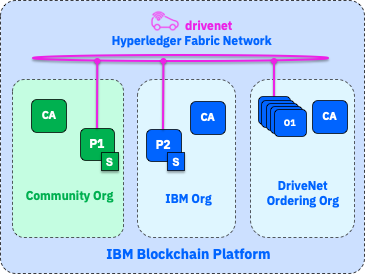
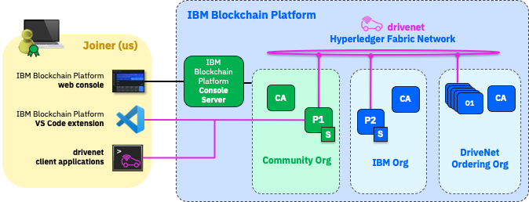
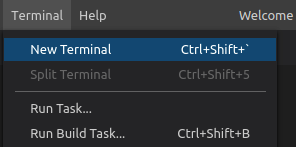
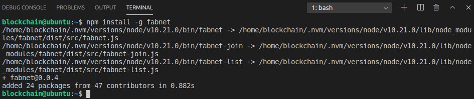

**IBM Blockchain Platform**

</img>

## **Tutorial B1: Getting started**


---

Estimated time: `10 minutes`

The purpose of this set of tutorials is to take you through the process of joining an existing Hyperledger Fabric network using the tools provided by IBM Blockchain Platform.

In this first tutorial of the set we will:
* Learn about the concepts that are relevant to joining a Hyperledger Fabric network
* Learn about the scenario upon which this set of tutorials is based, and the range of tools for interacting with and exploring the network
* Prepare your machine with the tools required to join the network

We will build on the concepts introduced in the previous set of tutorials, although you do not need any assets you created there in order to progress. You will need the IBM Blockchain Platform VS Code extension, a web browser and internet connectivity.

Please complete every task that begins with a blue square like this one:

 &nbsp;&nbsp;&nbsp;&nbsp; `B1.1`: &nbsp;&nbsp;&nbsp;&nbsp; Expand the first section below to get started.

If you run into problems, first check to make sure that you have completed all of these numbered steps in the correct order.

---
<details>
<summary><b>Learn blockchain network concepts</b></summary>

Blockchain gives us the ability to share transaction data with members of a business network, and to provably ensure that the data is not tampered with. 

Building a production blockchain network from scratch is a relatively infrequent occurrence. Given that each blockchain instance includes multiple participants, it stands to reason that joining a blockchain will be a more common task than creating a new one.

In order to understand the joining process, let's first consider what we mean by a *blockchain network*.

<br><h3 align='left'>Consortia</h3>

A blockchain use-case forms when a group of organizations can gain mutual benefit by sharing transaction data. Benefits might include lower costs through more efficient processes, increased revenue from new markets, or something else. Benefits might vary for each participant.

We think of this group of organizations as being a *consortium*. Consortia are often used to describe members of a single industry (such as a lobby group), but can also span multiple industries and geographies. Consider a consortium to track car ownership: this might include manufacturers, dealers and service organizations from all over the world. It might also include regulators, police, insurers and other interested parties.

Importantly, each member of the consortium needs an *incentive* to join a blockchain network - whether that's a business benefit, financial reward or regulatory pressure.

<br><h3 align='left'>Network roles and responsibilities</h3>

When it comes to building and operating a blockchain network, different consortium members will have different roles and responsibilities. Some might build blockchain assets, some might run peers, some might assert transaction order, and so on.

Some members of the consortium might interact with the network solely as a client, and delegate operational responsibilities onto a trusted third party. As you might expect, this is one of the simplest approaches for joining a blockchain network.

In our car example, think of a small repair business; they might be part of the business consortium and have an incentive to join a car ownership blockchain, but they might not have the IT budget to maintain a Hyperledger Fabric infrastructure, either locally or on the cloud.

This is the scenario we will follow in this 'B' set of tutorials.

We will adopt the role of a car network consortium member who is joining a blockchain network as a client, and will be able to submit transactions using an identity assigned by the network. We will not own any infrastructure ourselves; instead we will delegate the responsibility for running a peer and maintaining the ledger onto a trusted organization, which interacts with other members of the network on our behalf.

Let's look at the scenario in more detail.

&nbsp;

 &nbsp;&nbsp;&nbsp;&nbsp; `B1.2`: &nbsp;&nbsp;&nbsp;&nbsp; Expand the next section to continue.

</details>

---

<details>
<summary><b>Introduce the scenario</b></summary>

The network we are going to connect to is called *DriveNet*, which is a simple Hyperledger Fabric blockchain that uses the ledger to store the make, model, color and ownership information of a set of cars. It is based on the Hyperledger Fabric <a href="https://github.com/hyperledger/fabric-samples/tree/master/fabcar">fabcar</a> sample.

DriveNet is built and managed using IBM Blockchain Platform. The network is freely available for us to connect to, but please bear the following in mind:


   > <br>
   > <b>Important information about DriveNet</b>
   > <br>
   > <br>
   > <i>DriveNet is unsuitable for long-term or production use</i>
   > <br>The DriveNet network is regularly wiped and rebuilt. If you find yourself unable to connect after an absence, you might need to re-register with the network and recreate any assets you were working with. Data cannot be recovered once the network has been wiped, and it's not possible to transfer data between network instances.
   > <br>
   > <br>
   > <i>Please be considerate on the DriveNet network</i>
   > <br>DriveNet is shared with other users. As you submit transactions, take care to not do things that will inconvenience others on the network, and remember that transaction data you enter will be visible to other users. You take responsibility for the data you submit.
   > <br>
   > <br>
   > <i>DriveNet is unsupported</i>
   > <br>We make no guarantee with regard to service availability. We'll do our best to keep the network running, but we're unable to accept support tickets for the DriveNet network.
   > <br>&nbsp;
   

The DriveNet network consists of three organizations:

* **Community Org**: This consists of a certificate authority (CA) and a peer (P1) that has an instantiated smart contract (S).
* **IBM Org**: This consists of a certificate authority (CA) and another peer (P2), which has a copy of the same instantiated smart contract (S).
* **DriveNet Ordering Org**: This consists of a certificate authority (CA) and an ordering service (O1-O5) that asserts transaction order. More on this later.

</img>

We will use the services of the Community Org. Once we have registered to use it, we will be able to connect to its peer and use it to submit transactions and query the ledger.

  > <br>
   > <b>Community organizations</b><br>
   > A community organization is a common pattern for allowing smaller members of a consortium to make use of a blockchain without the ongoing expense of managing the network infrastructure. The downside of using a community organization is that we are delegating responsibility to it, and thus have to trust the organization to correctly submit our transactions and return our state. Given that blockchain is all about building trust between organizations, choosing whether you delegate responsibility for your transactions is an important decision.
   > <br>&nbsp;


Transactions can also be independently submitted by members of IBM Org, whose peer also maintains a copy of the ledger. Regardless of which organization submits transactions, there is an active policy on the network which states that both the Community Org and IBM Org must agree to (or *endorse*) each transaction before it can be added to the ledger. (We will look at endorsement in more detail as we go through the tutorials.)

An IBM-controlled organization is not mandatory in your own networks, even when using IBM Cloud or IBM Blockchain Platform. It is important to separate the roles of technology provider and active network participant; while DriveNet uses IBM Org to demonstrate multi-party transactions, your own networks are completely free to choose all participants in all roles.


<br><h3 align='left'>The tools</h3>

Here is a diagram that shows how we will interact with the network once we have registered:

</img>

As you can see, you will interact with the network using three sets of tools:

* **The IBM Blockchain Platform VS Code extension**: As we saw in the previous set of tutorials, this extension is a great way of quickly connecting to a network and submitting transactions.
* **The IBM Blockchain Platform web console**: This gives us an operational view of the network and allows administrators to configure various aspects of it. It is a web application that is served to us using an IBM Blockchain Platform component called the *Console Server*.
* **Client applications**: Business-specific tools that help the end-user, and which ultimately submit and evaluate transactions on the blockchain.

For production Hyperledger Fabric networks, *client applications* are the primary way that users interact with the blockchain.

 &nbsp;&nbsp;&nbsp;&nbsp; `B1.3`: &nbsp;&nbsp;&nbsp;&nbsp; Expand the next section to continue.
</details>

---

<details>
<summary><b>Prepare your machine</b></summary>

Before we can begin the process of connecting to DriveNet, we must install a command called 'fabnet' that is a set of tools that will allow us to discover and join Hyperledger Fabric networks that are listed in an online registry.

These tools are not required by all Hyperledger Fabric networks; only those that are referenced in the registry.

We will install the tools using npm in a terminal window. Any terminal window is fine, but we will use the embedded VS Code instance.

 &nbsp;&nbsp;&nbsp;&nbsp; `B1.4`: &nbsp;&nbsp;&nbsp;&nbsp;
From the VS Code menu bar click "Terminal" -> "New terminal".

</img>

 &nbsp;&nbsp;&nbsp;&nbsp; `B1.5`: &nbsp;&nbsp;&nbsp;&nbsp;
In the terminal view that opens, enter the following command:
```
npm install -g fabnet
```

Wait a few seconds while the tools are installed. You will need to be connected to the internet for this command to work.

</img>

> <br>
   > <b>Authorization errors?</b>
   > <br>
   > By default, some platforms (e.g. MacOS) do not allow the <i>npm -g</i> command to be run by users without administrative authority. If the installer fails with permission errors, you need to enable the root user and then run the command as root.
   > To enable the root user on MacOS, follow <a href="https://support.apple.com/en-us/HT204012">these instructions</a>. Then install the Fabnet client by running <pre>sudo npm install -g fabnet</pre>
   > &nbsp;

Your machine should now be ready to run the tools to discover and register with DriveNet.

<br><h3 align='left'>Summary</h3>

In this tutorial we have looked at the key concepts that underpin blockchain network formation, and introduced the joining scenario that this set of tutorials will be based on. We also looked at the type of user that we will embody as part of these tutorials and the type of onboarding that would make sense for them. We looked at the tools we will use that will make our scenario happen, and prepared your machine for joining.

In the next tutorial we will use the tools you just installed to discover DriveNet and request to join it.
</details>

---

<h3 align='right'> → <a href='./b2.md'><b>B2: Discovering the network</b></a></h3>
