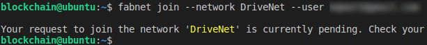

**IBM Blockchain Platform**

<h3 align='left'>← <a href='./b1.md'><b>B1: Getting started</b></a></h3>


</img>

## **Tutorial B2: Discovering the network**

---

Estimated time: `10 minutes`

In this tutorial we will:
* Look at what is needed to register with DriveNet
* Use the available tools to discover DriveNet and obtain your login details
* Log in to the IBM Blockchain Platform web console

In order to successfully complete this tutorial, you must have first completed tutorial <a href='./b1.md'>B1: Understanding the scenario</a> in the active VS Code workspace.

Remember to complete every task that begins with a blue square like this one:

 &nbsp;&nbsp;&nbsp;&nbsp; `B2.1`: &nbsp;&nbsp;&nbsp;&nbsp; Expand the first section below to get started.

---
<details>
<summary><b>Acquire connection details</b></summary>

Hyperledger Fabric networks use certificate authorities (CAs) to issue digital certificates to authorized users. These certificates are used to identify users and their role within the network.

In order to successfully onboard to the DriveNet network, we need to ask the Community Org CA to enroll ourselves as a new user. We will use the IBM Blockchain Platform web console to do this, and for this we need to know the URL of the web console, and a login and password to it.

Once we have logged in, we will use another login and password (called an *enrollment ID* and *secret*) that is already known to the Hyperledger Fabric network. This will be used by the CA to issue us with a certificate that we can then use within our client applications to interact with the network.

In summary, we need five pieces of information in order to complete the registration process to DriveNet: the admin console URL, console login, console password, Fabric enrollment ID and Fabric secret:

</img>

We will obtain these details using the tools we installed in the previous tutorial.

Following from the end of that tutorial, you should now see a terminal view. If you do not see this, right click the fabnet folder in the VS Code Explorer and select "Open in integrated Terminal".

Let's first browse the available networks:

 &nbsp;&nbsp;&nbsp;&nbsp; `B2.2`: &nbsp;&nbsp;&nbsp;&nbsp; In the terminal view, run the command:

```
fabnet list
```

This will run a command line application that will show you the networks that are currently available to join. For example:

</img>

You should see at least one network that begins *DriveNet*.

   > <br>
   > <b>Where are you?</b><br>
   > The default 'DriveNet' network is located in the London region. Depending on where you are in the world, you might gain better performance by connecting to an alternative instance; any suffix denotes the region where the network is deployed.
   > <br>&nbsp;

 &nbsp;&nbsp;&nbsp;&nbsp; `B2.3`: &nbsp;&nbsp;&nbsp;&nbsp; Enter the following command, replacing \<email\> with your email address. Also change the DriveNet instance, if necessary. Note that network names are case-insensitive.

```
fabnet join --network DriveNet --user <email>
```


</img>

When this command completes, check your email for a message that contains a token:

</img>

 &nbsp;&nbsp;&nbsp;&nbsp; `B2.4`: &nbsp;&nbsp;&nbsp;&nbsp; Run the join command again, this time adding the --token flag and the token you received:

```
fabnet join --network DriveNet --user <email> --token <token>
```

A set of login parameters and URLs will be displayed.

</img>

You will also receive an email with this information; please keep it safe.

As a convenience, you'll also be given a connection profile that allows you to connect to DriveNet. If you have write access to the current directory, it will be saved there by the join command. It will also be included as an attachment in your credentials email.

When connecting to your own networks, or if you lose your connection profile, you'll need to download it from the IBM Blockchain Platform web console. We will show you how to do this later on.

The registration for fabnet includes a link to the *Smart Contract* source and a link to a GUI *DriveNet App*. These links are not needed for this tutorial, but are described in more detail in tutorial <a href='./b9.md'>B9: Leaving a network</a>.

Let's log in to the IBM Blockchain Platform web console. This will allow us to view the network and complete our registration.

 &nbsp;&nbsp;&nbsp;&nbsp; `B2.5`: &nbsp;&nbsp;&nbsp;&nbsp; Expand the next section below to continue.

</details>

---
<details>
<summary><b>Log in to the web console</b></summary>

 &nbsp;&nbsp;&nbsp;&nbsp; `B2.6`: &nbsp;&nbsp;&nbsp;&nbsp;
Start a web browser, navigate to the admin console URL address you were given, and enter the console user ID and console password.

Be sure to use the *console* ID and password, and not the Fabric enrollment ID and secret.

</img>

 &nbsp;&nbsp;&nbsp;&nbsp; `B2.7`: &nbsp;&nbsp;&nbsp;&nbsp; When prompted, change your password.

</img>

 &nbsp;&nbsp;&nbsp;&nbsp; `B2.8`: &nbsp;&nbsp;&nbsp;&nbsp; Log back in using your new password.

When you have successfully logged in, you will be shown a welcome screen that shows graphically the different components of IBM Blockchain Platform.

You can hover over the on-screen elements in the web browser to learn more about them.

</img>

 &nbsp;&nbsp;&nbsp;&nbsp; `B2.9`: &nbsp;&nbsp;&nbsp;&nbsp; Click 'Let's get started' to dismiss the welcome screen.

You will now be shown the IBM Blockchain Platform web console.


<br><h3 align='left'>Summary</h3>

In this tutorial we have used a tool to discover some available Hyperledger Fabric networks and registered with DriveNet. We used a set of details that were supplied by DriveNet's Community Org administrator to login to the IBM Blockchain Platform web console. 

In the next tutorial we will take our first look at the IBM Blockchain Platform web console and use it to complete our enrollment of the DriveNet network.

</details>

---

<h3 align='right'> → <a href='./b3.md'><b>B3: Enrolling with the network</b></a></h3>
