**IBM Blockchain Platform**

<h3 align='left'>← <a href='./b2.md'><b>B2: Discovering the network</b></a></h3>

</img>

## **Tutorial B3: Enrolling with the network**

---

Estimated time: `10 minutes`

In the previous tutorial we authenticated ourselves with the IBM Blockchain Platform web console. However, until we have also enrolled with the Hyperledger Fabric network, our ability to use the console to work with DriveNet is limited.

In this tutorial we will:
* Complete the enrollment of your user with the Community Org CA
* Associate that user with the Community Org peer
* Browse the consortium of member organizations that comprise DriveNet

In order to successfully complete this tutorial, you must have first completed tutorial <a href='./b2.md'>B2: Discovering the network</a> in your web browser.

 &nbsp;&nbsp;&nbsp;&nbsp; `B3.1`: &nbsp;&nbsp;&nbsp;&nbsp; Expand the first section below to get started.

---

<b>Enroll with the certificate authority</b>

In this section we will complete the enrollment process.

At the end of the previous tutorial we logged in to the IBM Blockchain Platform web console. Now take a look at the page you are shown. It consists of:

1. a **main view** (showing *Nodes* by default)
2. an **icon bar** on the left that allows you to select the type of Hyperledger Fabric object shown in the main view, and
3. a set of tabs along the top for **general information and settings**. 

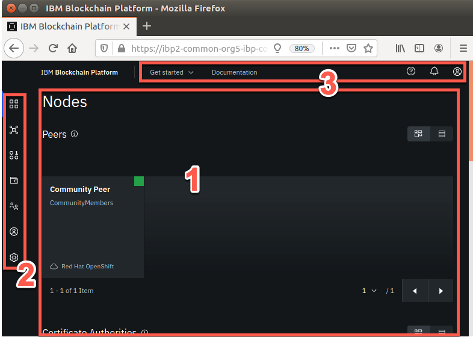</img>

 <h3 align='left'>Nodes</h3>

In Hyperledger Fabric, a *node* is the general term for any component that helps run the network. There are three node types:
* peers, which hold ledgers and execute smart contracts
* certificate authorities, which manage identities for an organization
* orderers, which assert transaction order and build blocks.

If you scroll through the IBM Blockchain Platform Nodes view, you can see the DriveNet nodes we've gained access to: Community Peer, Community CA and DriveNet Ordering Service. A green square in the corner of each of the nodes confirms that they are running.

We used a locally installed peer in the previous set of tutorials, and will use the Community Peer extensively in this set. But for now let's look at the certificate authority (CA), as this will allow us to enroll with the network.

*Enrollment* is the process where we take the Fabric enrollment ID and secret that was previously registered and supplied to us, and use it to request a digital certificate from the CA that we can use to identify ourselves with the network.

   >  
   > <b>Registration vs. Enrollment</b> 
   > Note that while an organization's administrator will typically <i>register</i> a user, it is the end-user who will <i>enroll</i> it. This two stage process is deliberate; it ensures that the administrator cannot impersonate the end-user by intercepting their certificate.
   >  &nbsp;

We will enroll our identity using the Community Org CA.

 &nbsp;&nbsp;&nbsp;&nbsp; `B3.2`: &nbsp;&nbsp;&nbsp;&nbsp; Scroll to the Certificate Authorities section of the Nodes view and click on 'Community CA'.

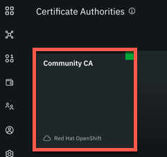</img>

The view will change to show some information about the Community CA node.

 &nbsp;&nbsp;&nbsp;&nbsp; `B3.3`: &nbsp;&nbsp;&nbsp;&nbsp; Click 'Associate identity'.

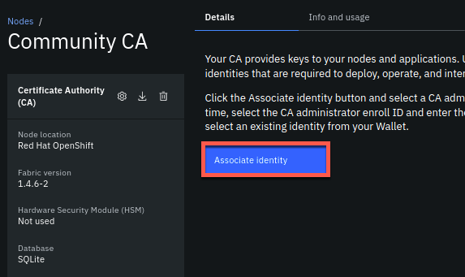</img>

 &nbsp;&nbsp;&nbsp;&nbsp; `B3.4`: &nbsp;&nbsp;&nbsp;&nbsp; In the side panel that appears, enter the Fabric enrollment user ID and secret that was supplied to you previously. Enter `student` as your identity display name, and when you're done, click 'Associate identity'.

Take particular care when entering your secret; use the eyeball icon to show what you're typing if necessary.

While it is possible to pick a different display name, we recommend sticking with *student* as it will be referenced throughout these tutorials.

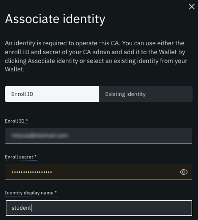</img>

You will now be enrolled onto the network and your certificate placed in your web browser's storage.

When completed, you might see an error that tells you that you cannot list the available users:

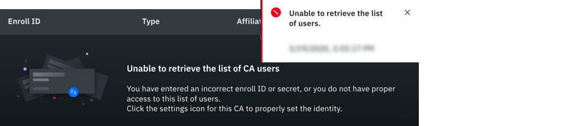</img>

This is because your role as a network joiner does not allow you to list other users registered in the CA.

 &nbsp;&nbsp;&nbsp;&nbsp; `B3.5`: &nbsp;&nbsp;&nbsp;&nbsp; Expand the next section to continue.

---

<b>Associate our identity with the peer</b>

The final stage of enrollment is to make our new ID known to the Community Org peer.

 &nbsp;&nbsp;&nbsp;&nbsp; `B3.6`: &nbsp;&nbsp;&nbsp;&nbsp; Click the 'Nodes' icon in the icon bar to show the Nodes view.

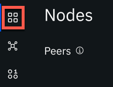</img>

 &nbsp;&nbsp;&nbsp;&nbsp; `B3.7`: &nbsp;&nbsp;&nbsp;&nbsp; Select the Community Peer.

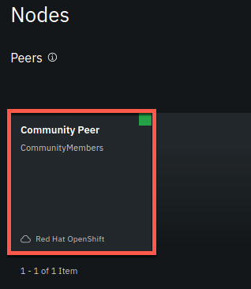</img>

Similar to before, the view changes to show details on community peer.

 &nbsp;&nbsp;&nbsp;&nbsp; `B3.8`: &nbsp;&nbsp;&nbsp;&nbsp; Click 'Associate identity'.

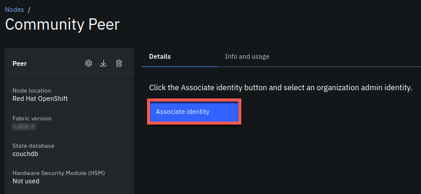</img>

 &nbsp;&nbsp;&nbsp;&nbsp; `B3.9`: &nbsp;&nbsp;&nbsp;&nbsp; In the side panel that appears, select 'student' from the drop down list. Click 'Associate identity'.

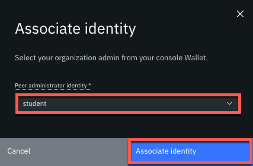</img>

---

<b>Browse the consortium</b>

That completes our enrollment onto the DriveNet network.

Before we use the network, it's worthwhile to browse the consortium that makes up the network, as this confirms the organizations with whom we're going to share data. This is shown on the *Channels* view of the IBM Blockchain Platform web console.

 <h3 align='left'>Channels</h3>

As we've seen, network channels, or channels, are the simplest and broadest way that Hyperledger Fabric scopes the sharing of transactions. DriveNet is an example of a channel.

By default, all organizations see the transaction details on the channel, but there are ways of restricting this. We'll see how in a later tutorial.

Each channel has a ledger, a set of member organizations, a set of participating nodes (e.g. peers) and a set of instantiated smart contracts.

We can browse all of these elements from the Channels view of the web console.

 &nbsp;&nbsp;&nbsp;&nbsp; `B3.10`: &nbsp;&nbsp;&nbsp;&nbsp; Click the 'Channels' icon in the icon bar to show the Channels view.

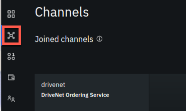</img>

 &nbsp;&nbsp;&nbsp;&nbsp; `B3.11`: &nbsp;&nbsp;&nbsp;&nbsp; Click the 'drivenet' tile.

</img>

The DriveNet page shows a list of transactions by default, which we will investigate in more detail in the next tutorial. For now, we want to find out the DriveNet members, which are shown on the Channel details tab.

 &nbsp;&nbsp;&nbsp;&nbsp; `B3.12`: &nbsp;&nbsp;&nbsp;&nbsp; Click 'Channel details'.

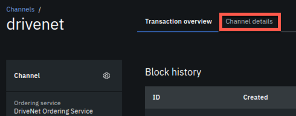</img>

This page describes all the components of the DriveNet network: for example, the nodes, channel members smart contracts.

If you scroll to the Channel members section you'll see the DriveNet member organizations.

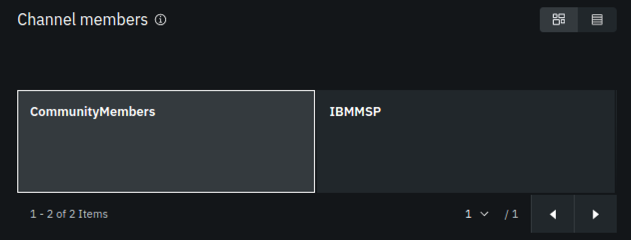</img>

These identifiers are called *Membership Services Provider identities*, or MSPIDs for short. MSP is a Hyperledger Fabric term that allows us to uniquely identify each organization in the network. DriveNet has two MSPs: *IBMMSP* and *CommunityMembers*; you're now a member of the latter.

Whenever we need to refer to an organization, for example, when creating a wallet, we must specify the MSPID.

Remember the CommunityMembers MSPID; we'll use it in the next tutorial.

 <h3 align='left'>Summary</h3>

In this tutorial we completed all the configuration steps necessary to onboard ourselves with the DriveNet network; we enrolled our user with the Community Org CA, and then we associated it with the Community Org peer. 

Now that we have fully registered into the network, we can connect to it from our client applications. In order to do this we first need to get hold of the connection profile and identity files that allow external applications to connect. We'll do this in the next tutorial.

---

<h3 align='right'> → <a href='./b4.md'><b>B4: Acquiring network connection details</b></a></h3>
