**IBM Blockchain Platform**

<h3 align='left'>← <a href='./b3.md'><b>B3: Enrolling with the network</b></a></h3>

</img>

## **Tutorial B4: Acquiring network connection details**

---

Estimated time: `10 minutes`

You may recall from tutorial <a href='../basic-tutorials/a5.md'>A5: Invoking a smart contract from an external application</a> that in order to connect to a Hyperledger Fabric network you need both a connection profile and a wallet. The connection profile allows client applications to specify *where* to connect; the wallet contains identities that allow client applications to specify *who* is connecting.

In this tutorial we will:
* Use the IBM Blockchain Platform web console to download your connection profile
* Use the IBM Blockchain Platform web console to download your identity
* Create a wallet from your identity

In order to successfully complete this tutorial, you must have first completed tutorial <a href='./b3.md'>B3: Enrolling with the network</a> in your web browser.

 &nbsp;&nbsp;&nbsp;&nbsp; `B4.1`: &nbsp;&nbsp;&nbsp;&nbsp; Expand the first section below to get started.

---

<b>Download the DriveNet connection profile</b>

Now that we are fully enrolled on the DriveNet network, we will now download these resources using the IBM Blockchain Platform web console. This will allow Hyperledger Fabric client applications, including the IBM Blockchain platform VS Code extension, to connect and use it.

You were given a connection profile when you first registered with DriveNet in tutorial <a href='./b2.md'>B2: Discovering the network</a>. This is a useful convenience, but you will not always be given such a file when you register for a new network. We'll therefore now go through the process for downloading one from the IBM Blockchain Platform web console.

To do this, we need to browse to the Organizations view in the web console.

 &nbsp;&nbsp;&nbsp;&nbsp; `B4.2`: &nbsp;&nbsp;&nbsp;&nbsp; Click the 'Organizations' icon in the icon bar.

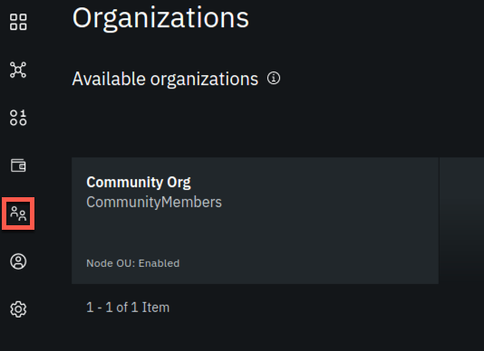</img>

The Organizations view shows you the organizations for which you have access, and is where you can download your connection profile.

 &nbsp;&nbsp;&nbsp;&nbsp; `B4.3`: &nbsp;&nbsp;&nbsp;&nbsp; Click the 'Community Org' tile.

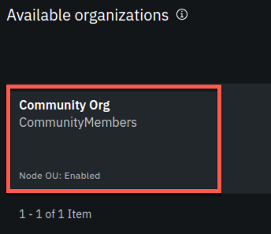</img>

The screen will now show the peers that Community Org is managing, and also give us the ability to generate our connection profile.

 &nbsp;&nbsp;&nbsp;&nbsp; `B4.4`: &nbsp;&nbsp;&nbsp;&nbsp; Click 'Create connection profile'.

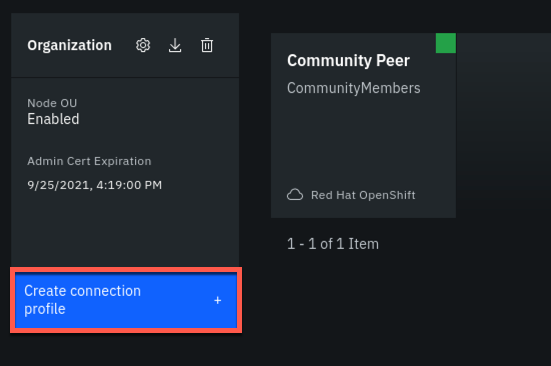</img>

This reveals a side panel that allows us to customize the connection profile. We need to select the peer(s) that our client applications will be accessing.

 &nbsp;&nbsp;&nbsp;&nbsp; `B4.5`: &nbsp;&nbsp;&nbsp;&nbsp; Under the 'Select peers to include section', click 'Peers' and select 'Community Peer'.

Notice that as you select Community Peer, the text underneath the peer confirms that this will allow you to connect to the 'DriveNet' network.

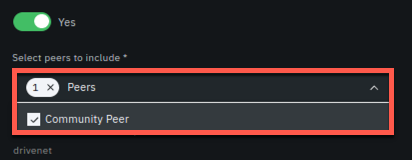</img>

 &nbsp;&nbsp;&nbsp;&nbsp; `B4.6`: &nbsp;&nbsp;&nbsp;&nbsp; Click the 'Download connection profile' button.

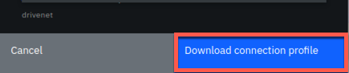</img>

The connection profile will be downloaded. The file will be called 'CommunityMembers_profile.json'.

Keep this file safe; we will use it in later tutorials.

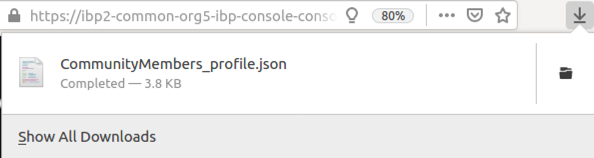</img>

---

<b>Download your identity file</b>

In tutorial <a href='./b3.md'>B3: Enrolling with the network</a> we enrolled our Fabric user and stored the certificate in a wallet in the web browser's storage. The Wallet view allows us to extract this certificate so we can import it into other wallets for use by other applications.

 &nbsp;&nbsp;&nbsp;&nbsp; `B4.7`: &nbsp;&nbsp;&nbsp;&nbsp; Click the 'Wallet' icon in the icon bar to show the Wallet view.

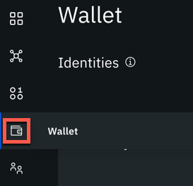</img>

There will only be one identity listed in this view, and is represented by the name you assigned earlier.

 &nbsp;&nbsp;&nbsp;&nbsp; `B4.8`: &nbsp;&nbsp;&nbsp;&nbsp; Click on the 'student' tile.

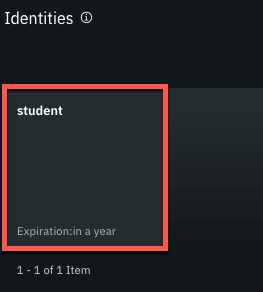</img>

This will reveal a side panel that shows information on the identity we selected.

 &nbsp;&nbsp;&nbsp;&nbsp; `B4.9`: &nbsp;&nbsp;&nbsp;&nbsp; Click 'Export identity'.

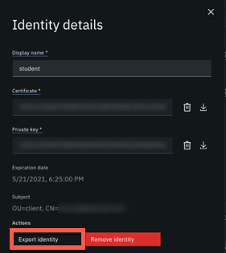</img>

A file called 'student_identity.json' will be downloaded.

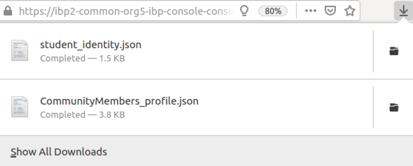</img>

Keep this file safe along with the connection profile; we will use them both throughout these tutorials.

 &nbsp;&nbsp;&nbsp;&nbsp; `B4.10`: &nbsp;&nbsp;&nbsp;&nbsp; Close the sidebar and expand the next section to continue.

---

<b>Create a wallet from your identity</b>

Now we have downloaded our identity, we need to store it in a wallet. Wallets are containers of user identities, and can take different forms depending on how they are going to be used. They can be stored on the file system, in memory or in a database. They can be backed by a hardware security module that provides secure storage of the private keys associated with an identity.

For our purposes we will use a simple file system wallet, and create it using the IBM Blockchain Platform VS Code extension. As we saw in tutorial <a href='../basic-tutorials/a5.md'>A5: Invoking a smart contract from an external application</a>, wallets created by the VS Code extension can be exported for use in any client application.

 &nbsp;&nbsp;&nbsp;&nbsp; `B4.11`: &nbsp;&nbsp;&nbsp;&nbsp; Switch to the VS Code application and if necessary, click the IBM Blockchain Platform icon to show the Fabric Wallets view in the side bar.

 &nbsp;&nbsp;&nbsp;&nbsp; `B4.12`: &nbsp;&nbsp;&nbsp;&nbsp; Hover over the Fabric Wallets view to reveal a '+' icon, and click it.

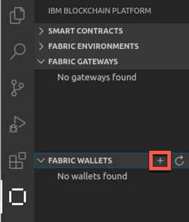</img>

 &nbsp;&nbsp;&nbsp;&nbsp; `B4.13`: &nbsp;&nbsp;&nbsp;&nbsp; Click 'Create a new wallet and add an identity'.

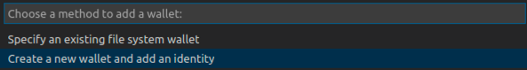</img>

 &nbsp;&nbsp;&nbsp;&nbsp; `B4.14`: &nbsp;&nbsp;&nbsp;&nbsp; Enter the name `drivenet_wallet` and press Enter. 

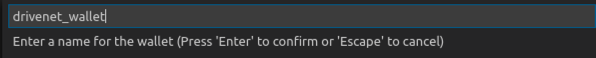</img>

You will now be prompted to enter the MSPID of the identity. As you will recall from tutorial <a href='./b3.md'>B3: Enrolling with the network</a>, our MSPID is called '*CommunityMembers*'.

 &nbsp;&nbsp;&nbsp;&nbsp; `B4.15`: &nbsp;&nbsp;&nbsp;&nbsp; Enter `CommunityMembers` as the MSPID and press Enter. (This is case sensitive).

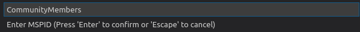</img>

 &nbsp;&nbsp;&nbsp;&nbsp; `B4.16`: &nbsp;&nbsp;&nbsp;&nbsp; Click 'Provide a JSON identity file from IBM Blockchain Platform'.

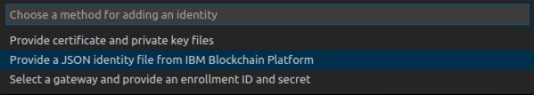</img>

 &nbsp;&nbsp;&nbsp;&nbsp; `B4.17`: &nbsp;&nbsp;&nbsp;&nbsp; Click 'Browse'.

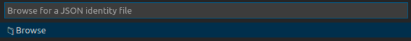</img>

 &nbsp;&nbsp;&nbsp;&nbsp; `B4.18`: &nbsp;&nbsp;&nbsp;&nbsp; Locate the *student_identity.json* file you downloaded earlier and click 'Select'.

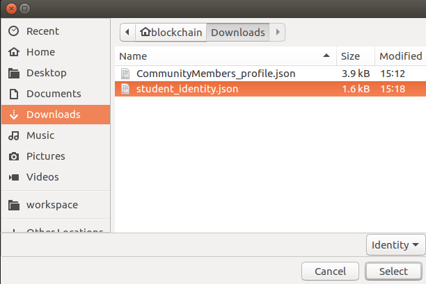</img>

The wallet will now be created, and displayed in the Fabric Wallets view. It will contain your identity.

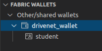</img>

Your wallet is now ready for use.

 <h3 align='left'>Summary</h3>

In this tutorial we used the IBM Blockchain Platform web console to download our connection profile and identity, and imported the identity into a new wallet within the IBM Blockchain Platform VS Code extension.

We are now ready to use the connection profile and wallet to connect to DriveNet and submit transactions. We'll do that in the next tutorial; at the same time we'll use the IBM Blockchain Platform web console to see in more detail what's happening when we do this.

---

<h3 align='right'> → <a href='./b5.md'><b>B5: Invoking transactions on the network</b></a></h3>
