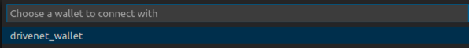

**IBM Blockchain Platform**

<h3 align='left'>← <a href='./b4.md'><b>B4: Acquiring network connection details</b></a></h3>

</img>

## **Tutorial B5: Invoking transactions on the network**

---

Estimated time: `15 minutes`

In this tutorial we will:
* Connect to the DriveNet network from the IBM Blockchain Platform VS Code extension
* Use the IBM Blockchain Platform VS Code extension to run our first transactions
* See how the IBM Blockchain Platform web console allows us to view transactions on the blockchain

In order to successfully complete this tutorial, you must have first completed tutorial <a href='./b4.md'>B4: Acquiring network connection details</a> in your web browser.

 &nbsp;&nbsp;&nbsp;&nbsp; `B5.1`: &nbsp;&nbsp;&nbsp;&nbsp; Expand the first section below to get started.

---

<b>Connect to the network from VS Code</b>

In tutorial <a href='../basic-tutorials/a4.md'>A4: Invoking a smart contract from VS Code</a> we used the IBM Blockchain Platform VS Code extension to run transactions on a local network. We will now use the same approach to run transactions on the DriveNet network.

To do this we will use the connection profile we downloaded in the previous tutorial. Note that it is also possible for the IBM Blockchain Platform VS Code Extension to connect to an IBM Blockchain Platform instance by specifying to the web console URL.

 &nbsp;&nbsp;&nbsp;&nbsp; `B5.2`: &nbsp;&nbsp;&nbsp;&nbsp; Hover over the Fabric Gateways view of the IBM Blockchain Platform VS Code extension and click on the '+' icon that appears.

</img>

 &nbsp;&nbsp;&nbsp;&nbsp; `B5.3`: &nbsp;&nbsp;&nbsp;&nbsp; Select 'Create a gateway from a connection profile'.

</img>

 &nbsp;&nbsp;&nbsp;&nbsp; `B5.4`: &nbsp;&nbsp;&nbsp;&nbsp; Type `drivenet` and press enter.

</img>

 &nbsp;&nbsp;&nbsp;&nbsp; `B5.5`: &nbsp;&nbsp;&nbsp;&nbsp; Click 'Browse'.

</img>

 &nbsp;&nbsp;&nbsp;&nbsp; `B5.6`: &nbsp;&nbsp;&nbsp;&nbsp; Navigate to the 'CommunityMembers_profile.json' file you downloaded earlier, select it and click 'Select'.

</img>

The gateway will now appear in the Fabric Gateways view.

In order to connect to the gateway, we need to specify who we are going to connect as; we will use the identity in the wallet we created in the previous tutorial.

 &nbsp;&nbsp;&nbsp;&nbsp; `B5.7`: &nbsp;&nbsp;&nbsp;&nbsp; Click the 'drivenet' gateway in the Fabric Gateways view.

</img>

 &nbsp;&nbsp;&nbsp;&nbsp; `B5.8`: &nbsp;&nbsp;&nbsp;&nbsp; Click 'drivenet_wallet'.

</img>

The gateway will now be connected and we can browse the available transactions.

 &nbsp;&nbsp;&nbsp;&nbsp; `B5.9`: &nbsp;&nbsp;&nbsp;&nbsp; Expand 'Channels' -> 'drivenet' -> 'fabcar@1.0.x'.

The exact version number of the smart contract might be different.

</img>

If you are not familiar the fabcar smart contract, it's worthwhile <a href="https://github.com/hyperledger/fabric-samples/blob/master/chaincode/fabcar/typescript/src/fabcar.ts">reviewing it</a>. The DriveNet version of the smart contract has a few minor changes, but is conceptually the same; the world state consists of a set of key/value pairs that describe properties of car assets:
* Each **key** is of the form 'CAR*n*', where *n* is a integer from 0 to 9999, with no padding of leading zeroes.
* Each **value** is a JSON data structure that contains four unparsed strings that describe the make, model, color and owner of the car.

The DriveNet instance of the fabcar smart contract contains methods to manipulate the records in the world state. For our scenario, we're interested in the following transactions:

* **createCar**: Adds a new car record to the world state. Input takes the form *[\<id\>,\<make\>,\<model\>,\<color\>,\<owner\>]*; there is no output data structure.

    *Input*: `["CAR500","Arium","Thanos","purple","Felicity"]` 
    *Output*: none

* **queryCar**: Returns the details of a car record in the world state. Input takes the form *[\<id\>]*; output contains the car details:

    *Input*: `["CAR500"]` 
    *Output*: `{"color":"purple","docType":"car","make":"Arium","model":"Thanos","owner":"Felicity"}`

* **queryAllCars**: Returns the details of all car records in the world state that conform to the correct key specification (CAR*n*). Input takes no parameters; output is an array of car details.

    *Input*: none 
    *Output*: `[{"key":"CAR0","car":{"color":"blue","docType":"car","make":"Toyota","model":"Prius","owner":"Tomoko"}},{"key":"CAR1"` ...

* **changeCarOwner**: Modifies the owner of a previously created car. Input takes the form *[\<id\>,\<owner\>]*; there is no output data structure.

    *Input*: `["CAR500","Beau"]` 
    *Output*: none

The DriveNet instance of fabcar includes some additional transactions:

* **getPreviousOwners**: Shows the ownership history of a car, excluding the current owner. Input takes the form *[\<id\>]*; output includes the number of owners, the array of owner names, the dates the changes happened and details of the current owner.

    *Input*: `["CAR500"]` 
    *Output*: `{"previousOwnerCount":3,"previousOwners":["Felicity","Lucky","Raymond"],"previousOwnershipChangeDates":["2020-09-10T12:34:09.197Z","2020-09-09T09:18:06.065Z","2020-09-09T09:17:32.394Z"],"currentOwner":"Beau","currentOwnershipChangeDate":"2020-08-28T15:14:56.344Z"}`

* **deleteCar**: Removes a car from the world state. The history is retained if the car is later restored. Input takes the form *[\<id\>]*; there is no output data structure.

    *Input*: `["CAR500"]` 
    *Output*: none

* **confirmTransfer**: Accepts ownership of a car that another registered user wants to send to you. Input takes the form *[\<id\>]*; there is no output data structure.

    *Input*: `["CAR500"]` 
    *Output*: none

* **findMyCars**: Returns all car records that are currently assigned to you as the *certOwner*. Input takes no parameters; output is an array of car details.

    *Input*: none 
    *Output*: `[{"key":"CAR500","car":{"color":"purple","docType":"car","make":"Arium","model":"Thanos","owner":"Felicity"}},{"key":"CAR501"` ...

* **queryByOwner**: Returns all car records that have the supplied *owner* field. Input takes the form *[\<owner\>]*; output is an array of car details.

    *Input*: `["Felicity"]` 
    *Output*: `[{"key":"CAR500","car":{"color":"purple","docType":"car","make":"Arium","model":"Thanos","owner":"Felicity"}},{"key":"CAR501"` ...

* **carExists**: Returns true if and only if the car with the supplied key exists in the world state. Input takes the form *[\<id\>]*; output is "true" or "false". If the input is not of the correct form (*CARnnn*), the transaction will fail.

    *Input*: `["CAR500"]` 
    *Output*: `"true"`

As we progress through the remainder of these tutorials we'll be using these transactions.

>  
   > <b>Please be considerate as you use the shared network.</b>
   >  
   >  Remember that DriveNet is shared with other users. As you submit transactions, take care to not do things that will inconvenience others on the network, and remember that transaction data you enter will be visible to other users.
   >  &nbsp;

 &nbsp;&nbsp;&nbsp;&nbsp; `B5.10`: &nbsp;&nbsp;&nbsp;&nbsp; Expand the next section to continue.

---

<b>Run transactions on the network</b>

As we learned in tutorial <a href='../basic-tutorials/a4.md'>A4: Invoking a smart contract from VS Code</a>, Hyperledger Fabric exposes two ways to run transactions on the network: *evaluating* (for ledger queries), and *submitting* (for making updates).

In this section we will try our first two transactions on DriveNet: one we'll evaluate and one we'll submit.

 <h3 align='left'>Query a car</h3>

Once a gateway is connected, the way transactions are submitted is identical regardless of the type of target network. The network's topology and endorsement policies are completely hidden from the application developer.

The opaqueness of the target network's configuration makes it easy for developers to use simple local networks for testing before the same assets are deployed to more complicated production networks. It also allows for the network and its policies to evolve without impacting existing smart contracts and applications.

With this in mind, we'll now attempt to run some transactions using the same process that we used in tutorial <a href='../basic-tutorials/a4.md'>A4: Invoking a smart contract from VS Code</a>. We'll start with a simple query of an existing car.

 &nbsp;&nbsp;&nbsp;&nbsp; `B5.11`: &nbsp;&nbsp;&nbsp;&nbsp; Right click on 'queryCar' and click 'Evaluate Transaction'.

</img>

 &nbsp;&nbsp;&nbsp;&nbsp; `B5.12`: &nbsp;&nbsp;&nbsp;&nbsp; 
Replace the input parameters with `["CAR1"]` and press Enter.

</img>

 &nbsp;&nbsp;&nbsp;&nbsp; `B5.13`: &nbsp;&nbsp;&nbsp;&nbsp; Press Enter to skip transient data, and Enter again to select the Default peer-targeting policy.

The transaction will be submitted and you should see the car details displayed in the Output view:

</img>

 <h3 align='left'>Create a car</h3>

We'll now attempt to create our own car record.

 &nbsp;&nbsp;&nbsp;&nbsp; `B5.14`: &nbsp;&nbsp;&nbsp;&nbsp; Right click on 'createCar' and click 'Submit Transaction'.

</img>

 &nbsp;&nbsp;&nbsp;&nbsp; `B5.15`: &nbsp;&nbsp;&nbsp;&nbsp; Enter the arguments to the transaction: use an ID of the form 'CAR*n*' where *n* is a random number between 11 and 9999. Follow this with make, model, color and owner strings - make these up too.

</img>

 &nbsp;&nbsp;&nbsp;&nbsp; `B5.16`: &nbsp;&nbsp;&nbsp;&nbsp; Press Enter to skip transient data, and Enter again to select the Default peer-targeting policy.

The transaction will be submitted and you should see a success message in the Output view:

</img>

Remember, this is a shared environment and other users might have already created an asset with the same ID. In the event that you've picked the same ID as an existing car that you do not already own, you will receive an error, for example:

</img>

If this happens, try picking another random number for your ID. Whatever key you end up with, remember it; we'll use it more later.

>  
   > <b>Selecting a good key</b>
   >  
   >  Instead of asking the end-user to choose a random key (which can generate clashes), more sophisticated applications usually generate a unique key differently - making use of an existing unique property of the asset, for example.
   >  Alternatively, the smart contract can generate the key. This needs to be done deterministically, such that all endorsing peers select the same key. This is sometimes done using an <i>oracle</i> - an external service that generates a consistent, deterministic value for a smart contract given the same set of inputs.
   >  However the key is generated, the process for identifying fields must be agreed up front by the members of the network - just like any shared data format.
   >  &nbsp;

 <h3 align='left'>Check the blockchain</h3>

So far in these tutorials we've dealt mainly with the *world state* that stores the asset details we've chosen to share. By submitting transactions, information can be created, modified, queried and deleted from the world state just like any standard database.

What makes our ledger special is its use of a second data structure - the blockchain itself - that gives us an unmodifiable record of the transactions that derive the world state.

Each transaction in the blockchain shows the keys and values in the world state that were read or written. These transactions are grouped into blocks which are cryptographically linked to each other to prevent tampering - hence the term *block chain*.

We'll look in more detail at how the blockchain works later. For now, let's look at the blockchain to find the transaction we just submitted.

 &nbsp;&nbsp;&nbsp;&nbsp; `B5.17`: &nbsp;&nbsp;&nbsp;&nbsp; Switch back to the IBM Blockchain Platform web console and click on the 'Channels' icon in the side bar.

</img>

 &nbsp;&nbsp;&nbsp;&nbsp; `B5.18`: &nbsp;&nbsp;&nbsp;&nbsp; Click on the 'drivenet' tile.

</img>

You will now be shown the block history of the DriveNet network, with the most recent blocks at the top of the list. Your block history will, of course, look slightly different to the screenshot below.

 &nbsp;&nbsp;&nbsp;&nbsp; `B5.19`: &nbsp;&nbsp;&nbsp;&nbsp;Click on the block that contains your transaction.

Your transaction's block is probably the block that was first created after you submitted your transaction. If you can't remember when this was, switch back to the Output view in the IBM Blockchain Platform VS Code extension; the log messages for your transaction will show you the time.

</img>

Most blocks contain a single transaction. In DriveNet, a block is typically created every second there is at least one transaction.

Each transaction is uniquely identified by a hexadecimal string called a Transaction ID.

 &nbsp;&nbsp;&nbsp;&nbsp; `B5.20`: &nbsp;&nbsp;&nbsp;&nbsp;Click on your transaction.

</img>

This will reveal a side panel that shows you:
* the smart contract and version that was run
* the method name and input parameters
* the list of keys that were read and written, including any associated values.

</img>

The createCar transaction writes a new record with a key that corresponds to the car ID that you specified. The value of the record contains the make, model, color and owner information, plus some additional information that the smart contract requires to enable assert write permissions on the network - more on this later.

 &nbsp;&nbsp;&nbsp;&nbsp; `B5.21`: &nbsp;&nbsp;&nbsp;&nbsp;Click the Close button to dismiss the side panel.

 <h3 align='left'>Summary</h3>

In this tutorial we created a gateway in the IBM Blockchain Platform VS Code extension and used it to connect the DriveNet network. We then ran our first two transactions and saw how the IBM Blockchain Platform web console displays the blocks and transactions that comprise the DriveNet blockchain.

In the next tutorial we'll submit some transactions that will help us learn about the policies that enable DriveNet to work.

---

<h3 align='right'> → <a href='./b6.md'><b>B6: Exercising network policies</b></a></h3>
