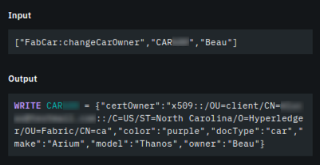

**IBM Blockchain Platform**

<h3 align='left'>← <a href='./b5.md'><b>B5: Invoking transactions on the network</b></a></h3>

</img>

## **Tutorial B6: Exercising network policies**

---

Estimated time: `20 minutes`

Policies are used to define the rules of how the blockchain network operates. In this tutorial we will:
* Learn about the importance and different kinds of policies
* Exercise the active endorsement policy on DriveNet
* See how smart contracts can implement their own policies

In order to successfully complete this tutorial, you must have first completed tutorial <a href='./b5.md'>B5: Submitting transactions on the network</a> in your web browser.

There is an optional section at the end that requires two registered users of the DriveNet network to collaborate.

 <h3 align='left'>Policies</h3>

In the real world, everything we do is subject to rules that determine what we can and can't do. The same applies to the blockchain world: Hyperledger Fabric calls these rules *policies* and are used, among other things, to help maintain privacy and confidentiality, or implement business rules that help reach agreement of transactions.

Policies can be implemented through Hyperledger Fabric configuration options, through smart contract logic, or through business agreements.

However they are implemented, policies are agreed between stakeholders in advance - for example, by the consortium of members or by a regulator. Policies must, of course, fit into the operating environment under which the participants find themselves; a regulator might require visibility of transactions, for example.

Example policies on the DriveNet network include:
* Car IDs must be in the range CAR0-CAR9999. Leading spaces (e.g. CAR0005) are not used.
* Any member of the network can view any car details.
* Only members of IBM Org can update car records CAR0-CAR10.
* Only the current owner of a car record can modify it.
* Updates must be agreed by peers in both the Community Org and the IBM Org.

In this tutorial we'll look in more detail at how the policies work in DriveNet.

 &nbsp;&nbsp;&nbsp;&nbsp; `B6.1`: &nbsp;&nbsp;&nbsp;&nbsp; Expand the first section below to get started.

---

<b>Endorsement policies</b>

To begin with, let's look at the following policy:

* Updates to car records must be agreed by peers in both the Community Org and the IBM Org.

Conceptually, this is an example of an *endorsement policy*. Any proposed updates to the world state must be signed (or *endorsed*) by a set of peers that match the active endorsement policy for the smart contract.

When a transaction is submitted to a Hyperledger Fabric blockchain, the transaction is run by all peers addressed by the endorsement policy. Each endorsing peer generates a digitally signed data structure that contains the proposed reads and writes to the world state.

This data structure, including the endorsing peers' signatures, form the transaction content that is compiled into a block by the ordering service. But before each peer applies the updates to its world state, it first checks that the transaction has been correctly signed according to its endorsement policy.

For the fabcar smart contract on DriveNet, each transaction that updates the world state must first be endorsed by both a Community Org peer and an IBM Org peer.

 <h3 align='left'>Updating the owner field </h3>

Let's test this endorsement policy, and see what happens if we attempt to update a car record without involving peers from both organizations. We'll attempt to submit a transaction to modify the owner field of our asset, but target it *only* at our Community Org peer.

To do this, we'll submit our transaction slightly differently to the way we've done in the past.

 &nbsp;&nbsp;&nbsp;&nbsp; `B6.2`: &nbsp;&nbsp;&nbsp;&nbsp;Switch to the IBM Blockchain Platform VS Code extension, right click the 'changeCarOwner' transaction and select 'Submit Transaction'.

</img>

The changeCarOwner transaction takes two arguments: the car ID and the new owner. Use the ID of the car you created in tutorial <a href='./b5.md'>B5: Invoking transactions on the network</a>, because you won't have the authority to modify other assets. For the new owner, make up a name.

 &nbsp;&nbsp;&nbsp;&nbsp; `B6.3`: &nbsp;&nbsp;&nbsp;&nbsp;Enter the transaction arguments and press Enter.

</img>

 &nbsp;&nbsp;&nbsp;&nbsp; `B6.4`: &nbsp;&nbsp;&nbsp;&nbsp;Press Enter to select the defaults for transient data.

</img>

Up until now, we've always specified the default peer targeting policy, which uses the connected gateway to target all endorsing peers. Now we'll only target the Community Org peer.

 &nbsp;&nbsp;&nbsp;&nbsp; `B6.5`: &nbsp;&nbsp;&nbsp;&nbsp;Select 'Custom' to specify a different set of target peers. 

</img>

 &nbsp;&nbsp;&nbsp;&nbsp; `B6.6`: &nbsp;&nbsp;&nbsp;&nbsp;Check only the peer that contains 'communitypeer' in the URL. Leave the URL containing 'ibmpeer' unchecked. Click OK or press Enter to confirm.

</img>

The transaction will now only be sent to the Community Org peer for endorsement, and you'll see that it fails with the code *ENDORSEMENT_POLICY_FAILURE*.

</img>

Even though the transaction runs successfully, the peers on the network will refuse to update the world state because the update has not been signed according to its endorsement policy.

(This transaction has still been added to the blockchain but has been marked as failed. In a later tutorial we'll write an application to demonstrate this.)

For now, let's confirm what happens when we set the endorsement policy correctly.

 &nbsp;&nbsp;&nbsp;&nbsp; `B6.7`: &nbsp;&nbsp;&nbsp;&nbsp;Submit the transaction again; this time, specify the custom endorsement policy but check **both** the IBM Org **and** the Community Org peers before clicking OK.

</img>

The transaction now succeeds.

</img>

Let's verify that we can see the new transaction in the IBM Blockchain Platform web console.

 &nbsp;&nbsp;&nbsp;&nbsp; `B6.8`: &nbsp;&nbsp;&nbsp;&nbsp;Switch back to the IBM Blockchain Platform web console and click 'drivenet' to return to the DriveNet block history view.

</img>

As a result of the transaction you just submitted, there should be a new block.

 &nbsp;&nbsp;&nbsp;&nbsp; `B6.9`: &nbsp;&nbsp;&nbsp;&nbsp;Navigate into the new block and review the details of your most recent transaction.

</img>

You should recognize most of the fields in the WRITE output set. The *certOwner* is used for an advanced scenario; we'll look at this field later on.

 &nbsp;&nbsp;&nbsp;&nbsp; `B6.10`: &nbsp;&nbsp;&nbsp;&nbsp;Click the Close button to dismiss the side panel.

 &nbsp;&nbsp;&nbsp;&nbsp; `B6.11`: &nbsp;&nbsp;&nbsp;&nbsp;Expand the next section to continue.

---

<b>Policies implemented by the smart contract</b>

Policies can be also implemented inside the logic of the smart contract. A common pattern is for a smart contract to check the validity of a transaction before updates are made to the world state. If checks fail, an exception is thrown by the smart contract that can be caught by the calling application, and the world state is not updated.

The fabcar smart contract in DriveNet makes several checks before applying state-changing transactions such as *createCar*, *deleteCar* and *changeCarOwner*. For example, whether the user is authorized to modify the car.

In this section we will try some of these policies out.

 <h3 align='left'>Attempt to delete an asset</h3>

 &nbsp;&nbsp;&nbsp;&nbsp; `B6.12`: &nbsp;&nbsp;&nbsp;&nbsp;In the IBM Blockchain Platform VS Code extension, submit a 'deleteCar' transaction against the car with ID 'CAR1'.

The deleteCar transaction only takes a single parameter (the car ID). Select the defaults for transient data and peer targeting.

</img>

When you submit the transaction, you will see errors in the output window:

</img>

This means that, when running the smart contract code, the IBM and Community peers encountered an error and so did not endorse the transaction. The error was thrown by the smart contract itself; it detected that the submitting organization was not authorized to delete the car.

 &nbsp;&nbsp;&nbsp;&nbsp; `B6.13`: &nbsp;&nbsp;&nbsp;&nbsp;Switch back to the IBM Blockchain Platform web console and browse for your failed transaction.

You'll see that the drivenet channel view does not show the failed transaction.

 <h3 align='left'>(Optional) Transfer a car to someone else</h3>

>  
   > <b>This final section requires two people</b> 
   > Transferring a car requires you to know someone else who is going through these tutorials with you on the same DriveNet instance. If you are working through these tutorials on your own, you can read through the theory but you will not be able to perform the actions; pick things up again with the next tutorial <a href='./b7.md'>B7: Connecting applications to the network</a>.
   >  &nbsp;

As we learned earlier, we can change our car record's owner field to a pretend value and retain the ability to modify it. You should still have write authority to your original car record, despite running the *changeCarOwner* transaction against it earlier.

However, it is possible to hand your write privileges to another registered user, by transferring the ownership of the car to them.

Specifically, the smart contract implements a policy which states that if the current owner changes the owner field to an ID that is registered on the network, then as soon as the new owner confirms the transfer using the *confirmTransfer* transaction, the previous owner will then lose the ability to modify it. In effect, write privileges pass to the new owner.

This two step transfer process ensures that if we set the owner field incorrectly, we have an opportunity to reclaim it. This policy mirrors many real-world transactions: for an asset transfer to be valid, both sender and receiver must agree.

   >  
   > <b>Under the hood</b> 
   > Write privileges are determined by a hidden field in the car record called '<i>certOwner</i>'. The value of this field is the ID of the registered user who can currently write to it.
   >  You can see the certOwner field when exploring transactions in the web console, but it's hidden from the output of the query transactions. Smart contracts can be selective about the information returned to the caller.
   >  &nbsp;

We'll now try out this policy and successfully transfer a car to another registered user, then get them to transfer another car back to us.

 &nbsp;&nbsp;&nbsp;&nbsp; `B6.14`: &nbsp;&nbsp;&nbsp;&nbsp;Share the following information with the other user:

<table>
<tr><td><i>yourFabricID</i></td><td>the Fabric enrollment ID you received via email in tutorial <a href='./b2.md'>B2: Discovering the network</a>.
<tr><td><i>yourCarID</i></td><td>the ID of the car you've been working with (CAR<i>nnn</i>).
<tr><td><i>theirFabricID</i></td><td>the Fabric enrollment ID the other user received via email.
<tr><td><i>theirCarID</i></td><td>the ID of the car the other user has been working with (CAR<i>mmm</i>).
</table>

 &nbsp;&nbsp;&nbsp;&nbsp; `B6.15`: &nbsp;&nbsp;&nbsp;&nbsp;Ask the other user to attempt to take ownership of your car: They should submit a changeCarOwner transaction with the parameters set to *yourCarID* and *theirFabricID*.

This should fail, because only the current owner of a car can modify it.

 &nbsp;&nbsp;&nbsp;&nbsp; `B6.16`: &nbsp;&nbsp;&nbsp;&nbsp;Transfer your car to the other user: You should submit a changeCarOwner transaction with the parameters *yourCarID*, *theirFabricID*.

They will acquire write privileges to the car record. However, until they confirm ownership of the car, you can also continue to modify it. This is to prevent you from accidentally forfeiting your rights to a record through a typo or pretend value.

 &nbsp;&nbsp;&nbsp;&nbsp; `B6.17`: &nbsp;&nbsp;&nbsp;&nbsp; They should submit a confirmTransfer transaction with the parameters *yourCarID*.

 &nbsp;&nbsp;&nbsp;&nbsp; `B6.18`: &nbsp;&nbsp;&nbsp;&nbsp;Attempt to take back your car. You should submit a changeCarOwner transaction with the parameters set to *theirCarID* and *yourFabricID*.

This will fail, because you are no longer the owner of the car.

 &nbsp;&nbsp;&nbsp;&nbsp; `B6.19`: &nbsp;&nbsp;&nbsp;&nbsp;Reverse roles; let the other user send *theirCarID* to you.

>  
   > <b>Dude, where's my car?</b> 
   > In this section you transferred cars as multiple independent transactions. What if you wanted to make the two transactions dependent on each other: <i>I'll give you my car if (and only if) you give me yours</i>?
   >  To do this, the smart contract developer would typically implement a single transaction in the smart contract that performs both updates at the same time. Consensus will ensure that either both updates occur or neither does.
   >  In the absence of this transaction, remember that the blockchain retains the history of all transactions. At least if your partner absconds with both cars, you have evidence to prove that the deed took place.
   >  &nbsp;

Remember the ID of the car that you now own; we'll work with it some more in the next tutorial.

 <h3 align='left'>Summary</h3>

In this tutorial we looked at the concept of *policies*. Policies can be an intrinsic part of the way a transaction gets agreed by the network - for example, endorsement. Alternatively, they can be implemented programmatically by the smart contract. Either way, they describe the operating rules under which the system works.

So far we have used the IBM Blockchain Platform VS Code extension to submit transactions. This is fine for basic testing, however organizations interacting with production networks will use fully-fledged applications. In the next tutorial we will create a simple client application that connects to DriveNet, and use it to learn more about the assets we've been working with.

---

<h3 align='right'> → <a href='./b7.md'><b>B7: Connecting applications to the network</b></a></h3>
