**IBM Blockchain Platform**

<h3 align='left'>← <a href='./b6.md'><b>B6: Exercising the network</b></a></h3>


</img>

## **Tutorial B7: Connecting applications to the network**


---

Estimated time: `30 minutes`

Blockchain client applications are the primary method for member organizations to interact with a Hyperledger Fabric blockchain. Depending on their role, different organizations might use different applications in order to interact with the shared data.

In this tutorial we will:
* Assemble the required network details that will allow our client applications to connect
* Build and run an application that displays the history of DriveNet assets
* Learn about immutability in the blockchain and how transactions are persisted

In order to successfully complete this tutorial, you must have recently completed tutorial <a href='./b6.md'>B6: Exercising the network</a> on the DriveNet network.

<br><h3 align='left'>Blockchain client applications vs. end-user applications</h3>

We'll now create a simple blockchain client application that iteracts directly with the DriveNet blockchain.

This is different to an end-user application. A typical end-user might not even know or care that the application they are using interacts with a blockchain, only that the information they see is trustworthy and that any transactions they initiate are completed successfully.

End-user applications typically consist of a mobile or web front end, and would probably interact with a blockchain via a portal of some kind, which would ultimately map to some business logic that submits any transactions on the end-user's behalf. Again, such a pattern requires users to place trust in the organization that is hosting these business services.

As an example, consider a blockchain for settling payments between banks. As an individual end-user or organization, we might interact with our bank using a mobile application and use it to send payments to a third party. Reconciliation of the account ledgers would take place between the banks; our end-user app will have no blockchain interaction whatsoever and merely submit transaction requests to our bank as a consumer.

Building a layered architecture such as this is beyond the scope of these tutorials. For our purposes, we'll look at the client applications that will interact directly with the DriveNet blockchain.


 &nbsp;&nbsp;&nbsp;&nbsp; `B7.1`: &nbsp;&nbsp;&nbsp;&nbsp; Expand the first section below to get started.

---

<details>
<summary><b>Export wallet</b></summary>

As we've seen several times throughout these tutorials, in order to connect to a Hyperledger Fabric network, applications need both a connection profile and a wallet containing an identity.

We downloaded our connection profile in tutorial <a href='./b4.md'>B4: Acquiring network connection details</a>. We will use this directly from our application.

In the same tutorial, we downloaded our identity and used it to create a wallet within the VS Code workspace. We will now export that wallet to the file system, so that we have a wallet that is accessible to our application.

 &nbsp;&nbsp;&nbsp;&nbsp; `B7.2`: &nbsp;&nbsp;&nbsp;&nbsp; In the Fabric Wallets view of the IBM Blockchain Platform VS Code extension, right click 'drivenet_wallet' and select 'Export Wallet'.

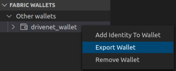</img>

 &nbsp;&nbsp;&nbsp;&nbsp; `B7.3`: &nbsp;&nbsp;&nbsp;&nbsp; Navigate to the folder that contains your downloaded connection profile and identity, and click Export.

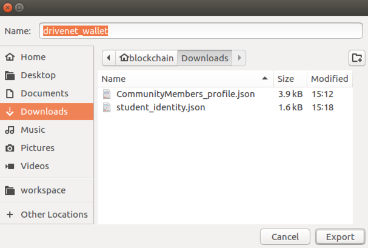</img>

You'll see a notification to tell you that the export was successful.

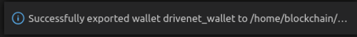</img>

 &nbsp;&nbsp;&nbsp;&nbsp; `B7.4`: &nbsp;&nbsp;&nbsp;&nbsp; Expand the next section to continue.

</details>

---

<details>
<summary><b>Build an application</b></summary>

Our application will report the ownership history for a car. It will take an optional input that is an ID of the form *CARnnn*, with an appropriate default value. It will then query the DriveNet blockchain for the transactions associated with an asset with that ID. Finally, it will display the list of owners and the times those ownership changes occurred.

The process for building our application will be the same as the process for building any Hyperledger Fabric application. We first did this in tutorial <a href='../basic-tutorials/a5.md'>A5: Invoking a smart contract from an external application</a>; we'll recap the general process here, but if you need precise guidance, refresh your memory from the earlier tutorial.

 &nbsp;&nbsp;&nbsp;&nbsp; `B7.5`: &nbsp;&nbsp;&nbsp;&nbsp; Create a new folder called 'drivenet-app' and add it to your VS Code workspace.

 &nbsp;&nbsp;&nbsp;&nbsp; `B7.6`: &nbsp;&nbsp;&nbsp;&nbsp; Copy both the exported wallet folder ('drivenet_wallet') and the connection profile ('CommunityMembers_profile.json') into drivenet-app.

 &nbsp;&nbsp;&nbsp;&nbsp; `B7.7`: &nbsp;&nbsp;&nbsp;&nbsp; Create a new folder called 'src' inside drivenet-app.

Your folder should currently look like this:

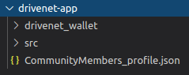</img>

 &nbsp;&nbsp;&nbsp;&nbsp; `B7.8`: &nbsp;&nbsp;&nbsp;&nbsp; Inside 'src' create a file called 'ownerhistory.ts' with the following 83 lines ([also available here](./resourcesb/ownerhistory_v1.ts)):

```typescript
process.env.HFC_LOGGING = '{"off": "console"}';
import { FileSystemWallet, Gateway, Network, Contract } from 'fabric-network';
import * as path from 'path';
import 'source-map-support/register';

interface Car {
    make:string;
    model:string;
    color:string;
    owner:string;
}

interface History {
    previousOwnerCount: number;
    previousOwners: string[];
    previousOwnershipChangeDates: string[];
    currentOwnershipChangeDate: string;
    currentOwner: string;
}

let carid:string;
let ownerSequenceNum = 0;
const DELETED_CAR_OWNER_IDENTIFIER = 'CAR KEY DELETED';

async function main () {
  try {
    // The ID of the car to look up (can be overridden by the first command line argument)
    carid = (process.argv[2] !== undefined) ? process.argv[2] : 'CARXXX'; // TODO change

    // Create a new file system based wallet for managing identities.
    const walletPath:string = path.join(process.cwd(), 'drivenet_wallet');
    const wallet:FileSystemWallet = new FileSystemWallet(walletPath);

    // Create a new gateway for connecting to our peer node.
    const gateway:Gateway = new Gateway();
    const connectionProfile:string = path.resolve(__dirname, '..', 'CommunityMembers_profile.json');
    const connectionOptions = { wallet, identity: 'student', discovery: { enabled: true, asLocalhost: false } };
    await gateway.connect(connectionProfile, connectionOptions);

    // Get to the drivenet network and smart contract
    const network:Network = await gateway.getNetwork('drivenet');
    const contract:Contract = network.getContract('fabcar');

    // First check that the car exists
    let existsBuffer:Buffer = await contract.evaluateTransaction('carExists', carid);
    if ((existsBuffer.toString()) === "false") {
      console.error(`Car "${carid}" doesn't exist`);
      return;
    }
    
    // Get current car details and owner history
    let carDetailsBuffer:Buffer = await contract.evaluateTransaction('queryCar', carid);
    const car: Car = JSON.parse(carDetailsBuffer.toString()) as Car;
    const previousOwnersBuffer = await contract.evaluateTransaction('getPreviousOwners', carid);
    const history: History = JSON.parse(previousOwnersBuffer.toString()) as History;
    console.log(`Owner history of ${carid} (currently ${car.color} ${car.make} ${car.model}):`);

    // Display the previous owners; start with the earliest owner.
    if (history.previousOwnerCount > 0) {
      for (let i=history.previousOwners.length-1; i>=0; i--) {
        const txTime = new Date(history.previousOwnershipChangeDates[i]).toUTCString();
        if (history.previousOwners[i] === DELETED_CAR_OWNER_IDENTIFIER) {
          console.log(`${txTime}: The car record was deleted`);
        } else {
          console.log(`${txTime}: ${history.previousOwners[i]} became owner #${(++ownerSequenceNum)}`);
        }
      }
    }

    // Display the current owner
    const txTime = new Date(history.currentOwnershipChangeDate).toUTCString();
    console.log(`${txTime}: ${history.currentOwner} became current owner #${(++ownerSequenceNum)}`);
    
    // Disconnect from the gateway
    gateway.disconnect();

  } catch (error) {
    console.error('Failed to call transaction:', error.message);
    process.exit(0);
  }
}

void main();
```

 &nbsp;&nbsp;&nbsp;&nbsp; `B7.9`: &nbsp;&nbsp;&nbsp;&nbsp; Around line 28, change the ID of the default car to be the one you ended up owning in tutorial <a href='./b5.md'>B5: Exercising the network</a>. Save your edits.

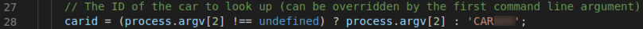</img>

(Note the other literal strings in this source file too; if you entered any non-default values when creating your wallet, identity and connection profiles (for example, the 'student' display name in tutorial <a href='./b3.md'>B3: Enrolling with the network</a>), remember to modify them here too.)

Some red underlines will appear, which indicate unresolved references in the source. This is fine; we'll fix these shortly.

 &nbsp;&nbsp;&nbsp;&nbsp; `B7.10`: &nbsp;&nbsp;&nbsp;&nbsp; Create and save a file directly inside 'drivenet-app' (NOT the src folder) called 'tsconfig.json', with the following 25 lines ([also available here](./resourcesb/tsconfig.json)):

```json
{
    "compilerOptions": {
      "target": "es6",
      "module": "commonjs",
      "allowJs": true,
      "sourceMap": true,
      "outDir": "./dist/",
      "strict": true,
      "noImplicitAny": true,
      "strictNullChecks": true,
      "strictFunctionTypes": true,
      "strictBindCallApply": true,
      "strictPropertyInitialization": true,
      "noImplicitThis": true,
      "alwaysStrict": true,
      "esModuleInterop": true,
      "forceConsistentCasingInFileNames": true
    },
    "include": [
      "./src/**/*"
    ],
    "exclude": [
      "node_modules"
    ]
}
```

 &nbsp;&nbsp;&nbsp;&nbsp; `B7.11`: &nbsp;&nbsp;&nbsp;&nbsp; Create and save a file directly inside 'drivenet-app' (NOT the src folder) called 'package.json', with the following 38 lines ([also available here](./resourcesb/package.json)):

```json
{
  "name": "drivenet-app",
  "version": "1.0.0",
  "description": "DriveNet client application",
  "main": "dist/index.js",
  "typings": "dist/index.d.ts",
  "engines": {
    "node": ">=8",
    "npm": ">=5"
  },
  "scripts": {
    "resolve": "npx npm-force-resolutions",
    "build": "tsc",
    "build:watch": "tsc -w",
    "start": "node ./dist/ownerhistory.js",
    "ownerhistory": "node ./dist/ownerhistory.js",
    "blockhistory": "node ./dist/blockhistory.js",
    "changeowner": "node ./dist/changeowner.js"
  },
  "engineStrict": true,
  "dependencies": {
    "fabric-network": "~1.4.0"
  },
  "devDependencies": {
    "@types/node": "^10.12.10",
    "@typescript-eslint/eslint-plugin": "^3.5.0",
    "@typescript-eslint/parser": "^3.5.0",
    "eslint": "^7.3.1",
    "eslint-config-standard": "^14.1.1",
    "eslint-plugin-import": "^2.22.0",
    "eslint-plugin-node": "^11.1.0",
    "eslint-plugin-promise": "^4.2.1",
    "eslint-plugin-standard": "^4.0.1",
    "source-map-support": "^0.5.19",
    "ts-node": "^8.3.0",
    "typescript": "^3.6.2"
  }
}
```

Your folder structure should look like this:

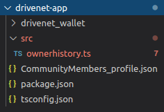</img>

 &nbsp;&nbsp;&nbsp;&nbsp; `B7.12`: &nbsp;&nbsp;&nbsp;&nbsp;
Right-click 'drivenet-app', select 'Open in integrated Terminal' and run the command ``npm install``.

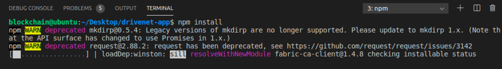</img>

Wait for this command to complete; it might take a few minutes. If any vulnerabilities are found, you can run ``npm run resolve`` to resolve them.

The red underlines for the unresolved references should disappear.

 &nbsp;&nbsp;&nbsp;&nbsp; `B7.13`: &nbsp;&nbsp;&nbsp;&nbsp;
In the main VS Code menu, click 'Terminal' -> 'Run Build Task...' and find and run the task 'tsc: watch - tsconfig.json drivenet-app'. Continue without scanning the task output.

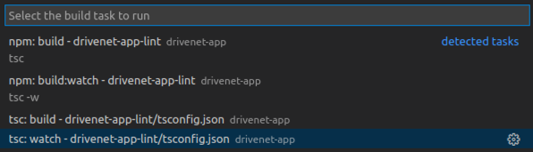</img>

Your application should now build without errors, and the compiler will enter watch mode. As you might recall, this means that any changes to the source will cause an automatic rebuild of the application.

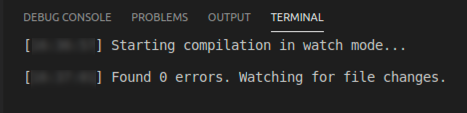</img>

Our application is able to override the default key with a parameter on the command line. (for example, *npm start CARXXX*). So let's configure the VS Code task menu to prompt us for a command line parameter; this will allow us to look up additional records without recompilation.

 &nbsp;&nbsp;&nbsp;&nbsp; `B7.14`: &nbsp;&nbsp;&nbsp;&nbsp;
In the main VS Code menu, click 'Terminal' -> 'Run Task...'. Find the task 'npm: ownerhistory drivenet-app' (click the 'npm' category if necessary) but **instead of** running it, click the Settings icon that appears to the right.

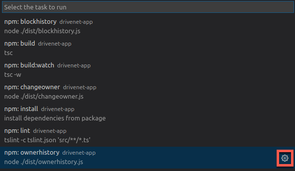</img>

An editor window appears for a VS Code configuration file called 'tasks.json'.

 &nbsp;&nbsp;&nbsp;&nbsp; `B7.15`: &nbsp;&nbsp;&nbsp;&nbsp;
Replace the contents of tasks.json with the following 19 lines ([also available here](./resourcesb/tasks.json)), remembering to update `CARXXX` in the description field to match the default you set earlier.

```json
{
    // See https://go.microsoft.com/fwlink/?LinkId=733558 
    // for the documentation about the tasks.json format
    "version": "2.0.0",
    "tasks": [
        {
            "type": "npm",
            "script": "start ${input:recordID}",
            "problemMatcher": []
        }
    ],
    "inputs": [
        {
            "id": "recordID",
            "type": "promptString",
            "description": "The unique key of the car record (default: CARXXX)"
        }
    ]
}
```

 &nbsp;&nbsp;&nbsp;&nbsp; `B7.16`: &nbsp;&nbsp;&nbsp;&nbsp;
Save the file ('File' -> 'Save').

We will now try the new application out.

 &nbsp;&nbsp;&nbsp;&nbsp; `B7.17`: &nbsp;&nbsp;&nbsp;&nbsp;
Expand the next section to continue.

</details>

---

<details>
<summary><b>Run the application</b></summary>

 &nbsp;&nbsp;&nbsp;&nbsp; `B7.18`: &nbsp;&nbsp;&nbsp;&nbsp;
In the main VS Code menu, click 'Terminal' -> 'Run Task...' and select the task 'npm: start ${input:recordID} drivenet-app'.

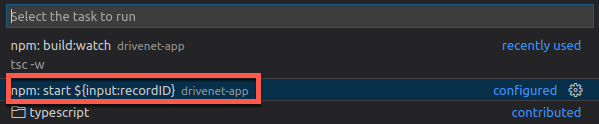</img>

We'll now be prompted for input parameters, just like we configured. For now however, it's fine to accept our defaults.

 &nbsp;&nbsp;&nbsp;&nbsp; `B7.19`: &nbsp;&nbsp;&nbsp;&nbsp;
Press Enter to accept the default lookup key. Then continue without scanning the task output.

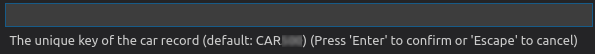</img>

The new application will now run. After a brief pause, the ownership history will be shown in the Output view.

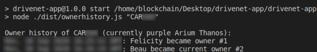</img>

Feel free to re-run the task with alternative input parameters, to view the ownership history of other car records.

<br><h3 align='left'>Blockchain provenance</h3>

As we introduced way back in tutorial <a href='../basic-tutorials/a1.md'>A1: Introduction</a>, one of the strengths of blockchain is that it maintains a tamper-evident history of the assets described within it; we call this *provenance*. Viewing the ownership history is an example of something that provenance gives us.

To achieve provenance, each block of transactions is cryptographically linked to the one before it. Specifically, each new block contains a hash of the previous block; if any transactions were to be tampered with, peers would notice because the hashes would no longer match. This means that the transaction history cannot be deleted or later falsified.

In other words, even if an asset record is deleted in the world state, the history of transactions involving the asset is retained on the blockchain.

> <br>
   > <b>Want to find out more?</b><br>
   > Learn how blocks are linked together by reading the <a href="https://hyperledger-fabric.readthedocs.io/en/latest/ledger/ledger.html#transactions">Ledger topic</a> in the Hyperledger Fabric documentation.
   > <br>&nbsp;

We'll now demonstrate this property by deleting an asset record and attempting to create a new one with the same ID.

 &nbsp;&nbsp;&nbsp;&nbsp; `B7.20`: &nbsp;&nbsp;&nbsp;&nbsp;Using the Fabric Gateways view of the IBM Blockchain Platform VS Code extension, submit a deleteCar transaction against the car that you currently own.

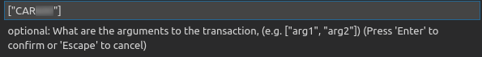</img>

This transaction should succeed.

 &nbsp;&nbsp;&nbsp;&nbsp; `B7.21`: &nbsp;&nbsp;&nbsp;&nbsp;Submit a createCar transaction with the **same ID** as before. The other values can be the same as before, or different.

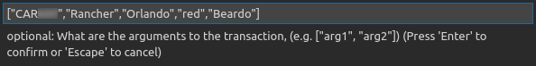</img>

While the transaction should succeed and the car record recreated, its history is retained.

 &nbsp;&nbsp;&nbsp;&nbsp; `B7.22`: &nbsp;&nbsp;&nbsp;&nbsp; Re-run the history application.

You'll see an updated history for the car record, including the break in ownership history where the record was deleted.

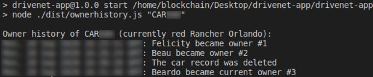</img>

While the application shows the complete ownership *history*, only the *current* make, model and color is shown. There is no reason why the smart contract couldn't show the history of other modified fields too; all transaction details are available on the blockchain. You can browse these by navigating the blocks in the web console.

<br><h3 align='left'>Summary</h3>

In this tutorial we created an application that connects to DriveNet and reports on the ownership history of assets.

Comparing the shape of this application to the one we created in tutorial <a href='../basic-tutorials/a5.md'>A5: Invoking a smart contract from an external application</a>, you'll see that interacting with a remote, multi-party network is conceptually identical to interacting with a local network. The network characteristics are hidden from the application developer; the location and credentials are completely encapsulated in the connection profile and wallet. This separation of concerns allows our applications to be more resilient to network changes.

We also looked more at the idea of provenance in the blockchain, and how transaction history is persisted even though individual asset records might not.

In the next tutorial we will extend our application to use the event framework, so that we can notified when the owner history changes. We'll also investigate some advanced uses of events for finding out when arbitrary transactions occur.

</details>

---


<h3 align='right'> → <a href='./b8.md'><b>B8: Listening for network events</b></a></h3>
