**IBM Blockchain Platform**

<h3 align='left'>← <a href='./b7.md'><b>B7: Connecting applications to the network</b></a></h3>

</img>

## **Tutorial B8: Listening for network events**

---

Estimated time: `30 minutes`

In the previous tutorial we created a client application to interact with the DriveNet network. Now we will look at how we can use the event framework in Hyperledger Fabric to make our applications more sophisticated.

Hyperledger Fabric networks can emit three types of events:
* *custom* events, which are emitted from within smart contracts and contain a user-configurable payload,
* *transaction* events, which are emitted when a specified transaction completes either successfully or unsuccessfully, and
* *block* events, which are emitted when blocks are added to the chain.

In this tutorial we'll write handlers for each of these types of events on DriveNet. Specifically, we will:
* Extend the history application to receive custom events from the fabcar smart contract
* Write an application to receive transaction events, giving us more information on the transactions we submit.
* Write an application to explore the blocks as they get added to the DriveNet blockchain

In order to successfully complete this tutorial, you must have recently completed tutorial <a href='./b7.md'>B7: Connecting applications to the network</a> on the DriveNet network.

Let's start by writing some handlers for custom events emitted by the fabcar smart contract. 

 &nbsp;&nbsp;&nbsp;&nbsp; `B8.1`: &nbsp;&nbsp;&nbsp;&nbsp; Expand the first section below to get started.

---

<details>
<summary><b>Listen for custom events</b></summary>

In this section we will update the client application we created previously to run indefinitely, so that once the ownership history of the car has been displayed, it will display ongoing updates in real time.

To do this, we'll make use of custom smart contract events. We first encountered custom events in tutorial <a href='../basic-tutorials/a9.md'>A9: Publishing an event</a>. We saw how smart contracts can emit events, and how the IBM Blockchain Platform VS Code extension and external applications can receive them.

The DriveNet instance of the fabcar smart contract emits custom events when *changeCarOwner*, *deleteCar* and *createCar* transactions are processed.

Our history application will subscribe to all three of these, because all of them can affect the ownership history.

 &nbsp;&nbsp;&nbsp;&nbsp; `B8.2`: &nbsp;&nbsp;&nbsp;&nbsp; In your VS Code workspace, switch to the editor for '*ownerhistory.ts*'.

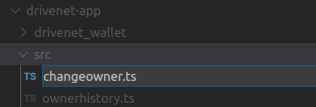</img>

There are a few changes we need to make to this file. We'll start by defining the data structures that contain the details of each event we receive.

 &nbsp;&nbsp;&nbsp;&nbsp; `B8.3`: &nbsp;&nbsp;&nbsp;&nbsp; Just after the interfaces section (around line 19), insert the following new interface definition and boolean variable:
```typescript
interface OwnerEvent {
    docType: string;
    transactionDate: string;
    carNumber: string;
    previousOwner: string;
    newOwner: string;
}
let finished:boolean;
```

The OwnerEvent data structure is a logical definition that encompasses the JSON payloads for the event types that we will subscribe to. When we receive each event, the JSON parser will map the payload into instances of this structure. We'll use the finished boolean while waiting for events to occur.

In the main body of the code, we now need to subscribe to our chosen event types and ensure that application waits for these events to occur.


 &nbsp;&nbsp;&nbsp;&nbsp; `B8.4`: &nbsp;&nbsp;&nbsp;&nbsp; Near the end of the main() function, insert the following code before the *gateway.disconnect()* statement:

```typescript
// Get ongoing notifications to our car from deleteCar, createCar and changeCarOwner transactions
finished=false;
await contract.addContractListener('changeListener', 'changeOwnerEvent', (error:Error, event:any) => {
  handleEvent(error, event);
});
await contract.addContractListener('deleteListener', 'deleteCarEvent', (error:Error, event:any) => {
  handleEvent(error, event);
});
await contract.addContractListener('createListener', 'createCarEvent', (error:Error, event:any) => {
  handleEvent(error, event);
});
console.log(`Listening for ${carid} update events...`);

while (!finished) {
  await new Promise(resolve => setTimeout(resolve, 5000));
  // ... do other things
}
```

Finally, we will implement a single function to handle the events, and display the details of each event to the console.

 &nbsp;&nbsp;&nbsp;&nbsp; `B8.5`: &nbsp;&nbsp;&nbsp;&nbsp; After the end of the implementation of the main() function, add the following additional function:

```typescript
function handleEvent (error:Error, event:any) {
  if (error) {
    console.log(`Error from event: ${error.toString()}`);
    finished = true;
    return;
  }
  // Filter to show events on our car only
  const ownerEvent: OwnerEvent = JSON.parse(event.payload) as OwnerEvent; // eslint-disable-line @typescript-eslint/no-unsafe-member-access
  if (ownerEvent.carNumber === carid) {
    const txTime = new Date(ownerEvent.transactionDate).toUTCString();
    if (ownerEvent.docType === 'deleteCarEvent') {
      console.log(`${txTime}: The car record was deleted`);
    } else {
      console.log(`${txTime}: ${ownerEvent.newOwner} became owner #${(++ownerSequenceNum)}`);
    }
  }
}
```

Your updated source file should be around 126 lines long ([also available here](./resourcesb/ownerhistory_v2.ts)).

 &nbsp;&nbsp;&nbsp;&nbsp; `B8.6`: &nbsp;&nbsp;&nbsp;&nbsp; Save the file ('File' -> 'Save').

If you previously enabled watch mode in your VS Code session, compilation should happen automatically. If not, select 'Terminal' -> 'Run Build Task...' and select the '*npm: build:watch drivenet-app*' task.

Compilation should be successful.

 &nbsp;&nbsp;&nbsp;&nbsp; `B8.7`: &nbsp;&nbsp;&nbsp;&nbsp; Run the application: Click 'Terminal' -> 'Run Task...', select the '*npm: start ${input:recordID}*' task, and when prompted, enter the input parameter of the car you currently own.

The application should run exactly the same as before, but will no longer finish when the owner history has been displayed. You should also see the 'Listening for update events' message.

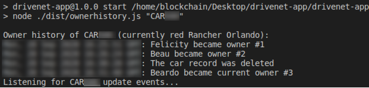</img>

 &nbsp;&nbsp;&nbsp;&nbsp; `B8.8`: &nbsp;&nbsp;&nbsp;&nbsp; Using the Fabric Gateways view of the IBM Blockchain Platform VS Code Extension, submit a *changeCarOwner* transaction against your car record. Set the owner to another new value.

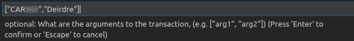</img>

Running this transaction switches focus to the VS Code Output view. Switch back to the Terminal view and you'll see that the application has displayed details of the caught event.

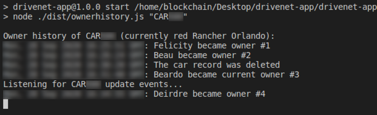</img>

Submit more transactions against the same car record if you wish.

 &nbsp;&nbsp;&nbsp;&nbsp; `B8.9`: &nbsp;&nbsp;&nbsp;&nbsp; When you have finished, right click in the Terminal view and select 'Kill Terminal' to stop the application.

 &nbsp;&nbsp;&nbsp;&nbsp; `B8.10`: &nbsp;&nbsp;&nbsp;&nbsp; Expand the next section to continue.

</details>

---

<details>
<summary><b>Listen for transaction events</b></summary>

So far we have used the event framework to receive custom payloads from the smart contract. Hyperledger Fabric uses the same framework to distribute operational events to interested applications. 

You'll see that subscribing to, and handling these system events is very similar to custom events: we still use a client application to connect to the gateway and still receive a payload that we have to parse, but we call slightly different methods to subscribe.

The first of the operational events we'll look at are called *transaction* events.

<br><h3 align='left'>Transaction events</h3>

Transaction events, also called commit events, allow applications to get notified when a transaction completes. They allow applications to find out more details on whether the transaction was agreed by the network, and if it was, the details of the block in which it was included. As such, these events only apply to *submitted* transactions, which update the ledger.

Let's write an application to submit a *changeCarOwner* transaction and use transaction event to get details on it.

 &nbsp;&nbsp;&nbsp;&nbsp; `B8.11`: &nbsp;&nbsp;&nbsp;&nbsp; In the Explorer sidebar, right click the 'src' directory underneath 'drivenet-app' and select 'New File'.

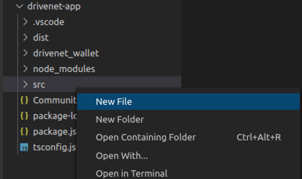</img>

 &nbsp;&nbsp;&nbsp;&nbsp; `B8.12`: &nbsp;&nbsp;&nbsp;&nbsp; Name the file `changeowner.ts`.

 &nbsp;&nbsp;&nbsp;&nbsp; `B8.13`: &nbsp;&nbsp;&nbsp;&nbsp; Paste the following 61 lines into the new file ([also available here](./resourcesb/changeowner.ts)):

```typescript
process.env.HFC_LOGGING = '{"off": "console"}';
import { FileSystemWallet, Gateway, Transaction, Contract, Network } from 'fabric-network';
import * as path from 'path';
import 'source-map-support/register';

let finished:boolean;
let carid:string;

async function main () {
  try {
    // The ID of the car to look up (can be overridden by the first command line argument)
    carid = (process.argv[2] !== undefined) ? process.argv[2] : 'CARXXX'; // TODO change

    // Connect to the network and access the smart contract
    const walletPath:string = path.join(process.cwd(), 'drivenet_wallet');
    const wallet:FileSystemWallet = new FileSystemWallet(walletPath);
    const gateway:Gateway = new Gateway();
    const connectionProfile:string = path.resolve(__dirname, '..', 'CommunityMembers_profile.json');
    const connectionOptions = { wallet, identity: 'student', discovery: { enabled: true, asLocalhost: false } };
    await gateway.connect(connectionProfile, connectionOptions);
    const network:Network = await gateway.getNetwork('drivenet');
    const contract:Contract = network.getContract('fabcar');

    // First check that the car exists
    let existsBuffer:Buffer = await contract.evaluateTransaction('carExists', carid);
    if ((existsBuffer.toString()) === "false") {
      console.error(`Car "${carid}" doesn't exist`);
      return;
    }

    // Create a transaction instance and register a listener for it
    const transaction:Transaction = contract.createTransaction('changeCarOwner');
    await transaction.addCommitListener((err, transactionId, status, blockNumber) => {
      finished = true;
      if (err) {
        console.error(err);
        return;
      }
      console.log('Transaction ID:',transactionId);
      console.log('Status:', status);
      console.log('Block number:', blockNumber);
    });

    // Submit the transaction - set the owner to a random string (random_nnn);
    const rnd:number = Math.round(1000 * Math.random());
    await transaction.submit(carid, `random_${rnd}`);

    while (!finished) {
      await new Promise(resolve => setTimeout(resolve, 1000));
      // ... do other things
      finished = true; // usually set to true by the handler above
    }

    // Disconnect from the gateway.
    gateway.disconnect();
  } catch (error) {
    console.error('Failed to call transaction:', error);
    process.exit(0);
  }
}
void main();
```

 &nbsp;&nbsp;&nbsp;&nbsp; `B8.14`: &nbsp;&nbsp;&nbsp;&nbsp;Update the value of the default parameter for the car ID to be the car record you currently own.

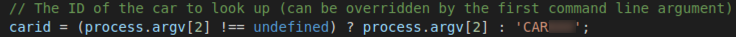</img>

The transaction that this application submits will change the owner field to a random string. Feel free to change this value:

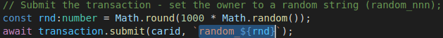</img>

 &nbsp;&nbsp;&nbsp;&nbsp; `B8.15`: &nbsp;&nbsp;&nbsp;&nbsp; Save the file ('File' -> 'Save').

If you previously enabled watch mode in your VS Code session, compilation should happen automatically. If not, select 'Terminal' -> 'Run Build Task...' and select the '*npm: build:watch drivenet-app*' task.

Compilation should be successful.

> <br>
   > <b>Configuring VS Code to accept command line arguments</b><br>
   > The <i>changeowner</i> app can take a single argument that overrides the car ID. If you wish, you can configure VS Code to prompt you for this when you run it. Refer back to tutorial <a href='./b7.md'>B7: Connecting applications to the network</a> for details of how to do this.
   > <br>&nbsp;
   

 &nbsp;&nbsp;&nbsp;&nbsp; `B8.16`: &nbsp;&nbsp;&nbsp;&nbsp; Run the application: Click 'Terminal' -> 'Run Task...' and find (selecting the npm category if necessary) the task '*npm: changeowner drivenet-app*'. Continue without scanning the task output.

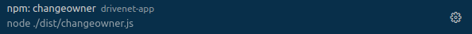</img>


When the task runs, the *changeCarOwner* transaction will be submitted. When the transaction has completed, the event handler will be called and the details displayed.

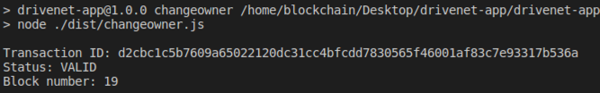</img>


Three things are shown: the *transaction ID*, which uniquely identifies the transaction on the network and is generated by Hyperledger Fabric, *the status*, which tells us whether or not the transaction was successful, and the *block number*, which tells us the block in which our transaction was included.

You might like to verify this information from the block explorer using the IBM Blockchain Platform web console.

<br>
Let's look at the source for this application to see how it works.

1. The first dozen or so lines are identical to the *ownerhistory* application; it connects to a gateway with a connection profile and identity, and accesses the drivenet network channel.

2. Where things change is the `addCommitListener` call. This is very similar to the *addContractListener* that we called before, but here the event payload includes the transactionId, status and blockNumber. The callback function simply displays the values of these properties to the console.

3. In order to register the transaction listener, we need to specify the transaction we're interested in. We don't get this when we use *submitTransaction*, because that creates and submits the transaction in a single call. To register a listener we need to create the transaction first so that we can use it to register a listener. Then we submit the transaction.

4. Each transaction will be committed only once. So once the callback has been run the first time, the application exits.

The payload of the event includes the number of the block that includes the transaction. In the next section we'll use a different event to find out more details of the block.

 &nbsp;&nbsp;&nbsp;&nbsp; `B8.17`: &nbsp;&nbsp;&nbsp;&nbsp;Expand the next section to continue.
</details>

---

<details>
<summary><b>Listen for block events</b></summary>

*Block* events return highly detailed information on the block data stucture. They are often used in operational monitoring scenarios, or for debugging relatively complex network transactions.

Let's write an application to receive these events. This will allow us to view technical details of the blocks of the DriveNet blockchain, and also to see when new blocks get added.

 &nbsp;&nbsp;&nbsp;&nbsp; `B8.18`: &nbsp;&nbsp;&nbsp;&nbsp; In the Explorer sidebar, right click the 'src' directory underneath 'drivenet-app' and select 'New File'.

</img>

 &nbsp;&nbsp;&nbsp;&nbsp; `B8.19`: &nbsp;&nbsp;&nbsp;&nbsp; Name the file `blockhistory.ts`.

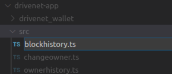</img>

 &nbsp;&nbsp;&nbsp;&nbsp; `B8.20`: &nbsp;&nbsp;&nbsp;&nbsp; Paste the following 91 lines into the new file ([also available here](./resourcesb/blockhistory.ts)):

```typescript
// Beware: for code clarity, the block structure is navigated unsafely
/* eslint @typescript-eslint/no-unsafe-member-access: 0 */
/* eslint @typescript-eslint/no-unsafe-assignment: 0 */

process.env.HFC_LOGGING = '{"off": "console"}';
import { FileSystemWallet, Gateway, Network } from 'fabric-network';
import * as path from 'path';
import 'source-map-support/register';

let finished:boolean;

async function main () {
  try {
    // Get to the drivenet network
    const walletPath:string = path.join(process.cwd(), 'drivenet_wallet');
    const wallet:FileSystemWallet = new FileSystemWallet(walletPath);
    const gateway:Gateway = new Gateway();
    const connectionProfile:string = path.resolve(__dirname, '..', 'CommunityMembers_profile.json');
    const connectionOptions = { wallet, identity: 'student', discovery: { enabled: true, asLocalhost: false } };
    await gateway.connect(connectionProfile, connectionOptions);
    const network:Network = await gateway.getNetwork('drivenet');

    // Display blocks
    finished = false;
    await network.addBlockListener('my-block-listener', (err: any, block: any) => {
      if (err) {
        console.error(err);
        finished = true;
        return;
      }
      if (block !== undefined) {
        // Read each block
        for (const i in block.data.data) {
          if (block.data.data[i].payload.data.actions !== undefined) {
            const inputArgs:Buffer[] = block.data.data[i].payload.data.actions[0].payload.chaincode_proposal_payload.input.chaincode_spec.input.args;

            // Print block details
            console.log('----------');
            console.log('Block',block.header.number,'transaction',i);

            // Show ID and timestamp of the transaction
            const txTime = new Date(block.data.data[i].payload.header.channel_header.timestamp).toUTCString();
            const txId:string = block.data.data[i].payload.header.channel_header.tx_id;
            console.log('Transaction Id:',txId);
            console.log('Timestamp:',txTime);

            // Show transaction inputs (formatted, as may contain binary data)
            let inputData = 'Inputs: ';
            for (let j=0; j<inputArgs.length; j++) {
              const inputArgPrintable:string = inputArgs[j].toString().replace(/[^\x20-\x7E]+/g, '');
              inputData = inputData.concat(inputArgPrintable, ' ');
            }
            console.log(inputData);

            // Show the proposed writes to the world state
            let keyData = 'Keys updated: ';
            for (const l in block.data.data[i].payload.data.actions[0].payload.action.proposal_response_payload.extension.results.ns_rwset[0].rwset.writes) {
              keyData = keyData.concat(block.data.data[i].payload.data.actions[0].payload.action.proposal_response_payload.extension.results.ns_rwset[0].rwset.writes[l].key,' ');
            }
            console.log(keyData);

            // Show which organizations endorsed
            let endorsers = 'Endorsers: ';
            for (const k in block.data.data[i].payload.data.actions[0].payload.action.endorsements) {
              endorsers = endorsers.concat(block.data.data[i].payload.data.actions[0].payload.action.endorsements[k].endorser.Mspid, ' ');
            }
            console.log(endorsers);

            // Was the transaction valid or not?
            // (Invalid transactions are still logged on the blockchain but don't affect the world state)
            if ((block.metadata.metadata[2])[i] !== 0) {
              console.log('INVALID TRANSACTION');
            }
          }
        }
      }
    }, { startBlock: 1 }); // Read from block 1, and continue to catch new blocks as they appear

    while (!finished) {
      await new Promise(resolve => setTimeout(resolve, 5000));
      // ... do other things
    }

    // Disconnect from the gateway
    gateway.disconnect();
  } catch (error) {
    console.error('Error: ', error.message);
    process.exit(0);
  }
}
void main();
```

 &nbsp;&nbsp;&nbsp;&nbsp; `B8.21`: &nbsp;&nbsp;&nbsp;&nbsp; Save the file ('File' -> 'Save').

If you previously enabled watch mode in your VS Code session, compilation should happen automatically. If not, select 'Terminal' -> 'Run Build Task...' and select the '*npm: build:watch drivenet-app*' task.

Compilation should be successful.

 &nbsp;&nbsp;&nbsp;&nbsp; `B8.22`: &nbsp;&nbsp;&nbsp;&nbsp; Run the application: Click 'Terminal' -> 'Run Task...' and find and select the '*npm: blockhistory drivenet-app*'. Continue without scanning the task output.

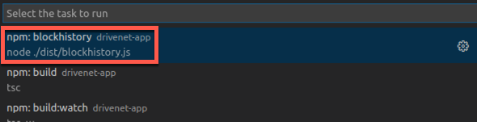</img>

When the task runs, you should see the DriveNet block details displayed. As before, the task will run indefinitely, using the event framework to listen for any new blocks that appear.

Take some time to review the output. Look particularly for the transactions that you have submitted over the course of these tutorials. For example, the incorrectly endorsed transaction you submitted in tutorial <a href='./b6.md'>B6: Exercising network policies</a> should be reported like this:

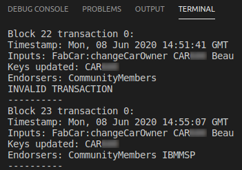</img>

The output shows the details of every FabCar transaction added to the blockchain, including ones that failed to be endorsed correctly. As you might recall, invalid transactions are logged to the blockchain but do not affect the world state.

<br><h3 align='left'>Reviewing the source</h3>

Let's look at the source for this application to see how it works.

1. The first dozen or so lines are again identical to the other applications; it connects to a gateway with a connection profile and identity, and accesses the DriveNet network channel.

2. The `addBlockListener` call is very similar to the other *addXXXlistener* methods that we called before, but now the event payload is an instance of the complex type *block*. This is a highly detailed <a href="https://developers.google.com/protocol-buffers/">protobuf</a> that contains the raw block details from the DriveNet ledger.

3. The inline implementation of the callback handler displays different pieces of information from this data structure. For example, the block number is stored in the element `block.header.number`.

4. The block structure will extend dynamically as more blocks get added; after the inline implementation of the callback, you can see an options structure that simply contains (`{startBlock: 1}`). The absence of an *endBlock* option here means that the structure will grow indefinitely.

Once you're comfortable with how the application works, feel free to update it to show other elements of the block data structure.

> <br>
   > <b>Understanding the block data structure</b><br>
   > The block data structure (as is typical with protobufs) is highly complex, but does contain a lot of information that might be useful. If you're interested, try setting a watch on the block instance and running the blockhistory application in the debugger; this will allow you to navigate the hierarchy of the data structure directly within VS Code. For a refresher on how to do this, take a look at tutorial <a href='../basic-tutorials/a7.md'>A7: Debugging a smart contract</a>.
   > <br>&nbsp;

 &nbsp;&nbsp;&nbsp;&nbsp; `B8.23`: &nbsp;&nbsp;&nbsp;&nbsp; When you have finished, right click in the Terminal view and select 'Kill Terminal' to stop the application.

<br><h3 align='left'>(Optional) Bringing it all together</h3>

The three client applications that we've been working with in this tutorial complement each other. As a final, optional task, you can try running them concurrently outside of VS Code to see the effects they have on each other.

 &nbsp;&nbsp;&nbsp;&nbsp; `B8.24`: &nbsp;&nbsp;&nbsp;&nbsp;Start three Terminal (Command Prompt) windows.

 &nbsp;&nbsp;&nbsp;&nbsp; `B8.25`: &nbsp;&nbsp;&nbsp;&nbsp;In each window, use the cd command to navigate to your drivenet-app folder.

 &nbsp;&nbsp;&nbsp;&nbsp; `B8.26`: &nbsp;&nbsp;&nbsp;&nbsp;In the first window, run `npm run blockhistory`.

 &nbsp;&nbsp;&nbsp;&nbsp; `B8.27`: &nbsp;&nbsp;&nbsp;&nbsp;In the second window, run `npm run ownerhistory CARXXX` (where *CARXXX* is your car record).

 &nbsp;&nbsp;&nbsp;&nbsp; `B8.28`: &nbsp;&nbsp;&nbsp;&nbsp;In the third window, run `npm run changeowner CARXXX` (again, where *CARXXX* is your car record).

Notice how changing the owner of your car record affects the other applications.

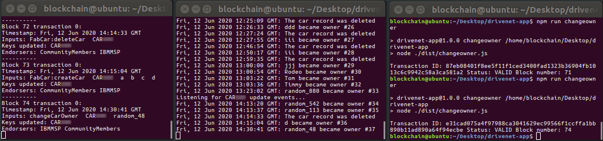</img>


<br><h3 align='left'>Summary</h3>

Blockchain networks are by their very nature asynchonous systems. Transactions do not complete immediately; they need to be distributed around multiple nodes across multiple organizations in order to achieve consensus, and this is done concurrently with other transactions.

It is for this reason that events are commonly used for interacting with blockchain networks. They allow applications to acknowledge that changes can come from multiple sources and at different times.

In this tutorial we implemented handlers for three types of events on the DriveNet network; custom events, transaction events, and block events.

This concludes what we're going to do with DriveNet. In the final tutorial in this set, we will look at the process for leaving a network and introduce where we'll go next.

</details>

---

<h3 align='right'> → <a href='./b9.md'><b>B9: Leaving a network</b></a></h3>
