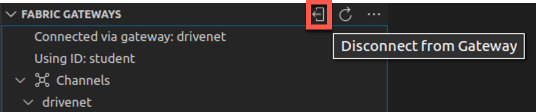
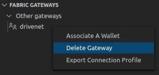
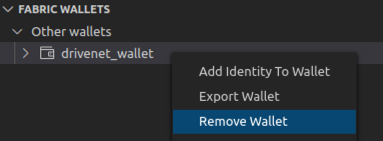

**IBM Blockchain Platform**

<h3 align='left'>← <a href='./b8.md'><b>B8: Listening for network events</b></a></h3>

</img>

## **Tutorial B9: Leaving a network**

---

Estimated time: `10 minutes`

We've learned how to interact with a remote network through a community organization. We used the IBM Blockchain Platform VS Code extension, web console and some additional applications.

Now that we've finished working with the network we will look at the process of leaving it. In this tutorial we will:
* Understand how a user can remove themselves from a community organization-based network
* Follow the process for leaving DriveNet
* Introduce the next set of tutorials

This tutorial will reference the concepts we learned in the previous tutorials in this set. It assumes you've enrolled with DriveNet, downloaded your identity and connection profile, and configured a gateway in the IBM Blockchain Platform VS Code extension.

 &nbsp;&nbsp;&nbsp;&nbsp; `B9.1`: &nbsp;&nbsp;&nbsp;&nbsp; Expand the first section below to get started.

---

<b>Leave the network</b>

When removing yourself from a blockchain network, it is important to offboard correctly according to the rules of the network, and to tidy up any resources you have been using.

This is less important for DriveNet, because DriveNet is a test network that is regularly destroyed and recreated. This causes the blockchain and world state to get completely wiped, and any userids and passwords that have been issued for it will stop working.

>  
   > <b>Before you leave...</b>
   >   
   > Your DriveNet registration details included a link to a web app, which is a simple graphical front end to  network. It allows you to create view and transfer ownership of vehicles just like the command line tools.
   > It connects to the same blockchain network used in the earlier tutorials, using the same smart contract and therefore subject to the same network policies as described in tutorial <a href='./b6.md'>B6: Exercising network policies</a>.
   >   
   > Your registration also included a link to the source of the smart contract used in the tutorials. It illustrates some of the considerations and techniques to consider when developing a production-quality smart contract.
   >   
   > Before you remove yourself from DriveNet, feel free to take some time to explore the app and smart contract.
   >  
   >  

 <h3 align='left'>Network resources</h3>

When a user has joined a blockchain network through a community organization, there is typically not much that the leaver needs to do, because the community organization continues to be responsible for the management of its resources for other users.

Furthermore, it is not usually possible to tidy up data shared on the network, because the nature of blockchain means that any assets and transactions that the user was involved with will persist after they have gone.

For DriveNet however, it is good practice to tidy up any car records you have been using so that they can be made available for other users. Specifically, you should make sure that any car records that you currently own are deleted, so that other users can use their IDs.

 &nbsp;&nbsp;&nbsp;&nbsp; `B9.2`: &nbsp;&nbsp;&nbsp;&nbsp; In the Fabric Gateways view of the IBM Blockchain Platform VS Code extension, evaluate the *findMyCars* transaction. It takes no input arguments.

This will report which car records you currently own.

 &nbsp;&nbsp;&nbsp;&nbsp; `B9.3`: &nbsp;&nbsp;&nbsp;&nbsp; Submit a *deleteCar* transaction against each reported car record.

As you may recall, this transaction takes a single argument - the ID of the car record you are deleting.

Remember that even though you have deleted the records, the *history* of each car record will be retained after you've done this - until the network is recreated.

 <h3 align='left'>Local resources</h3>

When offboarding, it's also a good idea to tidy up any remaining resources that exist within your organization - for example, on your local machine.

There is not much to remove from your local machine for DriveNet, particularly if you would like to keep the source assets you created for your own education, but there are a few recommended practices to follow nevertheless.

Before you do anything, remember to also stop any running applications (e.g. listeners that you created in the previous tutorial, and any compilers running in watch mode). You can use the Trash icon on the right of the Terminal window to do this.

 &nbsp;&nbsp;&nbsp;&nbsp; `B9.4`: &nbsp;&nbsp;&nbsp;&nbsp; Hover over the Fabric Gateways view and click the 'Disconnect from Gateway' icon.

</img>

 &nbsp;&nbsp;&nbsp;&nbsp; `B9.5`: &nbsp;&nbsp;&nbsp;&nbsp; Right click 'drivenet' and select 'Delete Gateway'. Click 'Yes' in the notification box to confirm.

</img>

 &nbsp;&nbsp;&nbsp;&nbsp; `B9.6`: &nbsp;&nbsp;&nbsp;&nbsp; In the Fabric Wallets view, right click 'drivenet_wallet' and select 'Remove Wallet'. Again, click 'Yes' in the notification box to confirm.

</img>

It's a particularly good idea to remove *all* copies of your connection details (e.g. wallets, identities, connection profiles) whenever you remove yourself from a network.

Even though login certificates can be revoked by the network, any private keys can still be used to decrypt any data you encrypted. If your decryption keys ever get compromised, it is impossible to prevent other users from decrypting any data you have previously shared on the network.

On a pragmatic note, deleting your old connection details will also prevent filename confusion if you ever rejoin the network.

 &nbsp;&nbsp;&nbsp;&nbsp; `B9.6`: &nbsp;&nbsp;&nbsp;&nbsp; 
Securely delete from your file system the exported wallets, identities and connection profiles associated with your user:

* *drivenet_wallet*
* *student_identity.json*
* *CommunityMembers_profile.json*

If you wish, you can now safely remove the drivenet_app folder from your VS Code workspace, and delete if from your file system.

If you wish to remove the fabnet tools that allow you to browse and join networks, run the command `npm uninstall -g fabnet` in your terminal window.

---

<b>What's next?</b>

In this tutorial set we've seen how you can successfully join a blockchain network and run transactions without managing any blockchain network infrastructure. We delegated responsibility for running peers and the certificate authority onto a fictitious community organization, which was shared between multiple users of the network.

By doing this we had to trust the community organization to correctly implement transactions on our behalf. We chose to trade our ownership of the ledger and its data, for lower set up costs and operational simplicity.

The next step is to become more involved with the running of a network, by creating and managing your own nodes. By running peers and becoming a fully-fledged organization on the network, you will own a copy of the ledger, sign your own transactions and be more involved with the consensus process.

>  
   > <b>More tutorials are coming soon</b>
   >   
   > The next set of tutorials is coming soon. In the mean time, here are some links to additional resources you can use to continue your learning.
   > <ul>
   > <li><a href="https://cloud.ibm.com/docs/blockchain?topic=blockchain-ibp-console-join-network">Joining a blockchain network
   > <li><a href="https://www.ibm.com/blockchain/">IBM Blockchain Homepage</a>
   > <li><a href="https://developer.ibm.com/technologies/blockchain/">IBM Blockchain Developer site</a>
   > </ul>
   >  

 <h3 align='left'>Congratulations!</h3>

Congratulations on completing this tutorial set, and have fun!

---
